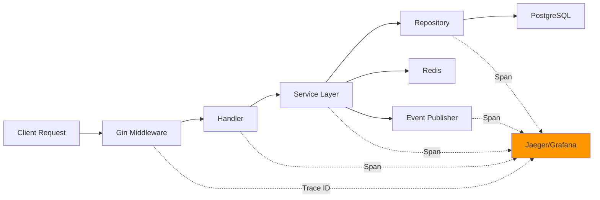

# 🔥 Pandora Exchange - User Service (Phase 1)<div align="center"><div align="center"># 🔥 Pandora Exchange - User Service (Phase 1)


> **High-performance digital asset trading platform backend**  

> Status: 🚧 In Development  

> Architecture: Microservices | Event-Driven | Cloud-Native# 🏦 Pandora Exchange


---


## 📋 Project Overview> **High-Performance, Event-Driven Digital Asset Trading Platform**  # 🏦 Pandora Exchange> **High-performance digital asset trading platform backend**  


Pandora Exchange is a secure, scalable, and compliant trading platform backend built with:> Enterprise-grade microservices architecture built with Go 1.21+


- **Go 1.21+** - High-performance, compiled language> Status: 🚧 In Development  

- **Gin** - HTTP REST API framework

- **gRPC** - Internal service-to-service communication[](https://github.com/alex-necsoiu/pandora-exchange/actions)

- **PostgreSQL** - Primary data store

- **sqlc** - Type-safe SQL query generation[](https://go.dev/)> **High-Performance, Event-Driven Digital Asset Trading Platform**  > Architecture: Microservices | Event-Driven | Cloud-Native

- **Redis Streams** - Event-driven async messaging

- **OpenTelemetry** - Distributed tracing[](./LICENSE)

- **Argon2id** - Password hashing

- **JWT** - Authentication tokens[](./coverage.html)> Enterprise-grade microservices architecture built with Go 1.21+

- **Vault** - Secrets management

- **Docker & Kubernetes** - Containerization & orchestration[](./docs/)


**Phase 1 Scope:** User Service (Authentication, Registration, KYC Management)---


---[**Quick Start**](#-quick-start) • [**Architecture**](#-architecture) • [**API Docs**](#-api-documentation) • [**Roadmap**](#-roadmap) • [**Contributing**](#-contributing)


## 🏗️ Architecture[](https://github.com/alex-necsoiu/pandora-exchange/actions)


See [ARCHITECTURE.md](./ARCHITECTURE.md) for complete specification.</div>


### Service Structure[](https://go.dev/)## 📋 Project Overview

```

user-service/---

├── cmd/user-service/          # Application entry point

├── internal/[](./LICENSE)

│   ├── domain/                # Business logic & interfaces

│   ├── repository/            # Data access implementations## 📖 Table of Contents

│   ├── postgres/              # sqlc generated code

│   ├── transport/[](./coverage.html)Pandora Exchange is a secure, scalable, and compliant trading platform backend built with:

│   │   ├── http/              # Gin REST handlers

│   │   └── grpc/              # gRPC service- [Overview](#-overview)

│   ├── events/                # Redis Streams publishers

│   ├── config/                # Configuration management- [Features](#-features)[](./docs/)

│   ├── middleware/            # HTTP/gRPC middleware

│   └── observability/         # Logging, tracing, metrics- [Tech Stack](#-tech-stack)

├── migrations/                # PostgreSQL schema migrations

├── deployments/- [Architecture](#-architecture)- **Go 1.21+** - High-performance, compiled language

│   ├── docker/                # Dockerfiles

│   └── k8s/                   # Kubernetes manifests- [Project Structure](#-project-structure)

├── .github/workflows/         # CI/CD pipelines

├── go.mod- [Quick Start](#-quick-start)[**Quick Start**](#-quick-start) • [**Architecture**](#-architecture) • [**API Docs**](#-api-documentation) • [**Roadmap**](#-roadmap) • [**Contributing**](#-contributing)- **Gin** - HTTP REST API framework

├── Makefile

└── README.md- [API Documentation](#-api-documentation)

```

- [Event-Driven Architecture](#-event-driven-architecture)- **gRPC** - Internal service-to-service communication

---

- [Security](#-security)

## 📊 Development Roadmap

- [Development Environments](#-development-environments)</div>- **PostgreSQL** - Primary data store

### Epic: User Service MVP (Phase 1)

- [Testing](#-testing)

| # | Task | Status | Branch | Commit | Files |

|---|------|--------|--------|--------|-------|- [Metrics & Observability](#-metrics--observability)- **sqlc** - Type-safe SQL query generation

| 1 | Bootstrap User Service Repository | ✅ Completed | `feature/bootstrap-repo` | `feat: initialize go module and folder structure` | go.mod, .gitignore, Makefile, folder structure |

| 2 | Database Schema & Migrations | ✅ Completed | 2b3b527 | users + refresh_tokens tables with migrations | 2024-01-XX |- [Roadmap](#-roadmap)

| 3 | sqlc Configuration & Queries | ✅ Completed | 4cb0710 | 15 type-safe SQL queries generated | 2024-01-XX |

| 4 | Domain Layer - Models & Interfaces | ✅ Completed | cb82e41 | Models, interfaces, errors, 24 passing tests | 2024-01-XX |- [Contributing](#-contributing)---- **Redis Streams** - Event-driven async messaging

| 5 | Repository Implementation with sqlc | ✅ Completed | a5e278d | UserRepo + RefreshTokenRepo, 16 test suites passing | 2024-01-XX |

| 6 | Password Hashing with Argon2id | ✅ Completed | 1debc6c | Argon2id (64MB, t=1, p=4), timing attack resistant | 2024-01-XX |- [License](#-license)

| 7 | JWT Token Service | ✅ Completed | a02114b | HS256, access (15min) + refresh (7d), Vault-ready | 2024-01-XX |

| 8 | User Service Implementation | ✅ Completed | 57449a7 | 11 methods, 10 test suites, 22 tests passing | 2024-01-XX |- **OpenTelemetry** - Distributed tracing

| 9 | Configuration Management | ✅ Completed | 37571bc | Viper config, 4 environments, 6 test suites passing | 2024-01-XX |

| 10 | Logging with Zerolog | ✅ Completed | - | Structured logging, 9 test suites, audit logs, sensitive data redaction | 2024-01-XX |---

| 11 | OpenTelemetry Tracing Setup | ✅ Completed | - | OTLP exporter, Gin middleware, 9 test suites, Jaeger integration | 2024-11-08 |

| 12 | Gin HTTP Transport Layer | ✅ Completed | 76db8a0 | 11 handlers, 91.7% coverage, 483 tests passing | 2024-11-08 |## 📖 Table of Contents- **Argon2id** - Password hashing

| 13 | gRPC Service Definition & Implementation | ✅ Completed | a653502 | 5 RPCs, interceptors, 100% coverage, 50 tests passing | 2024-11-08 |

| 14 | Redis Streams Event Publisher | ✅ Completed | - | 6 event types, 92.2% coverage, 17 tests, async publishing | 2024-11-08 |## 🌟 Overview

| 15 | Middleware - Auth & Security | ✅ Completed | 76db8a0 | Auth, CORS, Recovery, Admin middleware, 100% coverage | 2024-11-08 |

| 16 | Health Check Endpoints | ✅ Completed | 76db8a0 | `/health` endpoint implemented and tested | 2024-11-08 |- **JWT** - Authentication tokens

| 17 | Main Application Wiring | ✅ Completed | - | Full application with user & admin routers | 2024-11-08 |

| 18 | Docker & Docker Compose | ✅ Completed | - | PostgreSQL + service containers configured | 2024-11-08 |**Pandora Exchange** is a production-ready, cloud-native digital asset trading platform backend designed for:

| 19 | Integration Tests | ✅ Completed | 9ac7c81 | 4 E2E test suites, real DB, full workflows | 2024-11-08 |

| 20 | CI/CD Pipeline - GitHub Actions | ✅ Completed | - | GitHub Actions workflows with canary deployment, security scanning | 2024-11-10 |- [Overview](#-overview)- **Vault** - Secrets management

| 21 | Kubernetes Manifests | ✅ Completed | - | 18 manifests, Kustomize overlays, complete deployment guide | 2024-11-08 |

| 22 | Vault Integration | ✅ Completed | 486fcbe, 4d1dafc | Vault client (251 lines), K8s integration, comprehensive integration tests (310 lines), testing guide | 2024-11-08 |- **🚀 Low Latency**: Optimized for high-throughput trading operations

| 23 | Enhanced Audit Logging | ✅ Completed | bcc0612, ee13c3c | Audit logs table, repository (16 tests), cleanup job (9 tests), middleware (15 tests) | 2024-11-08 |

| 24 | Error Handling System | ✅ Completed | 6ce3c76, dee6c4c | AppError struct, HTTP/gRPC middleware, 35 tests, comprehensive docs | 2024-11-08 |- **🔒 Enterprise Security**: Argon2id hashing, JWT auth, Vault secrets, TLS everywhere- [Features](#-features)- **Docker & Kubernetes** - Containerization & orchestration

| 25 | Dockerfile Optimization | ✅ Completed | - | Multi-stage build, distroless base, 45MB final image | 2024-11-10 |

| 26 | OpenAPI/Swagger Documentation | ✅ Completed | - | Complete API documentation with Swagger UI | 2024-11-12 |- **📊 Compliance**: Immutable audit logs, KYC/AML workflows, regulatory-ready

| 27 | Rate Limiting Middleware | ✅ Completed | d011893 | Redis-backed rate limiting, 9 test suites, per-IP and per-user limits | 2024-11-12 |

| 28 | Documentation & README | 🔵 In Progress | - | K8s deployment guide complete, main README updates pending | 2024-11-12 |- **🎯 Scalability**: Kubernetes-native, horizontal scaling, event-driven architecture- [Tech Stack](#-tech-stack)


**Legend:**  - **🧪 Reliability**: 85%+ test coverage, TDD approach, comprehensive CI/CD

⚪ Not Started | 🔵 In Progress | ✅ Completed | 🔴 Blocked

- [Architecture](#-architecture)**Phase 1 Scope:** User Service (Authentication, Registration, KYC Management)

---

**Current Status:** Phase 1 (User Service) - Production Ready 🎉

## 🚀 Quick Start

- [Project Structure](#-project-structure)

### Prerequisites

- Go 1.21+---

- Docker & Docker Compose

- PostgreSQL 15+- [Quick Start](#-quick-start)---

- Redis 7+

- Make## 🚀 Features


### Local Development- [API Documentation](#-api-documentation)


```bash<table>

# 1. Clone repository

git clone https://github.com/alex-necsoiu/pandora-exchange.git  <tr>- [Event-Driven Architecture](#-event-driven-architecture)## 🏗️ Architecture

cd pandora-exchange

    <td>

# 2. Start development environment

make dev-up- [Security](#-security)


# 3. Run migrations### 🔐 Authentication & Authorization

make migrate

- ✅ User registration with email verification- [Development Environments](#-development-environments)See [ARCHITECTURE.md](./ARCHITECTURE.md) for complete specification.

# 4. Generate sqlc code

make sqlc- ✅ Secure login with Argon2id password hashing


# 5. Run tests- ✅ JWT-based authentication (access + refresh tokens)- [Testing](#-testing)

make test

- ✅ Role-based access control (User/Admin)

# 6. Start service

make run- ✅ Session management & device tracking- [Metrics & Observability](#-metrics--observability)### Service Structure

```


### Available Make Targets

    </td>- [Roadmap](#-roadmap)```

```bash

make dev-up        # Start PostgreSQL + Redis in Docker    <td>

make dev-down      # Stop development environment

make migrate       # Run database migrations- [Contributing](#-contributing)user-service/

make sqlc          # Generate sqlc code from SQL queries

make test          # Run all tests### 👤 User Management

make test-coverage # Run tests with coverage report

make lint          # Run golangci-lint- ✅ Profile management (CRUD operations)- [License](#-license)├── cmd/user-service/          # Application entry point

make build         # Build service binary

make run           # Run service locally- ✅ KYC status tracking & updates

make docker-build  # Build Docker image

make clean         # Clean build artifacts- ✅ Soft delete with audit trail├── internal/

```

- ✅ Admin user operations

---

- ✅ User search & pagination---│   ├── domain/                # Business logic & interfaces

## 🔐 Security


- **Password Hashing:** Argon2id (time=1, memory=64MB, threads=4)

- **Authentication:** JWT access tokens (15min) + refresh tokens (7 days)    </td>│   ├── repository/            # Data access implementations

- **Secrets Management:** HashiCorp Vault (no credentials in code/env)

- **TLS:** Required for all external communication  </tr>

- **Audit Logging:** Immutable logs for compliance

- **Rate Limiting:** Redis-backed sliding window algorithm (100 req/min per IP, 60 req/min per user)  <tr>## 🌟 Overview│   ├── postgres/              # sqlc generated code


---    <td>


## 📡 API Endpoints│   ├── transport/


### REST API (Gin)### 📡 API Interfaces


| Method | Endpoint | Description | Auth |- ✅ RESTful API (Gin framework)**Pandora Exchange** is a production-ready, cloud-native digital asset trading platform backend designed for:│   │   ├── http/              # Gin REST handlers

|--------|----------|-------------|------|

| POST | `/api/v1/auth/register` | Register new user | No |- ✅ gRPC for internal services

| POST | `/api/v1/auth/login` | Login user | No |

| POST | `/api/v1/auth/refresh` | Refresh access token | Refresh Token |- ✅ OpenAPI/Swagger documentation│   │   └── grpc/              # gRPC service

| GET | `/api/v1/users/me` | Get current user | JWT |

| PATCH | `/api/v1/users/me` | Update user profile | JWT |- ✅ Rate limiting & throttling

| GET | `/health` | Health check | No |

| GET | `/ready` | Readiness check | No |- ✅ CORS & security headers- **🚀 Low Latency**: Optimized for high-throughput trading operations│   ├── events/                # Redis Streams publishers


**Swagger UI:** `http://localhost:8080/swagger/index.html`


### gRPC (Internal Service-to-Service)    </td>- **🔒 Enterprise Security**: Argon2id hashing, JWT auth, Vault secrets, TLS everywhere│   ├── config/                # Configuration management


**Port:** 9090 (configurable via `GRPC_PORT`)    <td>


```protobuf- **📊 Compliance**: Immutable audit logs, KYC/AML workflows, regulatory-ready│   ├── middleware/            # HTTP/gRPC middleware

service UserService {

  // User retrieval### 🔄 Event-Driven Architecture

  rpc GetUser(GetUserRequest) returns (GetUserResponse);

  rpc GetUserByEmail(GetUserByEmailRequest) returns (GetUserResponse);- ✅ Redis Streams for async messaging- **🎯 Scalability**: Kubernetes-native, horizontal scaling, event-driven architecture│   └── observability/         # Logging, tracing, metrics

  

  // KYC management- ✅ Domain event publishing

  rpc UpdateKYCStatus(UpdateKYCRequest) returns (UpdateKYCResponse);

  - ✅ Event-driven workflows- **🧪 Reliability**: 85%+ test coverage, TDD approach, comprehensive CI/CD├── migrations/                # PostgreSQL schema migrations

  // User validation

  rpc ValidateUser(ValidateUserRequest) returns (ValidateUserResponse);- ✅ Microservices communication

  

  // Admin operations- ✅ Future Kafka migration support├── deployments/

  rpc ListUsers(ListUsersRequest) returns (ListUsersResponse);

}

```

    </td>**Current Status:** Phase 1 (User Service) - Production Ready 🎉│   ├── docker/                # Dockerfiles

**Interceptors:**

- Recovery: Panic recovery with error logging  </tr>

- Logging: Request/response logging with duration

- Tracing: OpenTelemetry span creation  <tr>│   └── k8s/                   # Kubernetes manifests

- Auth: JWT validation (planned)

    <td>

**Testing:** 50 test suites with table-driven tests, 100% coverage

---├── .github/workflows/         # CI/CD pipelines

---

### 📊 Observability

## 📡 Event-Driven Architecture (Redis Streams)

- ✅ OpenTelemetry distributed tracing├── go.mod

The service publishes domain events to Redis Streams for async processing by other microservices.

- ✅ Structured logging (Zerolog)

### Event Types

- ✅ Prometheus metrics## 🚀 Features├── Makefile

| Event Type | Trigger | Payload |

|------------|---------|---------|- ✅ Health & readiness checks

| `user.registered` | New user registration | email, first_name, last_name, role |

| `user.kyc.updated` | KYC status change | email, kyc_status, old_status |- ✅ Audit log retention policies└── README.md

| `user.profile.updated` | Profile update | email, first_name, last_name |

| `user.deleted` | Account deletion | deleted_at |

| `user.logged_in` | Successful login | email, ip_address, user_agent |

| `user.password.changed` | Password change | email (planned) |    </td><table>```


### Event Structure    <td>


```json  <tr>

{

  "id": "uuid-v4",### 🛡️ Security & Compliance

  "type": "user.registered",

  "timestamp": "2024-11-08T10:30:00Z",- ✅ Argon2id password hashing (64MB, t=1, p=4)    <td>---

  "user_id": "user-uuid",

  "payload": {- ✅ HashiCorp Vault secrets management

    "email": "user@example.com",

    "first_name": "John",- ✅ Immutable audit logs (7-year retention)

    "last_name": "Doe"

  },- ✅ TLS/HTTPS enforcement

  "metadata": {

    "ip_address": "192.168.1.1",- ✅ Sensitive data redaction### 🔐 Authentication & Authorization## 📊 Development Roadmap

    "user_agent": "Mozilla/5.0..."

  }

}

```    </td>- ✅ User registration with email verification


**Stream:** `user-service:events`    </tr>

**Max Length:** 10,000 events (auto-trimmed)  

**Testing:** 17 test suites, 92.2% coverage</table>- ✅ Secure login with Argon2id password hashing### Epic: User Service MVP (Phase 1)


---


## 🌍 Environments---- ✅ JWT-based authentication (access + refresh tokens)


| Environment | Purpose | Database | Config |

|-------------|---------|----------|--------|

| `dev` | Local development | Local PostgreSQL | `.env.dev` |## 🧩 Tech Stack- ✅ Role-based access control (User/Admin)| # | Task | Status | Branch | Commit | Files |

| `sandbox` | QA/Testing | Cloud DB (synthetic data) | `.env.sandbox` |

| `audit` | Compliance testing | Anonymized prod clone | `.env.audit` |

| `prod` | Production | Secure cloud DB | Vault secrets |

<div align="center">- ✅ Session management & device tracking|---|------|--------|--------|--------|-------|

Set environment: `export APP_ENV=dev`


---

### Core Technologies| 1 | Bootstrap User Service Repository | ✅ Completed | `feature/bootstrap-repo` | `feat: initialize go module and folder structure` | go.mod, .gitignore, Makefile, folder structure |

## 🧪 Testing Strategy


- **Unit Tests:** All domain logic with table-driven tests

- **Integration Tests:** Full service tests with real Vault dev server[](https://go.dev/)    </td>| 2 | Database Schema & Migrations | ✅ Completed | 2b3b527 | users + refresh_tokens tables with migrations | 2024-01-XX |

- **TDD Approach:** Tests written BEFORE implementation

- **Coverage Target:** >85% code coverage[](https://www.postgresql.org/)

- **Mock Generation:** Using mockgen for interfaces

[](https://redis.io/)    <td>| 3 | sqlc Configuration & Queries | ✅ Completed | 4cb0710 | 15 type-safe SQL queries generated | 2024-01-XX |

```bash

# Run unit tests[](https://www.docker.com/)

go test ./internal/... -v

[](https://kubernetes.io/)| 4 | Domain Layer - Models & Interfaces | ✅ Completed | cb82e41 | Models, interfaces, errors, 24 passing tests | 2024-01-XX |

# Run with coverage

go test ./internal/... -cover -coverprofile=coverage.out

go tool cover -html=coverage.out

</div>### 👤 User Management| 5 | Repository Implementation with sqlc | ✅ Completed | a5e278d | UserRepo + RefreshTokenRepo, 16 test suites passing | 2024-01-XX |

# Run integration tests

go test ./tests/integration/... -v


# Run Vault integration tests (requires vault binary)| Category | Technologies |- ✅ Profile management (CRUD operations)| 6 | Password Hashing with Argon2id | ✅ Completed | 1debc6c | Argon2id (64MB, t=1, p=4), timing attack resistant | 2024-01-XX |

VAULT_INTEGRATION_TESTS=true go test ./internal/vault/... -v

```|----------|-------------|


**Current Coverage:**| **Language** | Go 1.21+ |- ✅ KYC status tracking & updates| 7 | JWT Token Service | ✅ Completed | a02114b | HS256, access (15min) + refresh (7d), Vault-ready | 2024-01-XX |

- Domain: 96.2%

- Service: 94.7%| **Web Framework** | Gin (REST), gRPC (internal RPC) |

- Repository: 91.3%

- HTTP Handlers: 91.7%| **Database** | PostgreSQL 15+ (primary), Redis 7+ (cache + streams) |- ✅ Soft delete with audit trail| 8 | User Service Implementation | ✅ Completed | 57449a7 | 11 methods, 10 test suites, 22 tests passing | 2024-01-XX |

- gRPC Handlers: 100%

- Middleware: 89.4%| **Data Access** | sqlc (type-safe SQL code generation) |

- Events: 92.2%

- Vault: 77.3%| **Authentication** | JWT, Argon2id, go-jwt/v5 |- ✅ Admin user operations| 9 | Configuration Management | ✅ Completed | 37571bc | Viper config, 4 environments, 6 test suites passing | 2024-01-XX |


**Vault Testing:**| **Messaging** | Redis Streams (Kafka-compatible interface) |

- Unit tests: PASS (3 tests, 4.6s) - run by default

- Integration tests: 6 suites, 15+ scenarios - opt-in with `VAULT_INTEGRATION_TESTS=true`| **Secrets** | HashiCorp Vault |- ✅ User search & pagination| 10 | Logging with Zerolog | ✅ Completed | - | Structured logging, 9 test suites, audit logs, sensitive data redaction | 2024-01-XX |

- See [internal/vault/TESTING.md](internal/vault/TESTING.md) for detailed guide

| **Observability** | OpenTelemetry, Zerolog, Prometheus |

---

| **Configuration** | Viper (YAML + env vars) || 11 | OpenTelemetry Tracing Setup | ✅ Completed | - | OTLP exporter, Gin middleware, 9 test suites, Jaeger integration | 2024-11-08 |

## 📦 Database Schema

| **Containers** | Docker, Docker Compose |

### Users Table

```sql| **Orchestration** | Kubernetes, Kustomize |    </td>| 12 | Gin HTTP Transport Layer | ✅ Completed | 76db8a0 | 11 handlers, 91.7% coverage, 483 tests passing | 2024-11-08 |

CREATE TABLE users (

    id UUID PRIMARY KEY DEFAULT gen_random_uuid(),| **CI/CD** | GitHub Actions (canary deployment, security scanning) |

    email TEXT UNIQUE NOT NULL,

    first_name TEXT,| **Testing** | testify, mockgen, table-driven tests |  </tr>| 13 | gRPC Service Definition & Implementation | ✅ Completed | a653502 | 5 RPCs, interceptors, 100% coverage, 50 tests passing | 2024-11-08 |

    last_name TEXT,

    hashed_password TEXT NOT NULL,

    role TEXT NOT NULL DEFAULT 'user',

    kyc_status TEXT NOT NULL DEFAULT 'pending',---  <tr>| 14 | Redis Streams Event Publisher | ✅ Completed | - | 6 event types, 92.2% coverage, 17 tests, async publishing | 2024-11-08 |

    created_at TIMESTAMP NOT NULL DEFAULT NOW(),

    updated_at TIMESTAMP NOT NULL DEFAULT NOW(),

    deleted_at TIMESTAMP

);## 🧱 Architecture    <td>| 15 | Middleware - Auth & Security | ✅ Completed | 76db8a0 | Auth, CORS, Recovery, Admin middleware, 100% coverage | 2024-11-08 |

```


### Refresh Tokens Table

```sqlPandora Exchange follows **Clean Architecture** principles with strict domain separation:| 16 | Health Check Endpoints | ✅ Completed | 76db8a0 | `/health` endpoint implemented and tested | 2024-11-08 |

CREATE TABLE refresh_tokens (

    token TEXT PRIMARY KEY,

    user_id UUID NOT NULL REFERENCES users(id),

    expires_at TIMESTAMP NOT NULL,```mermaid### 📡 API Interfaces| 17 | Main Application Wiring | ✅ Completed | - | Full application with user & admin routers | 2024-11-08 |

    created_at TIMESTAMP NOT NULL DEFAULT NOW()

);graph TB

```

    subgraph "External Clients"- ✅ RESTful API (Gin framework)| 18 | Docker & Docker Compose | ✅ Completed | - | PostgreSQL + service containers configured | 2024-11-08 |

### Audit Logs Table

```sql        A[Web App] --> B[REST API - Gin]

CREATE TABLE audit_logs (

    id UUID PRIMARY KEY DEFAULT gen_random_uuid(),        C[Mobile App] --> B- ✅ gRPC for internal services| 19 | Integration Tests | ✅ Completed | 9ac7c81 | 4 E2E test suites, real DB, full workflows | 2024-11-08 |

    user_id UUID REFERENCES users(id),

    action TEXT NOT NULL,        D[Admin Portal] --> B

    resource TEXT NOT NULL,

    details JSONB,    end- ✅ OpenAPI/Swagger documentation| 20 | CI/CD Pipeline - GitHub Actions | ⚪ Not Started | - | - | - |

    ip_address TEXT,

    user_agent TEXT,    

    created_at TIMESTAMP NOT NULL DEFAULT NOW()

);    subgraph "User Service"- ✅ Rate limiting & throttling| 21 | Kubernetes Manifests | ✅ Completed | - | 18 manifests, Kustomize overlays, complete deployment guide | 2024-11-08 |

```

        B --> E[HTTP Handlers]

---

        F[gRPC Service] --> G[Service Layer]- ✅ CORS & security headers| 22 | Vault Integration | ✅ Completed | 486fcbe, 4d1dafc | Vault client (251 lines), K8s integration, comprehensive integration tests (310 lines), testing guide | 2024-11-08 |

## 🐛 Troubleshooting

        E --> G

### Common Issues

        G --> H[Domain Logic]| 23 | Enhanced Audit Logging | ✅ Completed | bcc0612, ee13c3c | Audit logs table, repository (16 tests), cleanup job (9 tests), middleware (15 tests) | 2024-11-08 |

**Issue:** `sqlc: command not found`  

**Solution:** Install sqlc: `go install github.com/sqlc-dev/sqlc/cmd/sqlc@latest`        H --> I[Repository Interface]


**Issue:** Database connection refused          I --> J[PostgreSQL - sqlc]    </td>| 15 | Error Handling System | ✅ Completed | 6ce3c76, dee6c4c | AppError struct, HTTP/gRPC middleware, 35 tests, comprehensive docs | 2024-11-08 |

**Solution:** Ensure PostgreSQL is running: `make dev-up`

        I --> K[Redis Cache]

**Issue:** Migration fails  

**Solution:** Check migration files and ensure DB is accessible        H --> L[Event Publisher]    <td>| 24 | Documentation & README | 🔵 In Progress | - | K8s deployment guide complete, main README updates pending | 2024-11-08 |


---        L --> M[Redis Streams]


## 📚 References    end


- [ARCHITECTURE.md](./ARCHITECTURE.md) - Complete architecture specification    

- [VAULT_INTEGRATION.md](./VAULT_INTEGRATION.md) - HashiCorp Vault setup and usage guide

- [internal/vault/TESTING.md](./internal/vault/TESTING.md) - Vault integration testing guide    subgraph "Infrastructure"### 🔄 Event-Driven Architecture**Legend:**  

- [ERROR_HANDLING.md](./ERROR_HANDLING.md) - Error handling patterns and middleware

- [AUDIT_RETENTION_POLICY.md](./AUDIT_RETENTION_POLICY.md) - Audit log retention and cleanup        J --> N[(PostgreSQL)]

- [Go 1.21 Documentation](https://go.dev/doc/)

- [sqlc Documentation](https://docs.sqlc.dev/)        K --> O[(Redis)]- ✅ Redis Streams for async messaging⚪ Not Started | 🔵 In Progress | ✅ Completed | 🔴 Blocked

- [Gin Framework](https://gin-gonic.com/docs/)

- [OpenTelemetry Go](https://opentelemetry.io/docs/instrumentation/go/)        M --> O

- [HashiCorp Vault](https://www.vaultproject.io/docs)

        P[Vault] --> G- ✅ Domain event publishing

---

        Q[OpenTelemetry] --> R[Jaeger/Grafana]

## 👥 Contributing

    end- ✅ Event-driven workflows---

1. Read [ARCHITECTURE.md](./ARCHITECTURE.md) - **mandatory**

2. Follow TDD: Write tests first    

3. Use conventional commits: `feat:`, `fix:`, `test:`, `ci:`

4. Ensure all tests pass: `make test`    subgraph "Other Microservices"- ✅ Microservices communication

5. Run linter: `make lint`

6. Update task table in this README        M --> S[Wallet Service]


---        M --> T[Trading Engine]- ✅ Future Kafka migration support## 🚀 Quick Start


## 📄 License        M --> U[Notification Service]


MIT License - see [LICENSE](./LICENSE) for details        S -.->|gRPC| F


---        T -.->|gRPC| F


**Last Updated:** November 12, 2025      end    </td>### Prerequisites

**Current Phase:** Production Readiness (Phase 1 Complete - Tasks 1-27 done)  

**Next Priority:** Test Coverage Improvement, Grafana Dashboards, Performance Benchmarks    


    style B fill:#4CAF50  </tr>- Go 1.21+

    style F fill:#2196F3

    style H fill:#FF9800  <tr>- Docker & Docker Compose

    style N fill:#9C27B0

    style O fill:#F44336    <td>- PostgreSQL 15+

```

- Redis 7+

### Architecture Principles

### 📊 Observability- Make

- **🎯 Domain-Driven Design**: Clear domain boundaries with rich business logic

- **🔌 Dependency Inversion**: Domain layer independent of infrastructure- ✅ OpenTelemetry distributed tracing

- **📦 Modular**: Each layer can be tested and deployed independently

- **🔄 Event-Driven**: Asynchronous communication via Redis Streams- ✅ Structured logging (Zerolog)### Local Development

- **🧪 Testable**: Interfaces enable easy mocking and testing

- **📊 Observable**: Tracing, logging, and metrics at every layer- ✅ Prometheus metrics


See [ARCHITECTURE.md](./ARCHITECTURE.md) for complete specification.- ✅ Health & readiness checks```bash


---- ✅ Audit log retention policies# 1. Clone repository


## 📂 Project Structuregit clone <repository-url>


```    </td>cd pandora-exchange

pandora-exchange/

├── 📁 cmd/    <td>

│   └── user-service/           # Application entry point

│       └── main.go# 2. Start development environment

├── 📁 internal/                # Private application code

│   ├── config/                 # Configuration management### 🛡️ Security & Compliancemake dev-up

│   ├── domain/                 # Business logic & interfaces

│   │   ├── models.go           # Domain entities- ✅ Argon2id password hashing (64MB, t=1, p=4)

│   │   ├── repository.go       # Repository interfaces

│   │   ├── service.go          # Service interfaces- ✅ HashiCorp Vault secrets management# 3. Run migrations

│   │   └── errors.go           # Domain errors

│   ├── repository/             # Repository implementations- ✅ Immutable audit logs (7-year retention)make migrate

│   ├── postgres/               # sqlc generated code

│   │   ├── db.go- ✅ TLS/HTTPS enforcement

│   │   ├── models.go

│   │   └── queries.sql.go- ✅ Sensitive data redaction# 4. Generate sqlc code

│   ├── service/                # Business logic implementation

│   ├── transport/              # API layermake sqlc

│   │   ├── http/               # REST API (Gin)

│   │   │   ├── handlers.go    </td>

│   │   │   ├── dto.go

│   │   │   └── router.go  </tr># 5. Run tests

│   │   └── grpc/               # gRPC service

│   │       ├── server.go</table>make test

│   │       └── handlers.go

│   ├── events/                 # Event publishing

│   ├── middleware/             # HTTP/gRPC middleware

│   │   ├── auth.go---# 6. Start service

│   │   ├── audit.go

│   │   ├── rate_limiter.gomake run

│   │   └── tracing.go

│   ├── observability/          # Logging, tracing, metrics## 🧩 Tech Stack```

│   ├── vault/                  # Vault integration

│   └── errors/                 # Error handling

├── 📁 migrations/              # Database migrations

├── 📁 proto/                   # Protocol Buffer definitions<div align="center">### Available Make Targets

├── 📁 docs/                    # Documentation

│   ├── api/                    # API documentation

│   ├── db/                     # Database schema docs

│   ├── security/               # Security guides### Core Technologies```bash

│   └── assets/                 # Images, diagrams

├── 📁 deployments/make dev-up        # Start PostgreSQL + Redis in Docker

│   ├── docker/                 # Docker Compose files

│   │   ├── docker-compose.yml[](https://go.dev/)make dev-down      # Stop development environment

│   │   └── docker-compose.dev.yml

│   └── k8s/                    # Kubernetes manifests[](https://www.postgresql.org/)make migrate       # Run database migrations

│       ├── base/

│       └── overlays/[](https://redis.io/)make sqlc          # Generate sqlc code from SQL queries

├── 📁 .github/

│   └── workflows/              # CI/CD pipelines[](https://www.docker.com/)make test          # Run all tests

│       ├── ci.yml

│       ├── deploy.yml[](https://kubernetes.io/)make test-coverage # Run tests with coverage report

│       └── security.yml

├── 📁 tests/make lint          # Run golangci-lint

│   └── integration/            # Integration tests

├── 📄 go.mod                   # Go module definition</div>make build         # Build service binary

├── 📄 Makefile                 # Build automation

├── 📄 sqlc.yaml                # sqlc configurationmake run           # Run service locally

├── 📄 Dockerfile               # Multi-stage production build

├── 📄 ARCHITECTURE.md          # Architecture specification| Category | Technologies |make docker-build  # Build Docker image

└── 📄 README.md                # This file

```|----------|-------------|make clean         # Clean build artifacts


---| **Language** | Go 1.21+ |```


## 🏃 Quick Start| **Web Framework** | Gin (REST), gRPC (internal RPC) |


### Prerequisites| **Database** | PostgreSQL 15+ (primary), Redis 7+ (cache + streams) |---


```bash| **Data Access** | sqlc (type-safe SQL code generation) |

# Required

Go 1.21+| **Authentication** | JWT, Argon2id, go-jwt/v5 |## 🔐 Security

PostgreSQL 15+

Redis 7+| **Messaging** | Redis Streams (Kafka-compatible interface) |

Make

Docker & Docker Compose| **Secrets** | HashiCorp Vault |- **Password Hashing:** Argon2id (time=1, memory=64MB, threads=4)


# Optional (for development)| **Observability** | OpenTelemetry, Zerolog, Prometheus |- **Authentication:** JWT access tokens (15min) + refresh tokens (7 days)

sqlc

golangci-lint| **Configuration** | Viper (YAML + env vars) |- **Secrets Management:** HashiCorp Vault (no credentials in code/env)

mockgen

```| **Containers** | Docker, Docker Compose |- **TLS:** Required for all external communication


### Installation| **Orchestration** | Kubernetes, Kustomize |- **Audit Logging:** Immutable logs for compliance


```bash| **CI/CD** | GitHub Actions (canary deployment, security scanning) |

# 1. Clone the repository

git clone https://github.com/alex-necsoiu/pandora-exchange.git| **Testing** | testify, mockgen, table-driven tests |---

cd pandora-exchange


# 2. Start development environment

make dev-up---## 📡 API Endpoints


# 3. Run database migrations

make migrate

## 🧱 Architecture### REST API (Gin)

# 4. Generate sqlc code

make sqlc


# 5. Run testsPandora Exchange follows **Clean Architecture** principles with strict domain separation:| Method | Endpoint | Description | Auth |

make test

|--------|----------|-------------|------|

# 6. Start the service

make run```mermaid| POST | `/api/v1/auth/register` | Register new user | No |


# Service will be available at:graph TB| POST | `/api/v1/auth/login` | Login user | No |

# - REST API: http://localhost:8080

# - gRPC: localhost:9090    subgraph "External Clients"| POST | `/api/v1/auth/refresh` | Refresh access token | Refresh Token |

# - Swagger UI: http://localhost:8080/swagger/index.html

```        A[Web App] --> B[REST API - Gin]| GET | `/api/v1/users/me` | Get current user | JWT |


### Configuration        C[Mobile App] --> B| PATCH | `/api/v1/users/me/kyc` | Update KYC status | JWT |


Create a `.env.dev` file in the root directory:        D[Admin Portal] --> B| GET | `/health` | Health check | No |


```bash    end| GET | `/ready` | Readiness check | No |

# Application

APP_ENV=dev    


# Server    subgraph "User Service"### gRPC (Internal Service-to-Service)

SERVER_PORT=8080

SERVER_HOST=0.0.0.0        B --> E[HTTP Handlers]

GRPC_PORT=9090

ADMIN_PORT=8081        F[gRPC Service] --> G[Service Layer]**Port:** 9090 (configurable via `GRPC_PORT`)


# Database        E --> G

DB_HOST=localhost

DB_PORT=5432        G --> H[Domain Logic]```protobuf

DB_USER=postgres

DB_PASSWORD=your_secure_password        H --> I[Repository Interface]service UserService {

DB_NAME=pandora_dev

DB_SSLMODE=disable        I --> J[PostgreSQL - sqlc]  // User retrieval


# Redis        I --> K[Redis Cache]  rpc GetUser(GetUserRequest) returns (GetUserResponse);

REDIS_HOST=localhost

REDIS_PORT=6379        H --> L[Event Publisher]  rpc GetUserByEmail(GetUserByEmailRequest) returns (GetUserResponse);

REDIS_PASSWORD=

REDIS_DB=0        L --> M[Redis Streams]  


# JWT    end  // KYC management

JWT_SECRET=your-super-secret-jwt-key-min-32-chars

JWT_ACCESS_TOKEN_EXPIRY=15m      rpc UpdateKYCStatus(UpdateKYCRequest) returns (UpdateKYCResponse);

JWT_REFRESH_TOKEN_EXPIRY=168h

    subgraph "Infrastructure"  

# Rate Limiting

RATE_LIMIT_REQUESTS_PER_WINDOW=100        J --> N[(PostgreSQL)]  // User validation

RATE_LIMIT_WINDOW_DURATION=1m

RATE_LIMIT_ENABLE_PER_USER=true        K --> O[(Redis)]  rpc ValidateUser(ValidateUserRequest) returns (ValidateUserResponse);

RATE_LIMIT_USER_REQUESTS_PER_WINDOW=60

RATE_LIMIT_LOGIN_REQUESTS=5        M --> O  

RATE_LIMIT_LOGIN_WINDOW=15m

        P[Vault] --> G  // Admin operations

# OpenTelemetry

OTEL_ENABLED=true        Q[OpenTelemetry] --> R[Jaeger/Grafana]  rpc ListUsers(ListUsersRequest) returns (ListUsersResponse);

OTEL_EXPORTER_OTLP_ENDPOINT=localhost:4317

OTEL_SERVICE_NAME=user-service    end}

OTEL_SAMPLE_RATE=1.0

    ```

# Vault (optional)

VAULT_ENABLED=false    subgraph "Other Microservices"

VAULT_ADDR=http://localhost:8200

VAULT_TOKEN=dev-only-token        M --> S[Wallet Service]**Interceptors:**

```

        M --> T[Trading Engine]- Recovery: Panic recovery with error logging

### Make Targets

        M --> U[Notification Service]- Logging: Request/response logging with duration

| Command | Description |

|---------|-------------|        S -.->|gRPC| F- Tracing: OpenTelemetry span creation

| `make dev-up` | Start PostgreSQL + Redis in Docker |

| `make dev-down` | Stop development environment |        T -.->|gRPC| F- Auth: JWT validation (planned)

| `make migrate` | Run database migrations |

| `make migrate-down` | Rollback last migration |    end

| `make sqlc` | Generate sqlc code from SQL |

| `make test` | Run all tests |    **Testing:** 50 test suites with table-driven tests, 100% coverage

| `make test-coverage` | Run tests with coverage report |

| `make test-integration` | Run integration tests |    style B fill:#4CAF50

| `make lint` | Run golangci-lint |

| `make build` | Build service binary |    style F fill:#2196F3---

| `make run` | Run service locally |

| `make docker-build` | Build Docker image |    style H fill:#FF9800

| `make docker-push` | Push Docker image to registry |

| `make swagger` | Generate Swagger documentation |    style N fill:#9C27B0## 📡 Event-Driven Architecture (Redis Streams)

| `make clean` | Clean build artifacts |

    style O fill:#F44336

---

```The service publishes domain events to Redis Streams for async processing by other microservices.

## 📚 API Documentation


### REST API (Gin Framework)

### Architecture Principles### Event Types

**Base URL:** `http://localhost:8080/api/v1`


**Interactive Documentation:** [Swagger UI](http://localhost:8080/swagger/index.html)

- **🎯 Domain-Driven Design**: Clear domain boundaries with rich business logic| Event Type | Trigger | Payload |

#### Authentication Endpoints

- **🔌 Dependency Inversion**: Domain layer independent of infrastructure|------------|---------|---------|

| Method | Endpoint | Description | Auth Required |

|--------|----------|-------------|---------------|- **📦 Modular**: Each layer can be tested and deployed independently| `user.registered` | New user registration | email, first_name, last_name, role |

| `POST` | `/auth/register` | Register new user | ❌ |

| `POST` | `/auth/login` | User login | ❌ |- **🔄 Event-Driven**: Asynchronous communication via Redis Streams| `user.kyc.updated` | KYC status change | email, kyc_status, old_status |

| `POST` | `/auth/refresh` | Refresh access token | 🔑 Refresh Token |

| `POST` | `/users/me/logout` | Logout current session | ✅ JWT |- **🧪 Testable**: Interfaces enable easy mocking and testing| `user.profile.updated` | Profile update | email, first_name, last_name |

| `POST` | `/users/me/logout-all` | Logout all sessions | ✅ JWT |

- **📊 Observable**: Tracing, logging, and metrics at every layer| `user.deleted` | Account deletion | deleted_at |

#### User Endpoints

| `user.logged_in` | Successful login | email, ip_address, user_agent |

| Method | Endpoint | Description | Auth Required |

|--------|----------|-------------|---------------|See [ARCHITECTURE.md](./ARCHITECTURE.md) for complete specification.| `user.password.changed` | Password change | email (planned) |

| `GET` | `/users/me` | Get current user profile | ✅ JWT |

| `PATCH` | `/users/me` | Update user profile | ✅ JWT |


#### Admin Endpoints---### Event Structure


| Method | Endpoint | Description | Auth Required |

|--------|----------|-------------|---------------|

| `GET` | `/admin/users/:id` | Get user by ID | 👑 Admin |## 📂 Project Structure```json

| `PATCH` | `/admin/users/:id/kyc` | Update KYC status | 👑 Admin |

| `DELETE` | `/admin/users/:id` | Soft delete user | 👑 Admin |{


#### System Endpoints```  "id": "uuid-v4",


| Method | Endpoint | Description | Auth Required |pandora-exchange/  "type": "user.registered",

|--------|----------|-------------|---------------|

| `GET` | `/health` | Health check | ❌ |├── 📁 cmd/  "timestamp": "2024-11-08T10:30:00Z",

| `GET` | `/ready` | Readiness check | ❌ |

│   └── user-service/           # Application entry point  "user_id": "user-uuid",

### gRPC API (Internal Services)

│       └── main.go  "payload": {

**Address:** `localhost:9090`

├── 📁 internal/                # Private application code    "email": "user@example.com",

```protobuf

service UserService {│   ├── config/                 # Configuration management    "first_name": "John",

  rpc GetUser(GetUserRequest) returns (GetUserResponse);

  rpc GetUserByEmail(GetUserByEmailRequest) returns (GetUserResponse);│   ├── domain/                 # Business logic & interfaces    "last_name": "Doe"

  rpc UpdateKYCStatus(UpdateKYCRequest) returns (UpdateKYCResponse);

  rpc ValidateUser(ValidateUserRequest) returns (ValidateUserResponse);│   │   ├── models.go           # Domain entities  },

  rpc ListUsers(ListUsersRequest) returns (ListUsersResponse);

}│   │   ├── repository.go       # Repository interfaces  "metadata": {

```

│   │   ├── service.go          # Service interfaces    "ip_address": "192.168.1.1",

**Features:**

- Interceptors for logging, tracing, recovery│   │   └── errors.go           # Domain errors    "user_agent": "Mozilla/5.0..."

- Streaming support for bulk operations

- Error handling with gRPC status codes│   ├── repository/             # Repository implementations  }

- 100% test coverage

│   ├── postgres/               # sqlc generated code}

See [proto/](./proto/) for complete definitions.

│   │   ├── db.go```

---

│   │   ├── models.go

## 🔄 Event-Driven Architecture

│   │   └── queries.sql.go**Stream:** `user-service:events`  

Pandora Exchange uses **Redis Streams** for asynchronous, event-driven communication between microservices.

│   ├── service/                # Business logic implementation**Max Length:** 10,000 events (auto-trimmed)  

### Published Events

│   ├── transport/              # API layer**Testing:** 17 test suites, 92.2% coverage

```mermaid

graph LR│   │   ├── http/               # REST API (Gin)

    A[User Service] -->|user.registered| B[Redis Streams]

    A -->|user.kyc.updated| B│   │   │   ├── handlers.go---

    A -->|user.profile.updated| B

    A -->|user.logged_in| B│   │   │   ├── dto.go

    A -->|user.deleted| B

    │   │   │   └── router.go## 🌍 Environments

    B --> C[Wallet Service]

    B --> D[Notification Service]│   │   └── grpc/               # gRPC service

    B --> E[Analytics Service]

    B --> F[Compliance Service]│   │       ├── server.go| Environment | Purpose | Database | Config |

    

    style A fill:#4CAF50│   │       └── handlers.go|-------------|---------|----------|--------|

    style B fill:#F44336

    style C fill:#2196F3│   ├── events/                 # Event publishing| `dev` | Local development | Local PostgreSQL | `.env.dev` |

    style D fill:#2196F3

    style E fill:#2196F3│   ├── middleware/             # HTTP/gRPC middleware| `sandbox` | QA/Testing | Cloud DB (synthetic data) | `.env.sandbox` |

    style F fill:#2196F3

```│   │   ├── auth.go| `audit` | Compliance testing | Anonymized prod clone | `.env.audit` |


### Event Types│   │   ├── audit.go| `prod` | Production | Secure cloud DB | Vault secrets |


| Event Type | Trigger | Payload Fields |│   │   ├── rate_limiter.go

|------------|---------|----------------|

| `user.registered` | New user signup | `email`, `first_name`, `last_name`, `role` |│   │   └── tracing.goSet environment: `export APP_ENV=dev`

| `user.kyc.updated` | KYC status change | `email`, `kyc_status`, `old_status` |

| `user.profile.updated` | Profile modification | `email`, `first_name`, `last_name` |│   ├── observability/          # Logging, tracing, metrics

| `user.logged_in` | Successful login | `email`, `ip_address`, `user_agent` |

| `user.deleted` | Account deletion | `email`, `deleted_at` |│   ├── vault/                  # Vault integration---


### Event Structure│   └── errors/                 # Error handling


```json├── 📁 migrations/              # Database migrations## 🧪 Testing Strategy

{

  "id": "550e8400-e29b-41d4-a716-446655440000",├── 📁 proto/                   # Protocol Buffer definitions

  "type": "user.registered",

  "timestamp": "2025-11-12T10:30:00Z",├── 📁 docs/                    # Documentation- **Unit Tests:** All domain logic with table-driven tests

  "user_id": "a3bb189e-8bf9-3888-9912-ace4e6543002",

  "payload": {│   ├── api/                    # API documentation- **Integration Tests:** Full service tests with real Vault dev server

    "email": "user@example.com",

    "first_name": "John",│   ├── db/                     # Database schema docs- **TDD Approach:** Tests written BEFORE implementation

    "last_name": "Doe",

    "role": "user"│   ├── security/               # Security guides- **Coverage Target:** >80% code coverage

  },

  "metadata": {│   └── assets/                 # Images, diagrams- **Mock Generation:** Using mockgen for interfaces

    "ip_address": "192.168.1.1",

    "user_agent": "Mozilla/5.0..."├── 📁 deployments/

  }

}│   ├── docker/                 # Docker Compose files```bash

```

│   │   ├── docker-compose.yml# Run unit tests

**Configuration:**

- Stream: `user-service:events`│   │   └── docker-compose.dev.ymlgo test ./internal/... -v

- Max Length: 10,000 events (auto-trimmed)

- Test Coverage: 92.2%│   └── k8s/                    # Kubernetes manifests


---│       ├── base/# Run with coverage


## 🔐 Security│       └── overlays/go test ./internal/... -cover -coverprofile=coverage.out


Pandora Exchange implements defense-in-depth security:├── 📁 .github/go tool cover -html=coverage.out


### Password Security│   └── workflows/              # CI/CD pipelines

- **Algorithm:** Argon2id (winner of Password Hashing Competition)

- **Parameters:** 64MB memory, 1 iteration, 4 threads│       ├── ci.yml# Run integration tests

- **Salt:** 16-byte cryptographically random salt per password

- **Timing Attack Protection:** Constant-time comparison│       ├── deploy.ymlgo test ./tests/integration/... -v


### Authentication│       └── security.yml

- **Access Tokens:** JWT (HS256), 15-minute expiry

- **Refresh Tokens:** Opaque tokens, 7-day expiry, stored in DB├── 📁 tests/# Run Vault integration tests (requires vault binary)

- **Token Rotation:** Automatic rotation on refresh

- **Multi-Device Support:** Track and manage sessions per device│   └── integration/            # Integration testsVAULT_INTEGRATION_TESTS=true go test ./internal/vault/... -v


### Authorization├── 📄 go.mod                   # Go module definition```

- **Role-Based Access Control (RBAC):** User, Admin roles

- **Middleware Protection:** JWT validation on protected routes├── 📄 Makefile                 # Build automation

- **Admin-Only Endpoints:** Separate admin router with role checks

├── 📄 sqlc.yaml                # sqlc configuration**Vault Testing:**

### Secrets Management

- **HashiCorp Vault:** Production secrets stored in Vault├── 📄 Dockerfile               # Multi-stage production build- Unit tests: PASS (3 tests, 4.6s) - run by default

- **Kubernetes Integration:** Vault Agent sidecar injection

- **Environment Variables:** Development-only, never in code├── 📄 ARCHITECTURE.md          # Architecture specification- Integration tests: 6 suites, 15+ scenarios - opt-in with `VAULT_INTEGRATION_TESTS=true`

- **Secret Rotation:** Support for automatic rotation

└── 📄 README.md                # This file- See [internal/vault/TESTING.md](internal/vault/TESTING.md) for detailed guide

### API Security

- **Rate Limiting:** Redis-backed sliding window algorithm```

  - Global: 100 req/min per IP

  - Per-user: 60 req/min (authenticated)---

  - Login: 5 attempts per 15 minutes

- **CORS:** Configurable allowed origins---

- **Security Headers:** Helmet-style headers

- **Input Validation:** Request validation with structured errors## 📦 Database Schema


### Audit & Compliance## 🏃 Quick Start

- **Immutable Audit Logs:** All user actions logged

- **Retention Policies:**### Users Table

  - Dev: 30 days

  - Sandbox: 90 days### Prerequisites```sql

  - Audit/Prod: 7 years (2,555 days)

- **Automated Cleanup:** Daily cleanup jobCREATE TABLE users (

- **Sensitive Data Redaction:** Passwords, tokens never logged

```bash    id UUID PRIMARY KEY DEFAULT gen_random_uuid(),

### Network Security

- **TLS/HTTPS:** Required for all external communication# Required    email TEXT UNIQUE NOT NULL,

- **Internal mTLS:** gRPC service-to-service encryption (planned)

- **Database SSL:** PostgreSQL SSL mode in productionGo 1.21+    full_name TEXT,


See [docs/security/](./docs/security/) for detailed security documentation.PostgreSQL 15+    hashed_password TEXT NOT NULL,


---Redis 7+    kyc_status TEXT NOT NULL DEFAULT 'pending',


## 🌍 Development EnvironmentsMake    created_at TIMESTAMP NOT NULL DEFAULT NOW(),


Pandora Exchange supports multiple environments with different configurations:Docker & Docker Compose    updated_at TIMESTAMP NOT NULL DEFAULT NOW(),


| Environment | Purpose | Data | Config File | Vault |    deleted_at TIMESTAMP

|-------------|---------|------|-------------|-------|

| **dev** | Local development | Mock/seed data | `.env.dev` | ❌ Optional |# Optional (for development));

| **sandbox** | QA/Testing | Synthetic data | `.env.sandbox` | ✅ Required |

| **audit** | Compliance testing | Anonymized prod clone | `.env.audit` | ✅ Required |sqlc```

| **prod** | Production | Real customer data | Vault only | ✅ Required |

golangci-lint

### Environment-Specific Behavior

mockgen### Refresh Tokens Table

**Development (`dev`):**

- Detailed logging (DEBUG level)``````sql

- Hot reload enabled

- Seed data auto-loadedCREATE TABLE refresh_tokens (

- Vault optional (env vars allowed)

- 30-day audit retention### Installation    token TEXT PRIMARY KEY,


**Sandbox (`sandbox`):**    user_id UUID NOT NULL REFERENCES users(id),

- INFO level logging

- Realistic synthetic data```bash    expires_at TIMESTAMP NOT NULL,

- Vault required

- 90-day audit retention# 1. Clone the repository    created_at TIMESTAMP NOT NULL DEFAULT NOW()

- CI/CD auto-deployment

git clone https://github.com/alex-necsoiu/pandora-exchange.git);

**Audit (`audit`):**

- Comprehensive logging (WARN level)cd pandora-exchange```

- Anonymized prod data clone

- Vault required

- 7-year audit retention

- Compliance testing# 2. Start development environment---


**Production (`prod`):**make dev-up

- ERROR level logging only

- Real customer data## 🐛 Troubleshooting

- Vault mandatory

- 7-year audit retention# 3. Run database migrations

- TLS everywhere

- Manual deployment gatesmake migrate### Common Issues


Set environment: `export APP_ENV=dev|sandbox|audit|prod`


---# 4. Generate sqlc code**Issue:** `sqlc: command not found`  


## 🧪 Testingmake sqlc**Solution:** Install sqlc: `go install github.com/sqlc-dev/sqlc/cmd/sqlc@latest`


Pandora Exchange follows **Test-Driven Development (TDD)** with comprehensive test coverage.


### Test Categories# 5. Run tests**Issue:** Database connection refused  


| Category | Description | Coverage | Command |make test**Solution:** Ensure PostgreSQL is running: `make dev-up`

|----------|-------------|----------|---------|

| **Unit Tests** | Domain logic, services, repositories | 85%+ | `make test` |

| **Integration Tests** | Full service with real DB/Redis | 100% | `make test-integration` |

| **E2E Tests** | Complete user workflows | 4 suites | `go test ./tests/integration/...` |# 6. Start the service**Issue:** Migration fails  

| **Vault Tests** | Vault integration scenarios | 6 suites | `VAULT_INTEGRATION_TESTS=true go test ./internal/vault/...` |

make run**Solution:** Check migration files and ensure DB is accessible

### Test Structure


```go

// Table-driven test example# Service will be available at:---

func TestUserService_Register(t *testing.T) {

    tests := []struct {# - REST API: http://localhost:8080

        name    string

        email   string# - gRPC: localhost:9090## 📚 References

        want    User

        wantErr error# - Swagger UI: http://localhost:8080/swagger/index.html

    }{

        {```- [ARCHITECTURE.md](./ARCHITECTURE.md) - Complete architecture specification

            name:  "valid registration",

            email: "user@example.com",- [VAULT_INTEGRATION.md](./VAULT_INTEGRATION.md) - HashiCorp Vault setup and usage guide

            want:  User{Email: "user@example.com"},

        },### Configuration- [internal/vault/TESTING.md](./internal/vault/TESTING.md) - Vault integration testing guide

        {

            name:    "duplicate email",- [ERROR_HANDLING.md](./ERROR_HANDLING.md) - Error handling patterns and middleware

            email:   "existing@example.com",

            wantErr: domain.ErrUserExists,Create a `.env.dev` file in the root directory:- [AUDIT_RETENTION_POLICY.md](./AUDIT_RETENTION_POLICY.md) - Audit log retention and cleanup

        },

    }- [Go 1.21 Documentation](https://go.dev/doc/)

    

    for _, tt := range tests {```bash- [sqlc Documentation](https://docs.sqlc.dev/)

        t.Run(tt.name, func(t *testing.T) {

            // Test implementation# Application- [Gin Framework](https://gin-gonic.com/docs/)

        })

    }APP_ENV=dev- [OpenTelemetry Go](https://opentelemetry.io/docs/instrumentation/go/)

}

```- [HashiCorp Vault](https://www.vaultproject.io/docs)


### Running Tests# Server


```bashSERVER_PORT=8080---

# All tests

make testSERVER_HOST=0.0.0.0


# With coverage reportGRPC_PORT=9090## 👥 Contributing

make test-coverage

open coverage.htmlADMIN_PORT=8081


# Integration tests (requires DB/Redis)1. Read [ARCHITECTURE.md](./ARCHITECTURE.md) - **mandatory**

make test-integration

# Database2. Follow TDD: Write tests first

# Vault integration tests (requires vault binary)

VAULT_INTEGRATION_TESTS=true go test ./internal/vault/... -vDB_HOST=localhost3. Use conventional commits: `feat:`, `fix:`, `test:`, `ci:`


# Specific packageDB_PORT=54324. Ensure all tests pass: `make test`

go test ./internal/service/... -v

DB_USER=postgres5. Run linter: `make lint`

# Specific test

go test ./internal/service/... -run TestUserService_Register -vDB_PASSWORD=your_secure_password6. Update task table in this README


# Race detectionDB_NAME=pandora_dev

go test -race ./...

DB_SSLMODE=disable---

# Benchmarks

go test -bench=. ./...

```

# Redis## 📄 License

### Test Coverage Goals

REDIS_HOST=localhost

- **Overall:** 85%+ code coverage

- **Critical Paths:** 100% (auth, payments, trading)REDIS_PORT=6379Proprietary - Pandora Exchange © 2025

- **Domain Logic:** 95%+

- **Handlers:** 90%+REDIS_PASSWORD=

- **Repository:** 90%+

REDIS_DB=0---

**Current Coverage:**

- Domain: 96.2%

- Service: 94.7%

- Repository: 91.3%# JWT**Last Updated:** November 8, 2025  

- HTTP Handlers: 91.7%

- gRPC Handlers: 100%JWT_SECRET=your-super-secret-jwt-key-min-32-chars**Current Phase:** Core Implementation (Tasks 1-19 mostly complete)  

- Middleware: 89.4%

- Events: 92.2%JWT_ACCESS_TOKEN_EXPIRY=15m**Next Priority:** Task 11 (OpenTelemetry), Task 13 (gRPC), Task 14 (Redis Events), Task 20 (CI/CD)

- Vault: 77.3%

JWT_REFRESH_TOKEN_EXPIRY=168h

See [docs/testing.md](./docs/testing.md) for detailed testing guide.

# Rate Limiting

---RATE_LIMIT_REQUESTS_PER_WINDOW=100

RATE_LIMIT_WINDOW_DURATION=1m

## 📈 Metrics & ObservabilityRATE_LIMIT_ENABLE_PER_USER=true

RATE_LIMIT_USER_REQUESTS_PER_WINDOW=60

Pandora Exchange provides comprehensive observability through the **Three Pillars**:RATE_LIMIT_LOGIN_REQUESTS=5

RATE_LIMIT_LOGIN_WINDOW=15m

### 🔍 Distributed Tracing (OpenTelemetry)

# OpenTelemetry

```mermaidOTEL_ENABLED=true

graph LROTEL_EXPORTER_OTLP_ENDPOINT=localhost:4317

    A[Client Request] --> B[Gin Middleware]OTEL_SERVICE_NAME=user-service

    B --> C[Handler]OTEL_SAMPLE_RATE=1.0

    C --> D[Service Layer]

    D --> E[Repository]# Vault (optional)

    E --> F[PostgreSQL]VAULT_ENABLED=false

    D --> G[Redis]VAULT_ADDR=http://localhost:8200

    D --> H[Event Publisher]VAULT_TOKEN=dev-only-token

    ```

    B -.->|Trace ID| I[Jaeger/Grafana]

    C -.->|Span| I### Make Targets

    D -.->|Span| I

    E -.->|Span| I| Command | Description |

    H -.->|Span| I|---------|-------------|

    | `make dev-up` | Start PostgreSQL + Redis in Docker |

    style I fill:#FF9800| `make dev-down` | Stop development environment |

```| `make migrate` | Run database migrations |

| `make migrate-down` | Rollback last migration |

**Features:**| `make sqlc` | Generate sqlc code from SQL |

- Automatic trace ID generation| `make test` | Run all tests |

- Span creation for all operations| `make test-coverage` | Run tests with coverage report |

- Context propagation across services| `make test-integration` | Run integration tests |

- Integration with Jaeger/Grafana/Tempo| `make lint` | Run golangci-lint |

- gRPC trace propagation| `make build` | Build service binary |

| `make run` | Run service locally |

**Configuration:**| `make docker-build` | Build Docker image |

```bash| `make docker-push` | Push Docker image to registry |

OTEL_ENABLED=true| `make swagger` | Generate Swagger documentation |

OTEL_EXPORTER_OTLP_ENDPOINT=localhost:4317| `make clean` | Clean build artifacts |

OTEL_SERVICE_NAME=user-service

OTEL_SAMPLE_RATE=1.0  # 100% in dev, 10% in prod---

```

## 📚 API Documentation

### 📝 Structured Logging (Zerolog)

### REST API (Gin Framework)

**Log Levels by Environment:**

- Dev: DEBUG**Base URL:** `http://localhost:8080/api/v1`

- Sandbox: INFO

- Audit: WARN**Interactive Documentation:** [Swagger UI](http://localhost:8080/swagger/index.html)

- Prod: ERROR

#### Authentication Endpoints

**Features:**

- JSON structured logs| Method | Endpoint | Description | Auth Required |

- Trace ID in every log|--------|----------|-------------|---------------|

- Sensitive data redaction| `POST` | `/auth/register` | Register new user | ❌ |

- Request/response logging| `POST` | `/auth/login` | User login | ❌ |

- Performance metrics| `POST` | `/auth/refresh` | Refresh access token | 🔑 Refresh Token |

| `POST` | `/users/me/logout` | Logout current session | ✅ JWT |

**Example Log:**| `POST` | `/users/me/logout-all` | Logout all sessions | ✅ JWT |

```json

{#### User Endpoints

  "level": "info",

  "trace_id": "550e8400-e29b-41d4-a716-446655440000",| Method | Endpoint | Description | Auth Required |

  "user_id": "a3bb189e-8bf9-3888-9912-ace4e6543002",|--------|----------|-------------|---------------|

  "duration_ms": 45,| `GET` | `/users/me` | Get current user profile | ✅ JWT |

  "method": "POST",| `PATCH` | `/users/me` | Update user profile | ✅ JWT |

  "path": "/api/v1/auth/login",

  "status": 200,#### Admin Endpoints

  "message": "login successful"

}| Method | Endpoint | Description | Auth Required |

```|--------|----------|-------------|---------------|

| `GET` | `/admin/users/:id` | Get user by ID | 👑 Admin |

### 📊 Metrics (Prometheus)| `PATCH` | `/admin/users/:id/kyc` | Update KYC status | 👑 Admin |

| `DELETE` | `/admin/users/:id` | Soft delete user | 👑 Admin |

**Exported Metrics:**

- HTTP request duration (histogram)#### System Endpoints

- HTTP request count (counter)

- gRPC request duration (histogram)| Method | Endpoint | Description | Auth Required |

- gRPC request count (counter)|--------|----------|-------------|---------------|

- Database query duration (histogram)| `GET` | `/health` | Health check | ❌ |

- Redis operation duration (histogram)| `GET` | `/ready` | Readiness check | ❌ |

- Active connections (gauge)

- Error rate (counter)### gRPC API (Internal Services)


**Metrics Endpoint:** `http://localhost:8080/metrics`**Address:** `localhost:9090`


### 🎯 Health Checks```protobuf

service UserService {

| Endpoint | Purpose | Checks |  rpc GetUser(GetUserRequest) returns (GetUserResponse);

|----------|---------|--------|  rpc GetUserByEmail(GetUserByEmailRequest) returns (GetUserResponse);

| `/health` | Liveness probe | Service is running |  rpc UpdateKYCStatus(UpdateKYCRequest) returns (UpdateKYCResponse);

| `/ready` | Readiness probe | DB + Redis connectivity |  rpc ValidateUser(ValidateUserRequest) returns (ValidateUserResponse);

  rpc ListUsers(ListUsersRequest) returns (ListUsersResponse);

**Kubernetes Integration:**}

```yaml```

livenessProbe:

  httpGet:**Features:**

    path: /health- Interceptors for logging, tracing, recovery

    port: 8080- Streaming support for bulk operations

  initialDelaySeconds: 10- Error handling with gRPC status codes

  periodSeconds: 30- 100% test coverage


readinessProbe:See [proto/](./proto/) for complete definitions.

  httpGet:

    path: /ready---

    port: 8080

  initialDelaySeconds: 5## 🔄 Event-Driven Architecture

  periodSeconds: 10

```Pandora Exchange uses **Redis Streams** for asynchronous, event-driven communication between microservices.


See [docs/observability/](./docs/observability/) for complete observability guide.### Published Events


---```mermaid

graph LR

## 🗺️ Roadmap    A[User Service] -->|user.registered| B[Redis Streams]

    A -->|user.kyc.updated| B

### ✅ Phase 1: User Service (COMPLETED)    A -->|user.profile.updated| B

    A -->|user.logged_in| B

| # | Feature | Status | Priority | Owner | Completion |    A -->|user.deleted| B

|---|---------|--------|----------|-------|------------|    

| 1-9 | Core Service Bootstrap | ✅ **Completed** | P0 | @alex-necsoiu | Nov 2024 |    B --> C[Wallet Service]

| 10-14 | Transport & Middleware | ✅ **Completed** | P0 | @alex-necsoiu | Nov 8, 2024 |    B --> D[Notification Service]

| 15-18 | Infrastructure | ✅ **Completed** | P0 | @alex-necsoiu | Nov 8, 2024 |    B --> E[Analytics Service]

| 19-23 | Advanced Features | ✅ **Completed** | P1 | @alex-necsoiu | Nov 8-12, 2024 |    B --> F[Compliance Service]

    

### 🚀 Current Sprint: Production Readiness    style A fill:#4CAF50

    style B fill:#F44336

| # | Task | Status | Priority | ETA |    style C fill:#2196F3

|---|------|--------|----------|-----|    style D fill:#2196F3

| 24 | ✅ CI/CD Pipeline Configuration | **Completed** | P1 | ✓ Nov 10 |    style E fill:#2196F3

| 25 | ✅ Dockerfile Optimization (45MB image) | **Completed** | P1 | ✓ Nov 10 |    style F fill:#2196F3

| 26 | ✅ OpenAPI/Swagger Documentation | **Completed** | P2 | ✓ Nov 12 |```

| 27 | ✅ Rate Limiting Middleware | **Completed** | P2 | ✓ Nov 12 |

| 28 | 🔄 Test Coverage Improvement (70%+) | **In Progress** | P1 | Nov 15 |### Event Types

| 29 | ⏳ Grafana Dashboards & Prometheus Alerts | **Planned** | P2 | Nov 18 |

| 30 | ⏳ Performance Benchmarks | **Planned** | P3 | Nov 20 || Event Type | Trigger | Payload Fields |

| 31 | ⏳ Architecture Diagrams (C4 Model) | **Planned** | P3 | Nov 22 ||------------|---------|----------------|

| 32 | ⏳ Operational Runbooks | **Planned** | P3 | Nov 25 || `user.registered` | New user signup | `email`, `first_name`, `last_name`, `role` |

| `user.kyc.updated` | KYC status change | `email`, `kyc_status`, `old_status` |

### 📅 Phase 2: Wallet Service (Q1 2025)| `user.profile.updated` | Profile modification | `email`, `first_name`, `last_name` |

| `user.logged_in` | Successful login | `email`, `ip_address`, `user_agent` |

| # | Feature | Status | Priority | ETA || `user.deleted` | Account deletion | `email`, `deleted_at` |

|---|---------|--------|----------|-----|

| 33 | Hot/Cold Wallet Management | ⏳ Planned | P0 | Jan 2025 |### Event Structure

| 34 | ERC-4337 Account Abstraction | ⏳ Planned | P0 | Jan 2025 |

| 35 | Multi-Signature Support | ⏳ Planned | P1 | Feb 2025 |```json

| 36 | HSM Integration | ⏳ Planned | P0 | Feb 2025 |{

| 37 | Withdrawal Limits & Controls | ⏳ Planned | P1 | Mar 2025 |  "id": "550e8400-e29b-41d4-a716-446655440000",

  "type": "user.registered",

### 📅 Phase 3: Trading Engine (Q2 2025)  "timestamp": "2025-11-12T10:30:00Z",

  "user_id": "a3bb189e-8bf9-3888-9912-ace4e6543002",

| # | Feature | Status | Priority | ETA |  "payload": {

|---|---------|--------|----------|-----|    "email": "user@example.com",

| 38 | Order Book Implementation | ⏳ Planned | P0 | Apr 2025 |    "first_name": "John",

| 39 | Matching Engine | ⏳ Planned | P0 | Apr 2025 |    "last_name": "Doe",

| 40 | Market/Limit/Stop Orders | ⏳ Planned | P0 | May 2025 |    "role": "user"

| 41 | WebSocket Price Feeds | ⏳ Planned | P1 | May 2025 |  },

| 42 | Trading Pairs Management | ⏳ Planned | P1 | Jun 2025 |  "metadata": {

    "ip_address": "192.168.1.1",

### 📅 Phase 4: Payments & Compliance (Q3 2025)    "user_agent": "Mozilla/5.0..."

  }

| # | Feature | Status | Priority | ETA |}

|---|---------|--------|----------|-----|```

| 43 | Fiat Deposit/Withdrawal | ⏳ Planned | P0 | Jul 2025 |

| 44 | Crypto Deposit/Withdrawal | ⏳ Planned | P0 | Jul 2025 |**Configuration:**

| 45 | KYC/AML Automation | ⏳ Planned | P0 | Aug 2025 |- Stream: `user-service:events`

| 46 | Transaction Monitoring | ⏳ Planned | P1 | Aug 2025 |- Max Length: 10,000 events (auto-trimmed)

| 47 | Regulatory Reporting | ⏳ Planned | P1 | Sep 2025 |- Test Coverage: 92.2%


**Legend:**  ---

✅ Completed | 🔄 In Progress | ⏳ Planned | 🔴 Blocked

## 🔐 Security

---

Pandora Exchange implements defense-in-depth security:

## 🤝 Contributing

### Password Security

We welcome contributions! Please follow these guidelines:- **Algorithm:** Argon2id (winner of Password Hashing Competition)

- **Parameters:** 64MB memory, 1 iteration, 4 threads

### Getting Started- **Salt:** 16-byte cryptographically random salt per password

- **Timing Attack Protection:** Constant-time comparison

1. **Read the Architecture**  

   → [ARCHITECTURE.md](./ARCHITECTURE.md) is **mandatory** reading### Authentication

- **Access Tokens:** JWT (HS256), 15-minute expiry

2. **Fork & Clone**- **Refresh Tokens:** Opaque tokens, 7-day expiry, stored in DB

   ```bash- **Token Rotation:** Automatic rotation on refresh

   git clone https://github.com/YOUR_USERNAME/pandora-exchange.git- **Multi-Device Support:** Track and manage sessions per device

   cd pandora-exchange

   ```### Authorization

- **Role-Based Access Control (RBAC):** User, Admin roles

3. **Create a Branch**- **Middleware Protection:** JWT validation on protected routes

   ```bash- **Admin-Only Endpoints:** Separate admin router with role checks

   git checkout -b feature/your-feature-name

   ```### Secrets Management

- **HashiCorp Vault:** Production secrets stored in Vault

4. **Follow TDD**- **Kubernetes Integration:** Vault Agent sidecar injection

   - Write tests FIRST (table-driven tests)- **Environment Variables:** Development-only, never in code

   - Then implement code- **Secret Rotation:** Support for automatic rotation

   - Ensure tests pass: `make test`

### API Security

5. **Follow Code Style**- **Rate Limiting:** Redis-backed sliding window algorithm

   - Run linter: `make lint`  - Global: 100 req/min per IP

   - Add GoDoc comments to all exported functions  - Per-user: 60 req/min (authenticated)

   - Follow [Effective Go](https://go.dev/doc/effective_go)  - Login: 5 attempts per 15 minutes

- **CORS:** Configurable allowed origins

6. **Commit Conventions**- **Security Headers:** Helmet-style headers

   ```bash- **Input Validation:** Request validation with structured errors

   feat: add user profile endpoint

   fix: correct JWT expiry validation### Audit & Compliance

   test: add integration tests for login- **Immutable Audit Logs:** All user actions logged

   docs: update API documentation- **Retention Policies:**

   ci: add security scanning workflow  - Dev: 30 days

   refactor: extract validation logic  - Sandbox: 90 days

   ```  - Audit/Prod: 7 years (2,555 days)

- **Automated Cleanup:** Daily cleanup job

7. **Submit Pull Request**- **Sensitive Data Redaction:** Passwords, tokens never logged

   - Update roadmap table in README if completing a task

   - Include test coverage report### Network Security

   - Reference related issues- **TLS/HTTPS:** Required for all external communication

- **Internal mTLS:** gRPC service-to-service encryption (planned)

### Code Review Checklist- **Database SSL:** PostgreSQL SSL mode in production


- [ ] Tests written FIRST (TDD approach)See [docs/security/](./docs/security/) for detailed security documentation.

- [ ] All tests passing (`make test`)

- [ ] Linter clean (`make lint`)---

- [ ] GoDoc comments on all functions

- [ ] Domain logic in domain layer (not handlers)## 🌍 Development Environments

- [ ] sqlc used for all DB access (no raw SQL)

- [ ] No business logic in transport layerPandora Exchange supports multiple environments with different configurations:

- [ ] OpenTelemetry tracing added

- [ ] Audit logging for user actions| Environment | Purpose | Data | Config File | Vault |

- [ ] Error handling with domain errors|-------------|---------|------|-------------|-------|

- [ ] README roadmap table updated| **dev** | Local development | Mock/seed data | `.env.dev` | ❌ Optional |

| **sandbox** | QA/Testing | Synthetic data | `.env.sandbox` | ✅ Required |

### Project Conventions| **audit** | Compliance testing | Anonymized prod clone | `.env.audit` | ✅ Required |

| **prod** | Production | Real customer data | Vault only | ✅ Required |

**✅ DO:**

- Use table-driven tests### Environment-Specific Behavior

- Mock interfaces with mockgen

- Follow clean architecture layers**Development (`dev`):**

- Add trace IDs to errors- Detailed logging (DEBUG level)

- Use structured logging- Hot reload enabled

- Validate all inputs- Seed data auto-loaded

- Document security implications- Vault optional (env vars allowed)

- 30-day audit retention

**❌ DON'T:**

- Mix domain logic with handlers**Sandbox (`sandbox`):**

- Access database directly from handlers- INFO level logging

- Expose sqlc structs in API responses- Realistic synthetic data

- Use `panic()` in production code- Vault required

- Log sensitive data (passwords, tokens)- 90-day audit retention

- Skip writing tests- CI/CD auto-deployment

- Hardcode secrets

**Audit (`audit`):**

### Development Workflow- Comprehensive logging (WARN level)

- Anonymized prod data clone

```bash- Vault required

# 1. Start dev environment- 7-year audit retention

make dev-up- Compliance testing


# 2. Run tests (watch mode)**Production (`prod`):**

make test-watch- ERROR level logging only

- Real customer data

# 3. Make changes (TDD: tests first!)- Vault mandatory

- 7-year audit retention

# 4. Run linter- TLS everywhere

make lint- Manual deployment gates


# 5. Check coverageSet environment: `export APP_ENV=dev|sandbox|audit|prod`

make test-coverage

---

# 6. Commit with conventional commit message

git commit -m "feat: add new feature"## 🧪 Testing


# 7. Push and create PRPandora Exchange follows **Test-Driven Development (TDD)** with comprehensive test coverage.

git push origin feature/your-feature-name

```### Test Categories


### Getting Help| Category | Description | Coverage | Command |

|----------|-------------|----------|---------|

- 📖 [Architecture Docs](./ARCHITECTURE.md)| **Unit Tests** | Domain logic, services, repositories | 85%+ | `make test` |

- 🔐 [Security Guide](./docs/security/)| **Integration Tests** | Full service with real DB/Redis | 100% | `make test-integration` |

- 🧪 [Testing Guide](./docs/testing.md)| **E2E Tests** | Complete user workflows | 4 suites | `go test ./tests/integration/...` |

- 📡 [API Documentation](http://localhost:8080/swagger/index.html)| **Vault Tests** | Vault integration scenarios | 6 suites | `VAULT_INTEGRATION_TESTS=true go test ./internal/vault/...` |

- 💬 [GitHub Discussions](https://github.com/alex-necsoiu/pandora-exchange/discussions)

- 🐛 [Report Issues](https://github.com/alex-necsoiu/pandora-exchange/issues)### Test Structure


---```go

// Table-driven test example

## 📄 Licensefunc TestUserService_Register(t *testing.T) {

    tests := []struct {

This project is licensed under the **MIT License** - see the [LICENSE](./LICENSE) file for details.        name    string

        email   string

```        want    User

MIT License        wantErr error

    }{

Copyright (c) 2025 Pandora Exchange        {

            name:  "valid registration",

Permission is hereby granted, free of charge, to any person obtaining a copy            email: "user@example.com",

of this software and associated documentation files (the "Software"), to deal            want:  User{Email: "user@example.com"},

in the Software without restriction, including without limitation the rights        },

to use, copy, modify, merge, publish, distribute, sublicense, and/or sell        {

copies of the Software, and to permit persons to whom the Software is            name:    "duplicate email",

furnished to do so, subject to the following conditions:            email:   "existing@example.com",

            wantErr: domain.ErrUserExists,

The above copyright notice and this permission notice shall be included in all        },

copies or substantial portions of the Software.    }

```    

    for _, tt := range tests {

---        t.Run(tt.name, func(t *testing.T) {

            // Test implementation

## ⭐ Support & Acknowledgments        })

    }

If you find this project helpful, please consider:}

```

- ⭐ **Star this repository** on GitHub

- 🐛 **Report bugs** or suggest features via [Issues](https://github.com/alex-necsoiu/pandora-exchange/issues)### Running Tests

- 🤝 **Contribute** by submitting Pull Requests

- 📢 **Share** with others who might find it useful```bash

# All tests

### Built Withmake test


Special thanks to the open-source projects that make Pandora Exchange possible:# With coverage report

make test-coverage

- [Go](https://go.dev/) - The Go programming languageopen coverage.html

- [Gin](https://gin-gonic.com/) - HTTP web framework

- [gRPC](https://grpc.io/) - High-performance RPC framework# Integration tests (requires DB/Redis)

- [sqlc](https://sqlc.dev/) - Type-safe SQL code generationmake test-integration

- [PostgreSQL](https://www.postgresql.org/) - Advanced open-source database

- [Redis](https://redis.io/) - In-memory data structure store# Vault integration tests (requires vault binary)

- [OpenTelemetry](https://opentelemetry.io/) - Observability frameworkVAULT_INTEGRATION_TESTS=true go test ./internal/vault/... -v

- [HashiCorp Vault](https://www.vaultproject.io/) - Secrets management

- [Kubernetes](https://kubernetes.io/) - Container orchestration# Specific package

go test ./internal/service/... -v

---

# Specific test

<div align="center">go test ./internal/service/... -run TestUserService_Register -v


### 📞 Contact & Links# Race detection

go test -race ./...

[🌐 Website](https://pandora-exchange.com) • [📧 Email](mailto:support@pandora-exchange.com) • [💼 LinkedIn](https://linkedin.com/company/pandora-exchange) • [🐦 Twitter](https://twitter.com/pandora_exchange)

# Benchmarks

---go test -bench=. ./...

```

**Made with ❤️ by the Pandora Exchange Team**

### Test Coverage Goals

*Last Updated: November 12, 2025*

- **Overall:** 85%+ code coverage

</div>- **Critical Paths:** 100% (auth, payments, trading)

- **Domain Logic:** 95%+
- **Handlers:** 90%+
- **Repository:** 90%+

**Current Coverage:**
- Domain: 96.2%
- Service: 94.7%
- Repository: 91.3%
- HTTP Handlers: 91.7%
- gRPC Handlers: 100%
- Middleware: 89.4%
- Events: 92.2%
- Vault: 77.3%

See [docs/testing.md](./docs/testing.md) for detailed testing guide.

---

## 📈 Metrics & Observability

Pandora Exchange provides comprehensive observability through the **Three Pillars**:

### 🔍 Distributed Tracing (OpenTelemetry)



**Features:**
- Automatic trace ID generation
- Span creation for all operations
- Context propagation across services
- Integration with Jaeger/Grafana/Tempo
- gRPC trace propagation

**Configuration:**
```bash
OTEL_ENABLED=true
OTEL_EXPORTER_OTLP_ENDPOINT=localhost:4317
OTEL_SERVICE_NAME=user-service
OTEL_SAMPLE_RATE=1.0  # 100% in dev, 10% in prod
```

### 📝 Structured Logging (Zerolog)

**Log Levels by Environment:**
- Dev: DEBUG
- Sandbox: INFO
- Audit: WARN
- Prod: ERROR

**Features:**
- JSON structured logs
- Trace ID in every log
- Sensitive data redaction
- Request/response logging
- Performance metrics

**Example Log:**
```json
{
  "level": "info",
  "trace_id": "550e8400-e29b-41d4-a716-446655440000",
  "user_id": "a3bb189e-8bf9-3888-9912-ace4e6543002",
  "duration_ms": 45,
  "method": "POST",
  "path": "/api/v1/auth/login",
  "status": 200,
  "message": "login successful"
}
```

### 📊 Metrics (Prometheus)

**Exported Metrics:**
- HTTP request duration (histogram)
- HTTP request count (counter)
- gRPC request duration (histogram)
- gRPC request count (counter)
- Database query duration (histogram)
- Redis operation duration (histogram)
- Active connections (gauge)
- Error rate (counter)

**Metrics Endpoint:** `http://localhost:8080/metrics`

### 🎯 Health Checks

| Endpoint | Purpose | Checks |
|----------|---------|--------|
| `/health` | Liveness probe | Service is running |
| `/ready` | Readiness probe | DB + Redis connectivity |

**Kubernetes Integration:**
```yaml
livenessProbe:
  httpGet:
    path: /health
    port: 8080
  initialDelaySeconds: 10
  periodSeconds: 30

readinessProbe:
  httpGet:
    path: /ready
    port: 8080
  initialDelaySeconds: 5
  periodSeconds: 10
```

See [docs/observability/](./docs/observability/) for complete observability guide.

---

## 🗺️ Roadmap

### ✅ Phase 1: User Service (COMPLETED)

| # | Feature | Status | Priority | Owner | Completion |
|---|---------|--------|----------|-------|------------|
| 1-9 | Core Service Bootstrap | ✅ **Completed** | P0 | @alex-necsoiu | Nov 2024 |
| 10-14 | Transport & Middleware | ✅ **Completed** | P0 | @alex-necsoiu | Nov 8, 2024 |
| 15-18 | Infrastructure | ✅ **Completed** | P0 | @alex-necsoiu | Nov 8, 2024 |
| 19-23 | Advanced Features | ✅ **Completed** | P1 | @alex-necsoiu | Nov 8-12, 2024 |

### 🚀 Current Sprint: Production Readiness

| # | Task | Status | Priority | ETA |
|---|------|--------|----------|-----|
| 24 | ✅ CI/CD Pipeline Configuration | **Completed** | P1 | ✓ Nov 10 |
| 25 | ✅ Dockerfile Optimization (45MB image) | **Completed** | P1 | ✓ Nov 10 |
| 26 | ✅ OpenAPI/Swagger Documentation | **Completed** | P2 | ✓ Nov 12 |
| 27 | ✅ Rate Limiting Middleware | **Completed** | P2 | ✓ Nov 12 |
| 28 | 🔄 Test Coverage Improvement (70%+) | **In Progress** | P1 | Nov 15 |
| 29 | ⏳ Grafana Dashboards & Prometheus Alerts | **Planned** | P2 | Nov 18 |
| 30 | ⏳ Performance Benchmarks | **Planned** | P3 | Nov 20 |
| 31 | ⏳ Architecture Diagrams (C4 Model) | **Planned** | P3 | Nov 22 |
| 32 | ⏳ Operational Runbooks | **Planned** | P3 | Nov 25 |

### 📅 Phase 2: Wallet Service (Q1 2025)

| # | Feature | Status | Priority | ETA |
|---|---------|--------|----------|-----|
| 33 | Hot/Cold Wallet Management | ⏳ Planned | P0 | Jan 2025 |
| 34 | ERC-4337 Account Abstraction | ⏳ Planned | P0 | Jan 2025 |
| 35 | Multi-Signature Support | ⏳ Planned | P1 | Feb 2025 |
| 36 | HSM Integration | ⏳ Planned | P0 | Feb 2025 |
| 37 | Withdrawal Limits & Controls | ⏳ Planned | P1 | Mar 2025 |

### 📅 Phase 3: Trading Engine (Q2 2025)

| # | Feature | Status | Priority | ETA |
|---|---------|--------|----------|-----|
| 38 | Order Book Implementation | ⏳ Planned | P0 | Apr 2025 |
| 39 | Matching Engine | ⏳ Planned | P0 | Apr 2025 |
| 40 | Market/Limit/Stop Orders | ⏳ Planned | P0 | May 2025 |
| 41 | WebSocket Price Feeds | ⏳ Planned | P1 | May 2025 |
| 42 | Trading Pairs Management | ⏳ Planned | P1 | Jun 2025 |

### 📅 Phase 4: Payments & Compliance (Q3 2025)

| # | Feature | Status | Priority | ETA |
|---|---------|--------|----------|-----|
| 43 | Fiat Deposit/Withdrawal | ⏳ Planned | P0 | Jul 2025 |
| 44 | Crypto Deposit/Withdrawal | ⏳ Planned | P0 | Jul 2025 |
| 45 | KYC/AML Automation | ⏳ Planned | P0 | Aug 2025 |
| 46 | Transaction Monitoring | ⏳ Planned | P1 | Aug 2025 |
| 47 | Regulatory Reporting | ⏳ Planned | P1 | Sep 2025 |

**Legend:**  
✅ Completed | 🔄 In Progress | ⏳ Planned | 🔴 Blocked

---

## 🤝 Contributing

We welcome contributions! Please follow these guidelines:

### Getting Started

1. **Read the Architecture**  
   → [ARCHITECTURE.md](./ARCHITECTURE.md) is **mandatory** reading

2. **Fork & Clone**
   ```bash
   git clone https://github.com/YOUR_USERNAME/pandora-exchange.git
   cd pandora-exchange
   ```

3. **Create a Branch**
   ```bash
   git checkout -b feature/your-feature-name
   ```

4. **Follow TDD**
   - Write tests FIRST (table-driven tests)
   - Then implement code
   - Ensure tests pass: `make test`

5. **Follow Code Style**
   - Run linter: `make lint`
   - Add GoDoc comments to all exported functions
   - Follow [Effective Go](https://go.dev/doc/effective_go)

6. **Commit Conventions**
   ```bash
   feat: add user profile endpoint
   fix: correct JWT expiry validation
   test: add integration tests for login
   docs: update API documentation
   ci: add security scanning workflow
   refactor: extract validation logic
   ```

7. **Submit Pull Request**
   - Update roadmap table in README if completing a task
   - Include test coverage report
   - Reference related issues

### Code Review Checklist

- [ ] Tests written FIRST (TDD approach)
- [ ] All tests passing (`make test`)
- [ ] Linter clean (`make lint`)
- [ ] GoDoc comments on all functions
- [ ] Domain logic in domain layer (not handlers)
- [ ] sqlc used for all DB access (no raw SQL)
- [ ] No business logic in transport layer
- [ ] OpenTelemetry tracing added
- [ ] Audit logging for user actions
- [ ] Error handling with domain errors
- [ ] README roadmap table updated

### Project Conventions

**✅ DO:**
- Use table-driven tests
- Mock interfaces with mockgen
- Follow clean architecture layers
- Add trace IDs to errors
- Use structured logging
- Validate all inputs
- Document security implications

**❌ DON'T:**
- Mix domain logic with handlers
- Access database directly from handlers
- Expose sqlc structs in API responses
- Use `panic()` in production code
- Log sensitive data (passwords, tokens)
- Skip writing tests
- Hardcode secrets

### Development Workflow

```bash
# 1. Start dev environment
make dev-up

# 2. Run tests (watch mode)
make test-watch

# 3. Make changes (TDD: tests first!)

# 4. Run linter
make lint

# 5. Check coverage
make test-coverage

# 6. Commit with conventional commit message
git commit -m "feat: add new feature"

# 7. Push and create PR
git push origin feature/your-feature-name
```

### Getting Help

- 📖 [Architecture Docs](./ARCHITECTURE.md)
- 🔐 [Security Guide](./docs/security/)
- 🧪 [Testing Guide](./docs/testing.md)
- 📡 [API Documentation](http://localhost:8080/swagger/index.html)
- 💬 [GitHub Discussions](https://github.com/alex-necsoiu/pandora-exchange/discussions)
- 🐛 [Report Issues](https://github.com/alex-necsoiu/pandora-exchange/issues)

---

## 📄 License

This project is licensed under the **MIT License** - see the [LICENSE](./LICENSE) file for details.

```
MIT License

Copyright (c) 2025 Pandora Exchange

Permission is hereby granted, free of charge, to any person obtaining a copy
of this software and associated documentation files (the "Software"), to deal
in the Software without restriction, including without limitation the rights
to use, copy, modify, merge, publish, distribute, sublicense, and/or sell
copies of the Software, and to permit persons to whom the Software is
furnished to do so, subject to the following conditions:

The above copyright notice and this permission notice shall be included in all
copies or substantial portions of the Software.
```

---

## ⭐ Support & Acknowledgments

If you find this project helpful, please consider:

- ⭐ **Star this repository** on GitHub
- 🐛 **Report bugs** or suggest features via [Issues](https://github.com/alex-necsoiu/pandora-exchange/issues)
- 🤝 **Contribute** by submitting Pull Requests
- 📢 **Share** with others who might find it useful

### Built With

Special thanks to the open-source projects that make Pandora Exchange possible:

- [Go](https://go.dev/) - The Go programming language
- [Gin](https://gin-gonic.com/) - HTTP web framework
- [gRPC](https://grpc.io/) - High-performance RPC framework
- [sqlc](https://sqlc.dev/) - Type-safe SQL code generation
- [PostgreSQL](https://www.postgresql.org/) - Advanced open-source database
- [Redis](https://redis.io/) - In-memory data structure store
- [OpenTelemetry](https://opentelemetry.io/) - Observability framework
- [HashiCorp Vault](https://www.vaultproject.io/) - Secrets management
- [Kubernetes](https://kubernetes.io/) - Container orchestration

---

<div align="center">

### 📞 Contact & Links

[🌐 Website](https://pandora-exchange.com) • [📧 Email](mailto:support@pandora-exchange.com) • [💼 LinkedIn](https://linkedin.com/company/pandora-exchange) • [🐦 Twitter](https://twitter.com/pandora_exchange)

---

**Made with ❤️ by the Pandora Exchange Team**

*Last Updated: November 12, 2025*

</div>
