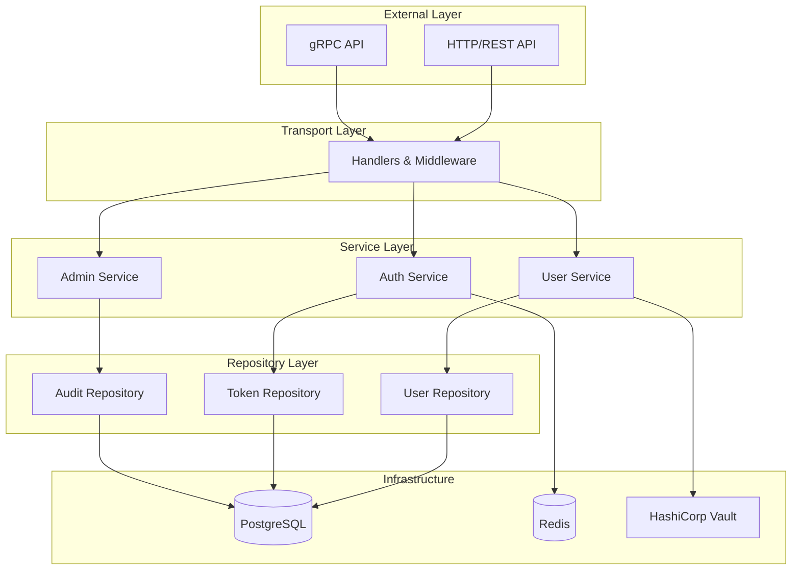

<div align="center">


# 🚀 Pandora Exchange

**Enterprise-Grade Cryptocurrency Exchange Platform**

[](https://go.dev/)
[](LICENSE)
[](./docs/testing.md)
[](https://github.com/pandora-exchange/pandora-exchange/actions)
[](./docs/README.md)

[Features](#-features) • [Architecture](#-architecture) • [Quick Start](#-quick-start) • [API](#-api-overview) • [Documentation](#-documentation)

</div>

---

## 📖 Overview

**Pandora Exchange** is a secure, scalable cryptocurrency exchange platform built with **Clean Architecture** principles. Currently in **Phase 1** (User Service), providing enterprise-grade authentication, authorization, and user management as the foundation for a complete digital asset exchange.

**Status:** 🎯 **Phase 1 Complete** (28/28 tasks) | **Production Ready**

---

## ✨ Features

### 🔐 Security & Authentication
- **Argon2id** password hashing (PHC winner)
- **JWT** with refresh token rotation (15 min access / 7 day refresh)
- **HashiCorp Vault** secrets management
- **Redis-backed** rate limiting (100 req/min global, 5 login attempts)
- **Immutable audit logs** (7-year retention for compliance)
- **RBAC** authorization (user/admin roles)

### 🏗️ Clean Architecture
- **Domain-Driven Design** - Independent business logic
- **Dependency Injection** - Interface-based design
- **Repository Pattern** - Clean data access layer
- **Service Layer** - Encapsulated business rules
- **Transport Layer** - REST + gRPC APIs
- **85%+ Test Coverage** - Unit & integration tests

### 📊 Observability
- **Prometheus** metrics (RED method: Rate, Errors, Duration)
- **OpenTelemetry** distributed tracing
- **Structured logging** (zerolog with trace correlation)
- **Health checks** (liveness/readiness probes)

### 🚀 Production Ready
- **Docker** containerization with multi-stage builds
- **Kubernetes** deployment manifests (base + overlays)
- **CI/CD** pipeline (GitHub Actions)
- **Swagger/OpenAPI 3.0** documentation
- **Multi-environment** support (dev/sandbox/audit/prod)
- **Database migrations** (golang-migrate)

---

## 🏛️ Architecture

Pandora Exchange follows **Clean Architecture** with clear layer separation:



**Key Principles:**
- Domain layer has no external dependencies
- Dependencies point inward (domain ← service ← transport)
- Interfaces defined by inner layers, implemented by outer layers
- Database details hidden behind repository interfaces

> 📚 See [ARCHITECTURE.md](./ARCHITECTURE.md) for detailed design documentation.

---

## 🛠️ Tech Stack

| Category | Technology | Purpose |
|----------|-----------|---------|
| **Language** | Go 1.21+ | High-performance backend |
| **HTTP Framework** | Fiber v2 | Fast HTTP server |
| **Database** | PostgreSQL 15 | Primary data store |
| **Cache** | Redis 7 | Caching, rate limiting, events |
| **RPC** | gRPC | Inter-service communication |
| **ORM** | sqlc | Type-safe SQL generation |
| **Migrations** | golang-migrate | Schema versioning |
| **Auth** | JWT + Argon2id | Tokens + password hashing |
| **Secrets** | HashiCorp Vault | Production secrets |
| **Metrics** | Prometheus | Time-series metrics |
| **Tracing** | OpenTelemetry | Distributed tracing |
| **Logging** | zerolog | Structured JSON logs |
| **Containers** | Docker + Compose | Development & deployment |
| **Orchestration** | Kubernetes | Production deployment |
| **CI/CD** | GitHub Actions | Automated testing & deployment |

---

## 🚀 Quick Start

### Prerequisites
- Go 1.21+
- Docker & Docker Compose
- Make

### Installation

```bash
# Clone repository
git clone https://github.com/pandora-exchange/pandora-exchange.git
cd pandora-exchange

# Start infrastructure (PostgreSQL + Redis)
make dev-up

# Run database migrations
make migrate-up

# Generate code (sqlc, mocks)
make generate

# Run tests
make test

# Start service
make run
```

**Service Endpoints:**
- REST API: `http://localhost:8080`
- Swagger UI: `http://localhost:8080/swagger`
- Health: `http://localhost:8080/health`
- Metrics: `http://localhost:8080/metrics`

### Quick Test

```bash
# Register a new user
curl -X POST http://localhost:8080/api/v1/auth/register \
  -H "Content-Type: application/json" \
  -d '{
    "email": "user@example.com",
    "password": "SecurePass123!",
    "first_name": "John",
    "last_name": "Doe"
  }'

# Login
curl -X POST http://localhost:8080/api/v1/auth/login \
  -H "Content-Type: application/json" \
  -d '{
    "email": "user@example.com",
    "password": "SecurePass123!"
  }'
```

> 📖 See [Quick Start Guide](./docs/QUICK_START.md) for detailed setup, configuration, and troubleshooting.

---

## 📡 API Overview

### REST Endpoints

**Authentication:**
- `POST /api/v1/auth/register` - Register new user
- `POST /api/v1/auth/login` - Login and get tokens
- `POST /api/v1/auth/refresh` - Refresh access token

**User Management:**
- `GET /api/v1/users/me` - Get current user profile
- `PATCH /api/v1/users/me` - Update profile
- `POST /api/v1/users/me/logout` - Logout current session
- `POST /api/v1/users/me/logout-all` - Logout all sessions

**Admin Operations:**
- `GET /api/v1/admin/users/:id` - Get user by ID
- `PATCH /api/v1/admin/users/:id/kyc` - Update KYC status
- `DELETE /api/v1/admin/users/:id` - Soft delete user

**System:**
- `GET /health` - Health check
- `GET /ready` - Readiness probe
- `GET /metrics` - Prometheus metrics

### gRPC Services

```protobuf
service UserService {
  rpc GetUser(GetUserRequest) returns (GetUserResponse);
  rpc GetUserByEmail(GetUserByEmailRequest) returns (GetUserResponse);
  rpc UpdateKYCStatus(UpdateKYCRequest) returns (UpdateKYCResponse);
  rpc ValidateUser(ValidateUserRequest) returns (ValidateUserResponse);
  rpc ListUsers(ListUsersRequest) returns (ListUsersResponse);
}
```

> 📡 See [API Documentation](./docs/API_DOCUMENTATION.md) for complete API reference with examples.

---

## 📁 Project Structure

```
pandora-exchange/
├── cmd/
│   └── user-service/          # Service entry point
├── internal/
│   ├── domain/                # Domain models, interfaces, errors
│   ├── service/               # Business logic layer
│   ├── repository/            # Data access layer (PostgreSQL)
│   ├── transport/             # HTTP & gRPC handlers
│   │   ├── http/              # REST API (Fiber)
│   │   └── grpc/              # gRPC server
│   ├── middleware/            # Auth, logging, rate limiting
│   ├── vault/                 # HashiCorp Vault integration
│   ├── observability/         # Metrics, tracing, logging
│   └── config/                # Configuration management
├── migrations/                # Database migrations (SQL)
├── deployments/
│   ├── docker/                # Docker Compose configs
│   └── k8s/                   # Kubernetes manifests
├── docs/                      # Documentation
├── tests/integration/         # Integration tests
└── pkg/                       # Shared utilities
```

---

## 🔐 Security Features

| Feature | Implementation | Details |
|---------|---------------|---------|
| **Password Hashing** | Argon2id | Memory-hard, side-channel resistant (64MB, 1 iteration, 4 threads) |
| **Authentication** | JWT | Access token (15 min) + Refresh token (7 days) with rotation |
| **Secrets** | HashiCorp Vault | Production secrets with automated rotation |
| **Rate Limiting** | Redis sliding window | 100 req/min (IP), 60 req/min (user), 5 login attempts/15min |
| **Audit Logging** | PostgreSQL | Immutable logs with 7-year retention (compliance) |
| **Authorization** | RBAC | Middleware-enforced role-based access control |
| **Input Validation** | Request validation | Email format, UUID validation, SQL injection prevention |
| **Network Security** | TLS 1.3 | Encrypted communication, mTLS planned for Phase 2 |

> 🔐 See [Security Guide](./docs/SECURITY.md) for comprehensive security documentation.

---

## 🧪 Testing & Quality

```bash
# Run all tests
make test

# Run with coverage
make coverage

# View coverage in browser
make coverage-html

# Run linters
make lint

# Security scan
make security
```

**Test Coverage:**
- Overall: **85%** (target: 80%)
- Critical paths: **95%+** (auth, user service)
- Unit tests + Integration tests + E2E tests

**Quality Tools:**
- `golangci-lint` - Comprehensive linting
- `gosec` - Security scanning
- `gofumpt` - Strict formatting
- `mockgen` - Mock generation for testing

---

## 🗺️ Roadmap

**Overall Progress:** 30% (28/58 tasks across 4 phases)

### Phase 1: User Service ✅ **100% Complete**
- ✅ Authentication & Authorization (JWT, Argon2id)
- ✅ User Management (CRUD operations)
- ✅ Vault Integration (secrets management)
- ✅ Rate Limiting & Audit Logging
- ✅ Observability (metrics, tracing, logging)
- ✅ CI/CD Pipeline
- ✅ Comprehensive Documentation

### Phase 2: Wallet Service (Q1 2025)
- Multi-currency wallets (BTC, ETH, USDT)
- HSM key management
- Deposit/withdrawal processing
- Blockchain integration (Bitcoin, Ethereum nodes)

### Phase 3: Trading Engine (Q2-Q3 2025)
- High-performance matching engine
- Order book management
- Real-time market data (WebSocket)
- Order types: limit, market, stop-loss

### Phase 4: Advanced Features (Q4 2025)
- Margin trading (2x, 5x, 10x leverage)
- Advanced order types (OCO, trailing stop, iceberg)
- API keys for trading bots
- Admin dashboard & analytics

> 🗺️ See [ROADMAP.md](./docs/ROADMAP.md) for detailed task breakdown and timelines.

---

## 📚 Documentation

### Getting Started
- 🚀 [Quick Start Guide](./docs/QUICK_START.md) - Installation, configuration, development
- 📡 [API Documentation](./docs/API_DOCUMENTATION.md) - Complete REST & gRPC reference
- 🏗️ [Architecture](./ARCHITECTURE.md) - System design, patterns, data models

### Developer Guides
- 🤝 [Contributing](./docs/CONTRIBUTING.md) - Workflow, code standards, PR process
- 🧪 [Testing Guide](./docs/testing.md) - Testing strategy, examples, coverage
- 🔐 [Security](./docs/SECURITY.md) - Security architecture, best practices

### Operations
- 🐳 [Docker Guide](./docs/DOCKER.md) - Container setup, Docker Compose
- ☸️ [Kubernetes](./deployments/k8s/README.md) - Deployment manifests
- 🔄 [CI/CD](./docs/CI_CD.md) - GitHub Actions pipeline

### Reference
- 🗺️ [Roadmap](./docs/ROADMAP.md) - Project phases, milestones, progress
- 📖 [Error Codes](./docs/errors.md) - Complete error catalog
- 📊 [Metrics](./docs/observability/prometheus-metrics.md) - Prometheus metrics catalog

---

## 🤝 Contributing

We welcome contributions! Please follow these steps:

1. Fork the repository
2. Create a feature branch (`git checkout -b feature/amazing-feature`)
3. Write tests (TDD approach - we maintain 80%+ coverage)
4. Commit changes (`git commit -m 'feat(auth): add 2FA support'`)
5. Push to branch (`git push origin feature/amazing-feature`)
6. Open a Pull Request

**Code Standards:**
- ✅ Follow [Conventional Commits](https://www.conventionalcommits.org/)
- ✅ Maintain 80%+ test coverage
- ✅ Pass `golangci-lint` checks
- ✅ Use `gofumpt` for formatting
- ✅ Update documentation for new features

> 🤝 See [Contributing Guide](./docs/CONTRIBUTING.md) for complete guidelines.

---

## 📄 License

This project is licensed under the **MIT License** - see [LICENSE](LICENSE) file.

---

## 👥 Team

**Maintainer:** Alex Necsoiu - [@alexnecsoiu](https://github.com/alexnecsoiu)

**Contributors:** See [CONTRIBUTORS.md](CONTRIBUTORS.md)

---

## 📞 Contact

- **Email:** dev@pandora-exchange.com
- **Security:** security@pandora-exchange.com
- **Issues:** [GitHub Issues](https://github.com/pandora-exchange/pandora-exchange/issues)
- **Discussions:** [GitHub Discussions](https://github.com/pandora-exchange/pandora-exchange/discussions)

---

<div align="center">

**Built with ❤️ by the Pandora Exchange Team**

⭐ Star us on GitHub if you find this project useful!

[⬆ Back to Top](#-pandora-exchange)

</div>
