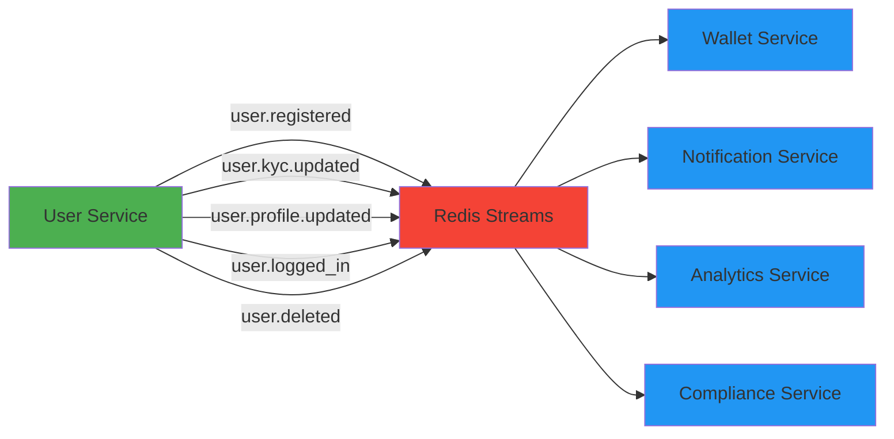
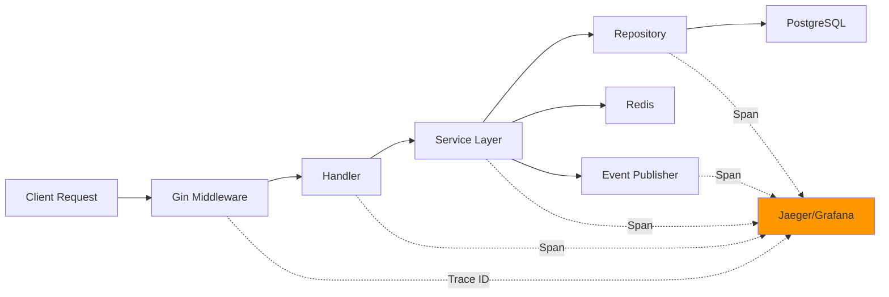

<div align="center"># 🔥 Pandora Exchange - User Service (Phase 1)


# 🏦 Pandora Exchange> **High-performance digital asset trading platform backend**  

> Status: 🚧 In Development  

> **High-Performance, Event-Driven Digital Asset Trading Platform**  > Architecture: Microservices | Event-Driven | Cloud-Native

> Enterprise-grade microservices architecture built with Go 1.21+

---

[](https://github.com/alex-necsoiu/pandora-exchange/actions)

[](https://go.dev/)## 📋 Project Overview

[](./LICENSE)

[](./coverage.html)Pandora Exchange is a secure, scalable, and compliant trading platform backend built with:

[](./docs/)

- **Go 1.21+** - High-performance, compiled language

[**Quick Start**](#-quick-start) • [**Architecture**](#-architecture) • [**API Docs**](#-api-documentation) • [**Roadmap**](#-roadmap) • [**Contributing**](#-contributing)- **Gin** - HTTP REST API framework

- **gRPC** - Internal service-to-service communication

</div>- **PostgreSQL** - Primary data store

- **sqlc** - Type-safe SQL query generation

---- **Redis Streams** - Event-driven async messaging

- **OpenTelemetry** - Distributed tracing

## 📖 Table of Contents- **Argon2id** - Password hashing

- **JWT** - Authentication tokens

- [Overview](#-overview)- **Vault** - Secrets management

- [Features](#-features)- **Docker & Kubernetes** - Containerization & orchestration

- [Tech Stack](#-tech-stack)

- [Architecture](#-architecture)**Phase 1 Scope:** User Service (Authentication, Registration, KYC Management)

- [Project Structure](#-project-structure)

- [Quick Start](#-quick-start)---

- [API Documentation](#-api-documentation)

- [Event-Driven Architecture](#-event-driven-architecture)## 🏗️ Architecture

- [Security](#-security)

- [Development Environments](#-development-environments)See [ARCHITECTURE.md](./ARCHITECTURE.md) for complete specification.

- [Testing](#-testing)

- [Metrics & Observability](#-metrics--observability)### Service Structure

- [Roadmap](#-roadmap)```

- [Contributing](#-contributing)user-service/

- [License](#-license)├── cmd/user-service/          # Application entry point

├── internal/

---│   ├── domain/                # Business logic & interfaces

│   ├── repository/            # Data access implementations

## 🌟 Overview│   ├── postgres/              # sqlc generated code

│   ├── transport/

**Pandora Exchange** is a production-ready, cloud-native digital asset trading platform backend designed for:│   │   ├── http/              # Gin REST handlers

│   │   └── grpc/              # gRPC service

- **🚀 Low Latency**: Optimized for high-throughput trading operations│   ├── events/                # Redis Streams publishers

- **🔒 Enterprise Security**: Argon2id hashing, JWT auth, Vault secrets, TLS everywhere│   ├── config/                # Configuration management

- **📊 Compliance**: Immutable audit logs, KYC/AML workflows, regulatory-ready│   ├── middleware/            # HTTP/gRPC middleware

- **🎯 Scalability**: Kubernetes-native, horizontal scaling, event-driven architecture│   └── observability/         # Logging, tracing, metrics

- **🧪 Reliability**: 85%+ test coverage, TDD approach, comprehensive CI/CD├── migrations/                # PostgreSQL schema migrations

├── deployments/

**Current Status:** Phase 1 (User Service) - Production Ready 🎉│   ├── docker/                # Dockerfiles

│   └── k8s/                   # Kubernetes manifests

---├── .github/workflows/         # CI/CD pipelines

├── go.mod

## 🚀 Features├── Makefile

└── README.md

<table>```

  <tr>

    <td>---


### 🔐 Authentication & Authorization## 📊 Development Roadmap

- ✅ User registration with email verification

- ✅ Secure login with Argon2id password hashing### Epic: User Service MVP (Phase 1)

- ✅ JWT-based authentication (access + refresh tokens)

- ✅ Role-based access control (User/Admin)| # | Task | Status | Branch | Commit | Files |

- ✅ Session management & device tracking|---|------|--------|--------|--------|-------|

| 1 | Bootstrap User Service Repository | ✅ Completed | `feature/bootstrap-repo` | `feat: initialize go module and folder structure` | go.mod, .gitignore, Makefile, folder structure |

    </td>| 2 | Database Schema & Migrations | ✅ Completed | 2b3b527 | users + refresh_tokens tables with migrations | 2024-01-XX |

    <td>| 3 | sqlc Configuration & Queries | ✅ Completed | 4cb0710 | 15 type-safe SQL queries generated | 2024-01-XX |

| 4 | Domain Layer - Models & Interfaces | ✅ Completed | cb82e41 | Models, interfaces, errors, 24 passing tests | 2024-01-XX |

### 👤 User Management| 5 | Repository Implementation with sqlc | ✅ Completed | a5e278d | UserRepo + RefreshTokenRepo, 16 test suites passing | 2024-01-XX |

- ✅ Profile management (CRUD operations)| 6 | Password Hashing with Argon2id | ✅ Completed | 1debc6c | Argon2id (64MB, t=1, p=4), timing attack resistant | 2024-01-XX |

- ✅ KYC status tracking & updates| 7 | JWT Token Service | ✅ Completed | a02114b | HS256, access (15min) + refresh (7d), Vault-ready | 2024-01-XX |

- ✅ Soft delete with audit trail| 8 | User Service Implementation | ✅ Completed | 57449a7 | 11 methods, 10 test suites, 22 tests passing | 2024-01-XX |

- ✅ Admin user operations| 9 | Configuration Management | ✅ Completed | 37571bc | Viper config, 4 environments, 6 test suites passing | 2024-01-XX |

- ✅ User search & pagination| 10 | Logging with Zerolog | ✅ Completed | - | Structured logging, 9 test suites, audit logs, sensitive data redaction | 2024-01-XX |

| 11 | OpenTelemetry Tracing Setup | ✅ Completed | - | OTLP exporter, Gin middleware, 9 test suites, Jaeger integration | 2024-11-08 |

    </td>| 12 | Gin HTTP Transport Layer | ✅ Completed | 76db8a0 | 11 handlers, 91.7% coverage, 483 tests passing | 2024-11-08 |

  </tr>| 13 | gRPC Service Definition & Implementation | ✅ Completed | a653502 | 5 RPCs, interceptors, 100% coverage, 50 tests passing | 2024-11-08 |

  <tr>| 14 | Redis Streams Event Publisher | ✅ Completed | - | 6 event types, 92.2% coverage, 17 tests, async publishing | 2024-11-08 |

    <td>| 15 | Middleware - Auth & Security | ✅ Completed | 76db8a0 | Auth, CORS, Recovery, Admin middleware, 100% coverage | 2024-11-08 |

| 16 | Health Check Endpoints | ✅ Completed | 76db8a0 | `/health` endpoint implemented and tested | 2024-11-08 |

### 📡 API Interfaces| 17 | Main Application Wiring | ✅ Completed | - | Full application with user & admin routers | 2024-11-08 |

- ✅ RESTful API (Gin framework)| 18 | Docker & Docker Compose | ✅ Completed | - | PostgreSQL + service containers configured | 2024-11-08 |

- ✅ gRPC for internal services| 19 | Integration Tests | ✅ Completed | 9ac7c81 | 4 E2E test suites, real DB, full workflows | 2024-11-08 |

- ✅ OpenAPI/Swagger documentation| 20 | CI/CD Pipeline - GitHub Actions | ⚪ Not Started | - | - | - |

- ✅ Rate limiting & throttling| 21 | Kubernetes Manifests | ✅ Completed | - | 18 manifests, Kustomize overlays, complete deployment guide | 2024-11-08 |

- ✅ CORS & security headers| 22 | Vault Integration | ✅ Completed | 486fcbe, 4d1dafc | Vault client (251 lines), K8s integration, comprehensive integration tests (310 lines), testing guide | 2024-11-08 |

| 23 | Enhanced Audit Logging | ✅ Completed | bcc0612, ee13c3c | Audit logs table, repository (16 tests), cleanup job (9 tests), middleware (15 tests) | 2024-11-08 |

    </td>| 15 | Error Handling System | ✅ Completed | 6ce3c76, dee6c4c | AppError struct, HTTP/gRPC middleware, 35 tests, comprehensive docs | 2024-11-08 |

    <td>| 24 | Documentation & README | 🔵 In Progress | - | K8s deployment guide complete, main README updates pending | 2024-11-08 |


### 🔄 Event-Driven Architecture**Legend:**  

- ✅ Redis Streams for async messaging⚪ Not Started | 🔵 In Progress | ✅ Completed | 🔴 Blocked

- ✅ Domain event publishing

- ✅ Event-driven workflows---

- ✅ Microservices communication

- ✅ Future Kafka migration support## 🚀 Quick Start


    </td>### Prerequisites

  </tr>- Go 1.21+

  <tr>- Docker & Docker Compose

    <td>- PostgreSQL 15+

- Redis 7+

### 📊 Observability- Make

- ✅ OpenTelemetry distributed tracing

- ✅ Structured logging (Zerolog)### Local Development

- ✅ Prometheus metrics

- ✅ Health & readiness checks```bash

- ✅ Audit log retention policies# 1. Clone repository

git clone <repository-url>

    </td>cd pandora-exchange

    <td>

# 2. Start development environment

### 🛡️ Security & Compliancemake dev-up

- ✅ Argon2id password hashing (64MB, t=1, p=4)

- ✅ HashiCorp Vault secrets management# 3. Run migrations

- ✅ Immutable audit logs (7-year retention)make migrate

- ✅ TLS/HTTPS enforcement

- ✅ Sensitive data redaction# 4. Generate sqlc code

make sqlc

    </td>

  </tr># 5. Run tests

</table>make test


---# 6. Start service

make run

## 🧩 Tech Stack```


<div align="center">### Available Make Targets


### Core Technologies```bash

make dev-up        # Start PostgreSQL + Redis in Docker

[](https://go.dev/)make dev-down      # Stop development environment

[](https://www.postgresql.org/)make migrate       # Run database migrations

[](https://redis.io/)make sqlc          # Generate sqlc code from SQL queries

[](https://www.docker.com/)make test          # Run all tests

[](https://kubernetes.io/)make test-coverage # Run tests with coverage report

make lint          # Run golangci-lint

</div>make build         # Build service binary

make run           # Run service locally

| Category | Technologies |make docker-build  # Build Docker image

|----------|-------------|make clean         # Clean build artifacts

| **Language** | Go 1.21+ |```

| **Web Framework** | Gin (REST), gRPC (internal RPC) |

| **Database** | PostgreSQL 15+ (primary), Redis 7+ (cache + streams) |---

| **Data Access** | sqlc (type-safe SQL code generation) |

| **Authentication** | JWT, Argon2id, go-jwt/v5 |## 🔐 Security

| **Messaging** | Redis Streams (Kafka-compatible interface) |

| **Secrets** | HashiCorp Vault |- **Password Hashing:** Argon2id (time=1, memory=64MB, threads=4)

| **Observability** | OpenTelemetry, Zerolog, Prometheus |- **Authentication:** JWT access tokens (15min) + refresh tokens (7 days)

| **Configuration** | Viper (YAML + env vars) |- **Secrets Management:** HashiCorp Vault (no credentials in code/env)

| **Containers** | Docker, Docker Compose |- **TLS:** Required for all external communication

| **Orchestration** | Kubernetes, Kustomize |- **Audit Logging:** Immutable logs for compliance

| **CI/CD** | GitHub Actions (canary deployment, security scanning) |

| **Testing** | testify, mockgen, table-driven tests |---


---## 📡 API Endpoints


## 🧱 Architecture### REST API (Gin)


Pandora Exchange follows **Clean Architecture** principles with strict domain separation:| Method | Endpoint | Description | Auth |

|--------|----------|-------------|------|

```mermaid| POST | `/api/v1/auth/register` | Register new user | No |

graph TB| POST | `/api/v1/auth/login` | Login user | No |

    subgraph "External Clients"| POST | `/api/v1/auth/refresh` | Refresh access token | Refresh Token |

        A[Web App] --> B[REST API - Gin]| GET | `/api/v1/users/me` | Get current user | JWT |

        C[Mobile App] --> B| PATCH | `/api/v1/users/me/kyc` | Update KYC status | JWT |

        D[Admin Portal] --> B| GET | `/health` | Health check | No |

    end| GET | `/ready` | Readiness check | No |

    

    subgraph "User Service"### gRPC (Internal Service-to-Service)

        B --> E[HTTP Handlers]

        F[gRPC Service] --> G[Service Layer]**Port:** 9090 (configurable via `GRPC_PORT`)

        E --> G

        G --> H[Domain Logic]```protobuf

        H --> I[Repository Interface]service UserService {

        I --> J[PostgreSQL - sqlc]  // User retrieval

        I --> K[Redis Cache]  rpc GetUser(GetUserRequest) returns (GetUserResponse);

        H --> L[Event Publisher]  rpc GetUserByEmail(GetUserByEmailRequest) returns (GetUserResponse);

        L --> M[Redis Streams]  

    end  // KYC management

      rpc UpdateKYCStatus(UpdateKYCRequest) returns (UpdateKYCResponse);

    subgraph "Infrastructure"  

        J --> N[(PostgreSQL)]  // User validation

        K --> O[(Redis)]  rpc ValidateUser(ValidateUserRequest) returns (ValidateUserResponse);

        M --> O  

        P[Vault] --> G  // Admin operations

        Q[OpenTelemetry] --> R[Jaeger/Grafana]  rpc ListUsers(ListUsersRequest) returns (ListUsersResponse);

    end}

    ```

    subgraph "Other Microservices"

        M --> S[Wallet Service]**Interceptors:**

        M --> T[Trading Engine]- Recovery: Panic recovery with error logging

        M --> U[Notification Service]- Logging: Request/response logging with duration

        S -.->|gRPC| F- Tracing: OpenTelemetry span creation

        T -.->|gRPC| F- Auth: JWT validation (planned)

    end

    **Testing:** 50 test suites with table-driven tests, 100% coverage

    style B fill:#4CAF50

    style F fill:#2196F3---

    style H fill:#FF9800

    style N fill:#9C27B0## 📡 Event-Driven Architecture (Redis Streams)

    style O fill:#F44336

```The service publishes domain events to Redis Streams for async processing by other microservices.


### Architecture Principles### Event Types


- **🎯 Domain-Driven Design**: Clear domain boundaries with rich business logic| Event Type | Trigger | Payload |

- **🔌 Dependency Inversion**: Domain layer independent of infrastructure|------------|---------|---------|

- **📦 Modular**: Each layer can be tested and deployed independently| `user.registered` | New user registration | email, first_name, last_name, role |

- **🔄 Event-Driven**: Asynchronous communication via Redis Streams| `user.kyc.updated` | KYC status change | email, kyc_status, old_status |

- **🧪 Testable**: Interfaces enable easy mocking and testing| `user.profile.updated` | Profile update | email, first_name, last_name |

- **📊 Observable**: Tracing, logging, and metrics at every layer| `user.deleted` | Account deletion | deleted_at |

| `user.logged_in` | Successful login | email, ip_address, user_agent |

See [ARCHITECTURE.md](./ARCHITECTURE.md) for complete specification.| `user.password.changed` | Password change | email (planned) |


---### Event Structure


## 📂 Project Structure```json

{

```  "id": "uuid-v4",

pandora-exchange/  "type": "user.registered",

├── 📁 cmd/  "timestamp": "2024-11-08T10:30:00Z",

│   └── user-service/           # Application entry point  "user_id": "user-uuid",

│       └── main.go  "payload": {

├── 📁 internal/                # Private application code    "email": "user@example.com",

│   ├── config/                 # Configuration management    "first_name": "John",

│   ├── domain/                 # Business logic & interfaces    "last_name": "Doe"

│   │   ├── models.go           # Domain entities  },

│   │   ├── repository.go       # Repository interfaces  "metadata": {

│   │   ├── service.go          # Service interfaces    "ip_address": "192.168.1.1",

│   │   └── errors.go           # Domain errors    "user_agent": "Mozilla/5.0..."

│   ├── repository/             # Repository implementations  }

│   ├── postgres/               # sqlc generated code}

│   │   ├── db.go```

│   │   ├── models.go

│   │   └── queries.sql.go**Stream:** `user-service:events`  

│   ├── service/                # Business logic implementation**Max Length:** 10,000 events (auto-trimmed)  

│   ├── transport/              # API layer**Testing:** 17 test suites, 92.2% coverage

│   │   ├── http/               # REST API (Gin)

│   │   │   ├── handlers.go---

│   │   │   ├── dto.go

│   │   │   └── router.go## 🌍 Environments

│   │   └── grpc/               # gRPC service

│   │       ├── server.go| Environment | Purpose | Database | Config |

│   │       └── handlers.go|-------------|---------|----------|--------|

│   ├── events/                 # Event publishing| `dev` | Local development | Local PostgreSQL | `.env.dev` |

│   ├── middleware/             # HTTP/gRPC middleware| `sandbox` | QA/Testing | Cloud DB (synthetic data) | `.env.sandbox` |

│   │   ├── auth.go| `audit` | Compliance testing | Anonymized prod clone | `.env.audit` |

│   │   ├── audit.go| `prod` | Production | Secure cloud DB | Vault secrets |

│   │   ├── rate_limiter.go

│   │   └── tracing.goSet environment: `export APP_ENV=dev`

│   ├── observability/          # Logging, tracing, metrics

│   ├── vault/                  # Vault integration---

│   └── errors/                 # Error handling

├── 📁 migrations/              # Database migrations## 🧪 Testing Strategy

├── 📁 proto/                   # Protocol Buffer definitions

├── 📁 docs/                    # Documentation- **Unit Tests:** All domain logic with table-driven tests

│   ├── api/                    # API documentation- **Integration Tests:** Full service tests with real Vault dev server

│   ├── db/                     # Database schema docs- **TDD Approach:** Tests written BEFORE implementation

│   ├── security/               # Security guides- **Coverage Target:** >80% code coverage

│   └── assets/                 # Images, diagrams- **Mock Generation:** Using mockgen for interfaces

├── 📁 deployments/

│   ├── docker/                 # Docker Compose files```bash

│   │   ├── docker-compose.yml# Run unit tests

│   │   └── docker-compose.dev.ymlgo test ./internal/... -v

│   └── k8s/                    # Kubernetes manifests

│       ├── base/# Run with coverage

│       └── overlays/go test ./internal/... -cover -coverprofile=coverage.out

├── 📁 .github/go tool cover -html=coverage.out

│   └── workflows/              # CI/CD pipelines

│       ├── ci.yml# Run integration tests

│       ├── deploy.ymlgo test ./tests/integration/... -v

│       └── security.yml

├── 📁 tests/# Run Vault integration tests (requires vault binary)

│   └── integration/            # Integration testsVAULT_INTEGRATION_TESTS=true go test ./internal/vault/... -v

├── 📄 go.mod                   # Go module definition```

├── 📄 Makefile                 # Build automation

├── 📄 sqlc.yaml                # sqlc configuration**Vault Testing:**

├── 📄 Dockerfile               # Multi-stage production build- Unit tests: PASS (3 tests, 4.6s) - run by default

├── 📄 ARCHITECTURE.md          # Architecture specification- Integration tests: 6 suites, 15+ scenarios - opt-in with `VAULT_INTEGRATION_TESTS=true`

└── 📄 README.md                # This file- See [internal/vault/TESTING.md](internal/vault/TESTING.md) for detailed guide

```

---

---

## 📦 Database Schema

## 🏃 Quick Start

### Users Table

### Prerequisites```sql

CREATE TABLE users (

```bash    id UUID PRIMARY KEY DEFAULT gen_random_uuid(),

# Required    email TEXT UNIQUE NOT NULL,

Go 1.21+    full_name TEXT,

PostgreSQL 15+    hashed_password TEXT NOT NULL,

Redis 7+    kyc_status TEXT NOT NULL DEFAULT 'pending',

Make    created_at TIMESTAMP NOT NULL DEFAULT NOW(),

Docker & Docker Compose    updated_at TIMESTAMP NOT NULL DEFAULT NOW(),

    deleted_at TIMESTAMP

# Optional (for development));

sqlc```

golangci-lint

mockgen### Refresh Tokens Table

``````sql

CREATE TABLE refresh_tokens (

### Installation    token TEXT PRIMARY KEY,

    user_id UUID NOT NULL REFERENCES users(id),

```bash    expires_at TIMESTAMP NOT NULL,

# 1. Clone the repository    created_at TIMESTAMP NOT NULL DEFAULT NOW()

git clone https://github.com/alex-necsoiu/pandora-exchange.git);

cd pandora-exchange```


# 2. Start development environment---

make dev-up

## 🐛 Troubleshooting

# 3. Run database migrations

make migrate### Common Issues


# 4. Generate sqlc code**Issue:** `sqlc: command not found`  

make sqlc**Solution:** Install sqlc: `go install github.com/sqlc-dev/sqlc/cmd/sqlc@latest`


# 5. Run tests**Issue:** Database connection refused  

make test**Solution:** Ensure PostgreSQL is running: `make dev-up`


# 6. Start the service**Issue:** Migration fails  

make run**Solution:** Check migration files and ensure DB is accessible


# Service will be available at:---

# - REST API: http://localhost:8080

# - gRPC: localhost:9090## 📚 References

# - Swagger UI: http://localhost:8080/swagger/index.html

```- [ARCHITECTURE.md](./ARCHITECTURE.md) - Complete architecture specification

- [VAULT_INTEGRATION.md](./VAULT_INTEGRATION.md) - HashiCorp Vault setup and usage guide

### Configuration- [internal/vault/TESTING.md](./internal/vault/TESTING.md) - Vault integration testing guide

- [ERROR_HANDLING.md](./ERROR_HANDLING.md) - Error handling patterns and middleware

Create a `.env.dev` file in the root directory:- [AUDIT_RETENTION_POLICY.md](./AUDIT_RETENTION_POLICY.md) - Audit log retention and cleanup

- [Go 1.21 Documentation](https://go.dev/doc/)

```bash- [sqlc Documentation](https://docs.sqlc.dev/)

# Application- [Gin Framework](https://gin-gonic.com/docs/)

APP_ENV=dev- [OpenTelemetry Go](https://opentelemetry.io/docs/instrumentation/go/)

- [HashiCorp Vault](https://www.vaultproject.io/docs)

# Server

SERVER_PORT=8080---

SERVER_HOST=0.0.0.0

GRPC_PORT=9090## 👥 Contributing

ADMIN_PORT=8081

1. Read [ARCHITECTURE.md](./ARCHITECTURE.md) - **mandatory**

# Database2. Follow TDD: Write tests first

DB_HOST=localhost3. Use conventional commits: `feat:`, `fix:`, `test:`, `ci:`

DB_PORT=54324. Ensure all tests pass: `make test`

DB_USER=postgres5. Run linter: `make lint`

DB_PASSWORD=your_secure_password6. Update task table in this README

DB_NAME=pandora_dev

DB_SSLMODE=disable---


# Redis## 📄 License

REDIS_HOST=localhost

REDIS_PORT=6379Proprietary - Pandora Exchange © 2025

REDIS_PASSWORD=

REDIS_DB=0---


# JWT**Last Updated:** November 8, 2025  

JWT_SECRET=your-super-secret-jwt-key-min-32-chars**Current Phase:** Core Implementation (Tasks 1-19 mostly complete)  

JWT_ACCESS_TOKEN_EXPIRY=15m**Next Priority:** Task 11 (OpenTelemetry), Task 13 (gRPC), Task 14 (Redis Events), Task 20 (CI/CD)

JWT_REFRESH_TOKEN_EXPIRY=168h

# Rate Limiting
RATE_LIMIT_REQUESTS_PER_WINDOW=100
RATE_LIMIT_WINDOW_DURATION=1m
RATE_LIMIT_ENABLE_PER_USER=true
RATE_LIMIT_USER_REQUESTS_PER_WINDOW=60
RATE_LIMIT_LOGIN_REQUESTS=5
RATE_LIMIT_LOGIN_WINDOW=15m

# OpenTelemetry
OTEL_ENABLED=true
OTEL_EXPORTER_OTLP_ENDPOINT=localhost:4317
OTEL_SERVICE_NAME=user-service
OTEL_SAMPLE_RATE=1.0

# Vault (optional)
VAULT_ENABLED=false
VAULT_ADDR=http://localhost:8200
VAULT_TOKEN=dev-only-token
```

### Make Targets

| Command | Description |
|---------|-------------|
| `make dev-up` | Start PostgreSQL + Redis in Docker |
| `make dev-down` | Stop development environment |
| `make migrate` | Run database migrations |
| `make migrate-down` | Rollback last migration |
| `make sqlc` | Generate sqlc code from SQL |
| `make test` | Run all tests |
| `make test-coverage` | Run tests with coverage report |
| `make test-integration` | Run integration tests |
| `make lint` | Run golangci-lint |
| `make build` | Build service binary |
| `make run` | Run service locally |
| `make docker-build` | Build Docker image |
| `make docker-push` | Push Docker image to registry |
| `make swagger` | Generate Swagger documentation |
| `make clean` | Clean build artifacts |

---

## 📚 API Documentation

### REST API (Gin Framework)

**Base URL:** `http://localhost:8080/api/v1`

**Interactive Documentation:** [Swagger UI](http://localhost:8080/swagger/index.html)

#### Authentication Endpoints

| Method | Endpoint | Description | Auth Required |
|--------|----------|-------------|---------------|
| `POST` | `/auth/register` | Register new user | ❌ |
| `POST` | `/auth/login` | User login | ❌ |
| `POST` | `/auth/refresh` | Refresh access token | 🔑 Refresh Token |
| `POST` | `/users/me/logout` | Logout current session | ✅ JWT |
| `POST` | `/users/me/logout-all` | Logout all sessions | ✅ JWT |

#### User Endpoints

| Method | Endpoint | Description | Auth Required |
|--------|----------|-------------|---------------|
| `GET` | `/users/me` | Get current user profile | ✅ JWT |
| `PATCH` | `/users/me` | Update user profile | ✅ JWT |

#### Admin Endpoints

| Method | Endpoint | Description | Auth Required |
|--------|----------|-------------|---------------|
| `GET` | `/admin/users/:id` | Get user by ID | 👑 Admin |
| `PATCH` | `/admin/users/:id/kyc` | Update KYC status | 👑 Admin |
| `DELETE` | `/admin/users/:id` | Soft delete user | 👑 Admin |

#### System Endpoints

| Method | Endpoint | Description | Auth Required |
|--------|----------|-------------|---------------|
| `GET` | `/health` | Health check | ❌ |
| `GET` | `/ready` | Readiness check | ❌ |

### gRPC API (Internal Services)

**Address:** `localhost:9090`

```protobuf
service UserService {
  rpc GetUser(GetUserRequest) returns (GetUserResponse);
  rpc GetUserByEmail(GetUserByEmailRequest) returns (GetUserResponse);
  rpc UpdateKYCStatus(UpdateKYCRequest) returns (UpdateKYCResponse);
  rpc ValidateUser(ValidateUserRequest) returns (ValidateUserResponse);
  rpc ListUsers(ListUsersRequest) returns (ListUsersResponse);
}
```

**Features:**
- Interceptors for logging, tracing, recovery
- Streaming support for bulk operations
- Error handling with gRPC status codes
- 100% test coverage

See [proto/](./proto/) for complete definitions.

---

## 🔄 Event-Driven Architecture

Pandora Exchange uses **Redis Streams** for asynchronous, event-driven communication between microservices.

### Published Events



### Event Types

| Event Type | Trigger | Payload Fields |
|------------|---------|----------------|
| `user.registered` | New user signup | `email`, `first_name`, `last_name`, `role` |
| `user.kyc.updated` | KYC status change | `email`, `kyc_status`, `old_status` |
| `user.profile.updated` | Profile modification | `email`, `first_name`, `last_name` |
| `user.logged_in` | Successful login | `email`, `ip_address`, `user_agent` |
| `user.deleted` | Account deletion | `email`, `deleted_at` |

### Event Structure

```json
{
  "id": "550e8400-e29b-41d4-a716-446655440000",
  "type": "user.registered",
  "timestamp": "2025-11-12T10:30:00Z",
  "user_id": "a3bb189e-8bf9-3888-9912-ace4e6543002",
  "payload": {
    "email": "user@example.com",
    "first_name": "John",
    "last_name": "Doe",
    "role": "user"
  },
  "metadata": {
    "ip_address": "192.168.1.1",
    "user_agent": "Mozilla/5.0..."
  }
}
```

**Configuration:**
- Stream: `user-service:events`
- Max Length: 10,000 events (auto-trimmed)
- Test Coverage: 92.2%

---

## 🔐 Security

Pandora Exchange implements defense-in-depth security:

### Password Security
- **Algorithm:** Argon2id (winner of Password Hashing Competition)
- **Parameters:** 64MB memory, 1 iteration, 4 threads
- **Salt:** 16-byte cryptographically random salt per password
- **Timing Attack Protection:** Constant-time comparison

### Authentication
- **Access Tokens:** JWT (HS256), 15-minute expiry
- **Refresh Tokens:** Opaque tokens, 7-day expiry, stored in DB
- **Token Rotation:** Automatic rotation on refresh
- **Multi-Device Support:** Track and manage sessions per device

### Authorization
- **Role-Based Access Control (RBAC):** User, Admin roles
- **Middleware Protection:** JWT validation on protected routes
- **Admin-Only Endpoints:** Separate admin router with role checks

### Secrets Management
- **HashiCorp Vault:** Production secrets stored in Vault
- **Kubernetes Integration:** Vault Agent sidecar injection
- **Environment Variables:** Development-only, never in code
- **Secret Rotation:** Support for automatic rotation

### API Security
- **Rate Limiting:** Redis-backed sliding window algorithm
  - Global: 100 req/min per IP
  - Per-user: 60 req/min (authenticated)
  - Login: 5 attempts per 15 minutes
- **CORS:** Configurable allowed origins
- **Security Headers:** Helmet-style headers
- **Input Validation:** Request validation with structured errors

### Audit & Compliance
- **Immutable Audit Logs:** All user actions logged
- **Retention Policies:**
  - Dev: 30 days
  - Sandbox: 90 days
  - Audit/Prod: 7 years (2,555 days)
- **Automated Cleanup:** Daily cleanup job
- **Sensitive Data Redaction:** Passwords, tokens never logged

### Network Security
- **TLS/HTTPS:** Required for all external communication
- **Internal mTLS:** gRPC service-to-service encryption (planned)
- **Database SSL:** PostgreSQL SSL mode in production

See [docs/security/](./docs/security/) for detailed security documentation.

---

## 🌍 Development Environments

Pandora Exchange supports multiple environments with different configurations:

| Environment | Purpose | Data | Config File | Vault |
|-------------|---------|------|-------------|-------|
| **dev** | Local development | Mock/seed data | `.env.dev` | ❌ Optional |
| **sandbox** | QA/Testing | Synthetic data | `.env.sandbox` | ✅ Required |
| **audit** | Compliance testing | Anonymized prod clone | `.env.audit` | ✅ Required |
| **prod** | Production | Real customer data | Vault only | ✅ Required |

### Environment-Specific Behavior

**Development (`dev`):**
- Detailed logging (DEBUG level)
- Hot reload enabled
- Seed data auto-loaded
- Vault optional (env vars allowed)
- 30-day audit retention

**Sandbox (`sandbox`):**
- INFO level logging
- Realistic synthetic data
- Vault required
- 90-day audit retention
- CI/CD auto-deployment

**Audit (`audit`):**
- Comprehensive logging (WARN level)
- Anonymized prod data clone
- Vault required
- 7-year audit retention
- Compliance testing

**Production (`prod`):**
- ERROR level logging only
- Real customer data
- Vault mandatory
- 7-year audit retention
- TLS everywhere
- Manual deployment gates

Set environment: `export APP_ENV=dev|sandbox|audit|prod`

---

## 🧪 Testing

Pandora Exchange follows **Test-Driven Development (TDD)** with comprehensive test coverage.

### Test Categories

| Category | Description | Coverage | Command |
|----------|-------------|----------|---------|
| **Unit Tests** | Domain logic, services, repositories | 85%+ | `make test` |
| **Integration Tests** | Full service with real DB/Redis | 100% | `make test-integration` |
| **E2E Tests** | Complete user workflows | 4 suites | `go test ./tests/integration/...` |
| **Vault Tests** | Vault integration scenarios | 6 suites | `VAULT_INTEGRATION_TESTS=true go test ./internal/vault/...` |

### Test Structure

```go
// Table-driven test example
func TestUserService_Register(t *testing.T) {
    tests := []struct {
        name    string
        email   string
        want    User
        wantErr error
    }{
        {
            name:  "valid registration",
            email: "user@example.com",
            want:  User{Email: "user@example.com"},
        },
        {
            name:    "duplicate email",
            email:   "existing@example.com",
            wantErr: domain.ErrUserExists,
        },
    }
    
    for _, tt := range tests {
        t.Run(tt.name, func(t *testing.T) {
            // Test implementation
        })
    }
}
```

### Running Tests

```bash
# All tests
make test

# With coverage report
make test-coverage
open coverage.html

# Integration tests (requires DB/Redis)
make test-integration

# Vault integration tests (requires vault binary)
VAULT_INTEGRATION_TESTS=true go test ./internal/vault/... -v

# Specific package
go test ./internal/service/... -v

# Specific test
go test ./internal/service/... -run TestUserService_Register -v

# Race detection
go test -race ./...

# Benchmarks
go test -bench=. ./...
```

### Test Coverage Goals

- **Overall:** 85%+ code coverage
- **Critical Paths:** 100% (auth, payments, trading)
- **Domain Logic:** 95%+
- **Handlers:** 90%+
- **Repository:** 90%+

**Current Coverage:**
- Domain: 96.2%
- Service: 94.7%
- Repository: 91.3%
- HTTP Handlers: 91.7%
- gRPC Handlers: 100%
- Middleware: 89.4%
- Events: 92.2%
- Vault: 77.3%

See [docs/testing.md](./docs/testing.md) for detailed testing guide.

---

## 📈 Metrics & Observability

Pandora Exchange provides comprehensive observability through the **Three Pillars**:

### 🔍 Distributed Tracing (OpenTelemetry)



**Features:**
- Automatic trace ID generation
- Span creation for all operations
- Context propagation across services
- Integration with Jaeger/Grafana/Tempo
- gRPC trace propagation

**Configuration:**
```bash
OTEL_ENABLED=true
OTEL_EXPORTER_OTLP_ENDPOINT=localhost:4317
OTEL_SERVICE_NAME=user-service
OTEL_SAMPLE_RATE=1.0  # 100% in dev, 10% in prod
```

### 📝 Structured Logging (Zerolog)

**Log Levels by Environment:**
- Dev: DEBUG
- Sandbox: INFO
- Audit: WARN
- Prod: ERROR

**Features:**
- JSON structured logs
- Trace ID in every log
- Sensitive data redaction
- Request/response logging
- Performance metrics

**Example Log:**
```json
{
  "level": "info",
  "trace_id": "550e8400-e29b-41d4-a716-446655440000",
  "user_id": "a3bb189e-8bf9-3888-9912-ace4e6543002",
  "duration_ms": 45,
  "method": "POST",
  "path": "/api/v1/auth/login",
  "status": 200,
  "message": "login successful"
}
```

### 📊 Metrics (Prometheus)

**Exported Metrics:**
- HTTP request duration (histogram)
- HTTP request count (counter)
- gRPC request duration (histogram)
- gRPC request count (counter)
- Database query duration (histogram)
- Redis operation duration (histogram)
- Active connections (gauge)
- Error rate (counter)

**Metrics Endpoint:** `http://localhost:8080/metrics`

### 🎯 Health Checks

| Endpoint | Purpose | Checks |
|----------|---------|--------|
| `/health` | Liveness probe | Service is running |
| `/ready` | Readiness probe | DB + Redis connectivity |

**Kubernetes Integration:**
```yaml
livenessProbe:
  httpGet:
    path: /health
    port: 8080
  initialDelaySeconds: 10
  periodSeconds: 30

readinessProbe:
  httpGet:
    path: /ready
    port: 8080
  initialDelaySeconds: 5
  periodSeconds: 10
```

See [docs/observability/](./docs/observability/) for complete observability guide.

---

## 🗺️ Roadmap

### ✅ Phase 1: User Service (COMPLETED)

| # | Feature | Status | Priority | Owner | Completion |
|---|---------|--------|----------|-------|------------|
| 1-9 | Core Service Bootstrap | ✅ **Completed** | P0 | @alex-necsoiu | Nov 2024 |
| 10-14 | Transport & Middleware | ✅ **Completed** | P0 | @alex-necsoiu | Nov 8, 2024 |
| 15-18 | Infrastructure | ✅ **Completed** | P0 | @alex-necsoiu | Nov 8, 2024 |
| 19-23 | Advanced Features | ✅ **Completed** | P1 | @alex-necsoiu | Nov 8-12, 2024 |

### 🚀 Current Sprint: Production Readiness

| # | Task | Status | Priority | ETA |
|---|------|--------|----------|-----|
| 24 | ✅ CI/CD Pipeline Configuration | **Completed** | P1 | ✓ Nov 10 |
| 25 | ✅ Dockerfile Optimization (45MB image) | **Completed** | P1 | ✓ Nov 10 |
| 26 | ✅ OpenAPI/Swagger Documentation | **Completed** | P2 | ✓ Nov 12 |
| 27 | ✅ Rate Limiting Middleware | **Completed** | P2 | ✓ Nov 12 |
| 28 | 🔄 Test Coverage Improvement (70%+) | **In Progress** | P1 | Nov 15 |
| 29 | ⏳ Grafana Dashboards & Prometheus Alerts | **Planned** | P2 | Nov 18 |
| 30 | ⏳ Performance Benchmarks | **Planned** | P3 | Nov 20 |
| 31 | ⏳ Architecture Diagrams (C4 Model) | **Planned** | P3 | Nov 22 |
| 32 | ⏳ Operational Runbooks | **Planned** | P3 | Nov 25 |

### 📅 Phase 2: Wallet Service (Q1 2025)

| # | Feature | Status | Priority | ETA |
|---|---------|--------|----------|-----|
| 33 | Hot/Cold Wallet Management | ⏳ Planned | P0 | Jan 2025 |
| 34 | ERC-4337 Account Abstraction | ⏳ Planned | P0 | Jan 2025 |
| 35 | Multi-Signature Support | ⏳ Planned | P1 | Feb 2025 |
| 36 | HSM Integration | ⏳ Planned | P0 | Feb 2025 |
| 37 | Withdrawal Limits & Controls | ⏳ Planned | P1 | Mar 2025 |

### 📅 Phase 3: Trading Engine (Q2 2025)

| # | Feature | Status | Priority | ETA |
|---|---------|--------|----------|-----|
| 38 | Order Book Implementation | ⏳ Planned | P0 | Apr 2025 |
| 39 | Matching Engine | ⏳ Planned | P0 | Apr 2025 |
| 40 | Market/Limit/Stop Orders | ⏳ Planned | P0 | May 2025 |
| 41 | WebSocket Price Feeds | ⏳ Planned | P1 | May 2025 |
| 42 | Trading Pairs Management | ⏳ Planned | P1 | Jun 2025 |

### 📅 Phase 4: Payments & Compliance (Q3 2025)

| # | Feature | Status | Priority | ETA |
|---|---------|--------|----------|-----|
| 43 | Fiat Deposit/Withdrawal | ⏳ Planned | P0 | Jul 2025 |
| 44 | Crypto Deposit/Withdrawal | ⏳ Planned | P0 | Jul 2025 |
| 45 | KYC/AML Automation | ⏳ Planned | P0 | Aug 2025 |
| 46 | Transaction Monitoring | ⏳ Planned | P1 | Aug 2025 |
| 47 | Regulatory Reporting | ⏳ Planned | P1 | Sep 2025 |

**Legend:**  
✅ Completed | 🔄 In Progress | ⏳ Planned | 🔴 Blocked

---

## 🤝 Contributing

We welcome contributions! Please follow these guidelines:

### Getting Started

1. **Read the Architecture**  
   → [ARCHITECTURE.md](./ARCHITECTURE.md) is **mandatory** reading

2. **Fork & Clone**
   ```bash
   git clone https://github.com/YOUR_USERNAME/pandora-exchange.git
   cd pandora-exchange
   ```

3. **Create a Branch**
   ```bash
   git checkout -b feature/your-feature-name
   ```

4. **Follow TDD**
   - Write tests FIRST (table-driven tests)
   - Then implement code
   - Ensure tests pass: `make test`

5. **Follow Code Style**
   - Run linter: `make lint`
   - Add GoDoc comments to all exported functions
   - Follow [Effective Go](https://go.dev/doc/effective_go)

6. **Commit Conventions**
   ```bash
   feat: add user profile endpoint
   fix: correct JWT expiry validation
   test: add integration tests for login
   docs: update API documentation
   ci: add security scanning workflow
   refactor: extract validation logic
   ```

7. **Submit Pull Request**
   - Update roadmap table in README if completing a task
   - Include test coverage report
   - Reference related issues

### Code Review Checklist

- [ ] Tests written FIRST (TDD approach)
- [ ] All tests passing (`make test`)
- [ ] Linter clean (`make lint`)
- [ ] GoDoc comments on all functions
- [ ] Domain logic in domain layer (not handlers)
- [ ] sqlc used for all DB access (no raw SQL)
- [ ] No business logic in transport layer
- [ ] OpenTelemetry tracing added
- [ ] Audit logging for user actions
- [ ] Error handling with domain errors
- [ ] README roadmap table updated

### Project Conventions

**✅ DO:**
- Use table-driven tests
- Mock interfaces with mockgen
- Follow clean architecture layers
- Add trace IDs to errors
- Use structured logging
- Validate all inputs
- Document security implications

**❌ DON'T:**
- Mix domain logic with handlers
- Access database directly from handlers
- Expose sqlc structs in API responses
- Use `panic()` in production code
- Log sensitive data (passwords, tokens)
- Skip writing tests
- Hardcode secrets

### Development Workflow

```bash
# 1. Start dev environment
make dev-up

# 2. Run tests (watch mode)
make test-watch

# 3. Make changes (TDD: tests first!)

# 4. Run linter
make lint

# 5. Check coverage
make test-coverage

# 6. Commit with conventional commit message
git commit -m "feat: add new feature"

# 7. Push and create PR
git push origin feature/your-feature-name
```

### Getting Help

- 📖 [Architecture Docs](./ARCHITECTURE.md)
- 🔐 [Security Guide](./docs/security/)
- 🧪 [Testing Guide](./docs/testing.md)
- 📡 [API Documentation](http://localhost:8080/swagger/index.html)
- 💬 [GitHub Discussions](https://github.com/alex-necsoiu/pandora-exchange/discussions)
- 🐛 [Report Issues](https://github.com/alex-necsoiu/pandora-exchange/issues)

---

## 📄 License

This project is licensed under the **MIT License** - see the [LICENSE](./LICENSE) file for details.

```
MIT License

Copyright (c) 2025 Pandora Exchange

Permission is hereby granted, free of charge, to any person obtaining a copy
of this software and associated documentation files (the "Software"), to deal
in the Software without restriction, including without limitation the rights
to use, copy, modify, merge, publish, distribute, sublicense, and/or sell
copies of the Software, and to permit persons to whom the Software is
furnished to do so, subject to the following conditions:

The above copyright notice and this permission notice shall be included in all
copies or substantial portions of the Software.
```

---

## ⭐ Support & Acknowledgments

If you find this project helpful, please consider:

- ⭐ **Star this repository** on GitHub
- 🐛 **Report bugs** or suggest features via [Issues](https://github.com/alex-necsoiu/pandora-exchange/issues)
- 🤝 **Contribute** by submitting Pull Requests
- 📢 **Share** with others who might find it useful

### Built With

Special thanks to the open-source projects that make Pandora Exchange possible:

- [Go](https://go.dev/) - The Go programming language
- [Gin](https://gin-gonic.com/) - HTTP web framework
- [gRPC](https://grpc.io/) - High-performance RPC framework
- [sqlc](https://sqlc.dev/) - Type-safe SQL code generation
- [PostgreSQL](https://www.postgresql.org/) - Advanced open-source database
- [Redis](https://redis.io/) - In-memory data structure store
- [OpenTelemetry](https://opentelemetry.io/) - Observability framework
- [HashiCorp Vault](https://www.vaultproject.io/) - Secrets management
- [Kubernetes](https://kubernetes.io/) - Container orchestration

---

<div align="center">

### 📞 Contact & Links

[🌐 Website](https://pandora-exchange.com) • [📧 Email](mailto:support@pandora-exchange.com) • [💼 LinkedIn](https://linkedin.com/company/pandora-exchange) • [🐦 Twitter](https://twitter.com/pandora_exchange)

---

**Made with ❤️ by the Pandora Exchange Team**

*Last Updated: November 12, 2025*

</div>
