# Architecture Diagrams

> **Visual documentation for Pandora Exchange User Service**  
> **Last Updated:** November 8, 2025

---

## Overview

This directory contains Mermaid diagrams documenting the architecture, workflows, and integrations of the Pandora Exchange platform.

**Why Mermaid?**
- ✅ Version controlled (text-based, Git-friendly)
- ✅ Renders in GitHub, GitLab, Markdown viewers
- ✅ Easy to update (no external tools required)
- ✅ Consistent styling
- ✅ No binary files

**Viewing Diagrams:**
- **GitHub/GitLab:** Automatic rendering in README files
- **VS Code:** Install [Markdown Preview Mermaid Support](https://marketplace.visualstudio.com/items?itemName=bierner.markdown-mermaid)
- **IntelliJ/GoLand:** Built-in Mermaid support in Markdown preview
- **Online:** [Mermaid Live Editor](https://mermaid.live/)

---

## Diagram Index

| Diagram | Type | Description | Complexity |
|---------|------|-------------|------------|
| **[User Registration Flow](#user-registration-flow)** | Sequence | User registration process | Simple |
| **[Authentication Flow](#authentication-flow)** | Sequence | Login and token refresh | Medium |
| **[Clean Architecture](#clean-architecture)** | Flowchart | Layer dependencies | Simple |
| **[Event Publishing Flow](#event-publishing-flow)** | Sequence | Event-driven architecture | Medium |

---

## User Registration Flow

**Purpose:** Document the complete user registration process including validation, password hashing, database storage, and event publishing.


**Key Flows:**
1. **Happy Path:** User registration succeeds, event published
2. **Validation Error:** Invalid input rejected before database access
3. **Duplicate Email:** Database constraint enforced, transaction rolled back

---

## Authentication Flow

**Purpose:** Document JWT-based authentication including login, token refresh, and token rotation.


**Key Flows:**
1. **Login:** Credentials validated, tokens generated and stored
2. **Token Refresh:** Old refresh token revoked, new tokens issued (rotation)
3. **Error Cases:** Invalid credentials, expired tokens, token theft detection

**Security Features:**
- Passwords hashed with Argon2id (never stored plaintext)
- JWT secret retrieved from Vault (never hardcoded)
- Refresh tokens are one-time use (rotation prevents replay attacks)
- Refresh tokens hashed before database storage

---

## Clean Architecture

**Purpose:** Document the layered architecture and dependency rules (Inner layers know nothing about outer layers).

```mermaid
flowchart TD
    subgraph External["🌐 External Layer"]
        Client[Client Applications]
        DB[(PostgreSQL)]
        Vault[HashiCorp Vault]
        Queue[Message Queue]
    end
    
    subgraph Transport["📡 Transport Layer (Outer)"]
        HTTP[HTTP Handlers<br/>Gin Router]
        GRPC[gRPC Handlers<br/>Planned]
        Middleware[Middleware<br/>Auth, Logging, etc.]
    end
    
    subgraph Service["⚙️ Service Layer (Application)"]
        UserService[User Service<br/>Business Logic]
        AuditService[Audit Cleanup Job]
    end
    
    subgraph Domain["💼 Domain Layer (Core)"]
        Models[Domain Models<br/>User, RefreshToken, AuditLog]
        Interfaces[Interfaces<br/>UserRepository, EventPublisher]
        Errors[Domain Errors<br/>ErrUserNotFound, etc.]
    end
    
    subgraph Infra["🔧 Infrastructure Layer (Outer)"]
        UserRepo[User Repository<br/>PostgreSQL impl]
        AuditRepo[Audit Repository<br/>PostgreSQL impl]
        EventPub[Event Publisher<br/>RabbitMQ impl]
        VaultClient[Vault Client]
    end
    
    Client -->|HTTP Requests| HTTP
    Client -->|gRPC Requests| GRPC
    
    HTTP --> Middleware
    GRPC --> Middleware
    Middleware -->|Calls| UserService
    
    UserService -->|Uses| Interfaces
    UserService -->|Returns| Models
    UserService -->|Throws| Errors
    
    AuditService -->|Uses| Interfaces
    
    UserRepo -->|Implements| Interfaces
    AuditRepo -->|Implements| Interfaces
    EventPub -->|Implements| Interfaces
    
    UserRepo -->|Queries| DB
    AuditRepo -->|Queries| DB
    VaultClient -->|Fetches Secrets| Vault
    EventPub -->|Publishes| Queue
    
    style Domain fill:#e1f5ff,stroke:#01579b,stroke-width:3px
    style Service fill:#fff9c4,stroke:#f57f17,stroke-width:2px
    style Transport fill:#f3e5f5,stroke:#4a148c,stroke-width:2px
    style Infra fill:#e8f5e9,stroke:#1b5e20,stroke-width:2px
    style External fill:#fce4ec,stroke:#880e4f,stroke-width:2px
    
    classDef coreStyle fill:#bbdefb,stroke:#0d47a1
    class Models,Interfaces,Errors coreStyle
```



**Dependency Rules:**

```
Domain (Core)
    ↑
    │ depends on
    │
Service Layer
    ↑
    │ depends on
    │
Transport Layer → Infrastructure Layer
    ↑                    ↑
    │                    │
External Systems ←───────┘
```

**Key Principles:**
1. **Domain Layer** (innermost):
   - No external dependencies
   - Pure business logic
   - Defines interfaces (ports)
   - Stable, rarely changes

2. **Service Layer**:
   - Orchestrates domain logic
   - Depends only on domain interfaces
   - Transaction boundaries
   - Use cases implementation

3. **Transport Layer** (HTTP, gRPC):
   - Adapters for external communication
   - Maps DTOs ↔ Domain models
   - Input validation
   - Error mapping

4. **Infrastructure Layer**:
   - Implements domain interfaces
   - Database access (sqlc)
   - Event publishing
   - External service clients

**Benefits:**
- ✅ Testable (mock interfaces easily)
- ✅ Framework-independent core
- ✅ Database-independent core
- ✅ Easy to swap implementations

---

## Event Publishing Flow

**Purpose:** Document event-driven architecture for async operations and cross-service communication.


**Event Schema:**

```json
{
  "event_id": "550e8400-e29b-41d4-a716-446655440000",
  "event_type": "user.registered",
  "timestamp": "2025-11-08T10:30:00Z",
  "data": {
    "user_id": "550e8400-e29b-41d4-a716-446655440000",
    "email": "alice@example.com",
    "first_name": "Alice",
    "last_name": "Smith",
    "role": "user"
  },
  "metadata": {
    "service": "user-service",
    "version": "1.2.3"
  }
}
```

**Event Types:**
- `user.registered` - New user created
- `user.profile.updated` - Profile changed
- `user.kyc.updated` - KYC status changed
- `user.deleted` - User account deleted
- `user.logged_in` - User authenticated

**Benefits:**
- ✅ Loose coupling between services
- ✅ Async processing (non-blocking)
- ✅ Scalability (add consumers independently)
- ✅ Reliability (message queue guarantees delivery)
- ✅ Audit trail (all events logged)

---

## Editing Diagrams

### Mermaid Syntax

**Sequence Diagram:**


**Flowchart:**


**Learn More:**
- [Mermaid Documentation](https://mermaid.js.org/intro/)
- [Mermaid Live Editor](https://mermaid.live/) (test diagrams)

---

## Contributing

**Adding a new diagram:**

1. **Create .mmd file** (optional, for complex diagrams)
   ```bash
   touch docs/diagrams/new-diagram.mmd
   ```

2. **Write Mermaid syntax**
   ```mermaid
   flowchart TD
       A --> B
   ```

3. **Add to this README**
   - Update diagram index table
   - Add section with diagram + description

4. **Test rendering**
   - Preview in VS Code / IntelliJ
   - Or paste into [Mermaid Live](https://mermaid.live/)

5. **Submit PR**
   - Include screenshot of rendered diagram in PR description

---

## References

- [Mermaid Documentation](https://mermaid.js.org/)
- [Mermaid Live Editor](https://mermaid.live/)
- [ARCHITECTURE.md](../../ARCHITECTURE.md) - System architecture
- [User Service Documentation](../services/user-service.md)

---

**Last Updated:** November 8, 2025  
**Maintained By:** Engineering Team
