# JWT Token Rotation

> **Token rotation policy and implementation for Pandora Exchange**  
> **Last Updated:** November 8, 2025

---

## Overview

Pandora Exchange implements automatic JWT refresh token rotation to enhance security by limiting the lifetime of authentication credentials and detecting token theft.

**Key Benefits:**
- Reduces window of exposure if refresh token is compromised
- Detects replay attacks (reuse of old refresh tokens)
- Enables token revocation (user logout, suspicious activity)
- Provides audit trail of all token usage

---

## Token Types

### Access Token

**Purpose:** Short-lived token for API authentication

**Characteristics:**
- **Lifetime:** 15 minutes (configurable via `JWT_ACCESS_EXPIRY`)
- **Storage:** Client-side (memory, **never localStorage**)
- **Algorithm:** HS256 (HMAC with SHA-256)
- **Revocation:** Not stored, cannot be revoked (short expiry mitigates risk)

**Claims:**
```json
{
  "user_id": "550e8400-e29b-41d4-a716-446655440000",
  "email": "alice@example.com",
  "role": "user",
  "exp": 1699451400,
  "iat": 1699450500
}
```

### Refresh Token

**Purpose:** Long-lived token for obtaining new access tokens

**Characteristics:**
- **Lifetime:** 7 days (configurable via `JWT_REFRESH_EXPIRY`)
- **Storage:** Database (hashed), client-side (HTTPOnly cookie or secure storage)
- **Algorithm:** HS256
- **Revocation:** Can be revoked (database DELETE)
- **One-time use:** Invalidated on refresh (rotation)

**Database Schema:**
```sql
CREATE TABLE refresh_tokens (
    id UUID PRIMARY KEY DEFAULT gen_random_uuid(),
    user_id UUID NOT NULL REFERENCES users(id) ON DELETE CASCADE,
    token_hash TEXT NOT NULL UNIQUE,
    expires_at TIMESTAMP NOT NULL,
    created_at TIMESTAMP DEFAULT NOW()
);

CREATE INDEX idx_refresh_tokens_user_id ON refresh_tokens(user_id);
CREATE INDEX idx_refresh_tokens_expires_at ON refresh_tokens(expires_at);
```

---

## Token Rotation Flow

### Automatic Rotation

```mermaid
sequenceDiagram
    participant Client
    participant API
    participant DB

    Note over Client: Access token expired (15 min)
    
    Client->>API: POST /auth/refresh<br/>{refresh_token: "abc123..."}
    
    API->>DB: Validate refresh token hash
    
    alt Valid refresh token
        DB-->>API: Token found, not expired
        
        API->>DB: DELETE old refresh token
        API->>API: Generate new access token (15 min)
        API->>API: Generate new refresh token (7 days)
        API->>DB: INSERT new refresh token hash
        
        API-->>Client: {access_token: "xyz...", refresh_token: "def..."}
        
        Note over Client: Use new access token<br/>Store new refresh token
    else Invalid/expired refresh token
        DB-->>API: Token not found or expired
        API-->>Client: 401 Unauthorized<br/>"Invalid or expired refresh token"
        
        Note over Client: Redirect to login
    end
```



### Token Theft Detection

**Scenario:** Attacker steals refresh token, tries to use it

```
1. Legitimate user:   POST /auth/refresh (token: abc123)
   → Server: Generate new tokens (access: xyz, refresh: def456)
   → Server: DELETE abc123 from database
   
2. Attacker (stolen token): POST /auth/refresh (token: abc123)
   → Server: Token abc123 not found in database
   → Server: 401 Unauthorized
   → Server: (Optional) Log suspicious activity, alert user
```

**Detection Signals:**
- Refresh token reuse (token not in database)
- Multiple refresh attempts with same token
- Refresh from unusual IP/location
- Rapid refresh attempts (DDoS)

---

## Implementation

### Login (Initial Token Generation)

```go
// POST /auth/login
func (h *UserHandler) Login(c *gin.Context) {
    var req LoginRequest
    if err := c.ShouldBindJSON(&req); err != nil {
        c.JSON(400, gin.H{"error": "Invalid request"})
        return
    }

    // Validate credentials
    user, err := h.service.ValidateCredentials(c.Request.Context(), req.Email, req.Password)
    if err != nil {
        c.JSON(401, gin.H{"error": "Invalid credentials"})
        return
    }

    // Generate access token (15 min)
    accessToken, err := h.tokenService.GenerateAccessToken(user)
    if err != nil {
        c.JSON(500, gin.H{"error": "Failed to generate token"})
        return
    }

    // Generate refresh token (7 days)
    refreshToken, err := h.tokenService.GenerateRefreshToken(user)
    if err != nil {
        c.JSON(500, gin.H{"error": "Failed to generate token"})
        return
    }

    // Store refresh token in database (hashed)
    if err := h.service.StoreRefreshToken(c.Request.Context(), user.ID, refreshToken); err != nil {
        c.JSON(500, gin.H{"error": "Failed to store token"})
        return
    }

    c.JSON(200, LoginResponse{
        AccessToken:  accessToken,
        RefreshToken: refreshToken,
        ExpiresIn:    900, // 15 minutes in seconds
    })
}
```

### Token Refresh (Rotation)

```go
// POST /auth/refresh
func (h *UserHandler) RefreshToken(c *gin.Context) {
    var req RefreshTokenRequest
    if err := c.ShouldBindJSON(&req); err != nil {
        c.JSON(400, gin.H{"error": "Invalid request"})
        return
    }

    // Validate refresh token
    userID, err := h.service.ValidateRefreshToken(c.Request.Context(), req.RefreshToken)
    if err != nil {
        if errors.Is(err, domain.ErrInvalidToken) {
            // Token not found or expired - possible theft
            logger.Warn().
                Str("ip", c.ClientIP()).
                Msg("Attempted reuse of invalid refresh token")
        }
        c.JSON(401, gin.H{"error": "Invalid or expired refresh token"})
        return
    }

    // Get user
    user, err := h.service.GetUserByID(c.Request.Context(), userID)
    if err != nil {
        c.JSON(401, gin.H{"error": "Invalid token"})
        return
    }

    // Revoke old refresh token (one-time use)
    if err := h.service.RevokeRefreshToken(c.Request.Context(), req.RefreshToken); err != nil {
        c.JSON(500, gin.H{"error": "Failed to revoke token"})
        return
    }

    // Generate new access token (15 min)
    newAccessToken, err := h.tokenService.GenerateAccessToken(user)
    if err != nil {
        c.JSON(500, gin.H{"error": "Failed to generate token"})
        return
    }

    // Generate new refresh token (7 days)
    newRefreshToken, err := h.tokenService.GenerateRefreshToken(user)
    if err != nil {
        c.JSON(500, gin.H{"error": "Failed to generate token"})
        return
    }

    // Store new refresh token in database
    if err := h.service.StoreRefreshToken(c.Request.Context(), user.ID, newRefreshToken); err != nil {
        c.JSON(500, gin.H{"error": "Failed to store token"})
        return
    }

    c.JSON(200, RefreshTokenResponse{
        AccessToken:  newAccessToken,
        RefreshToken: newRefreshToken,
        ExpiresIn:    900,
    })
}
```

### Logout (Token Revocation)

```go
// POST /auth/logout
func (h *UserHandler) Logout(c *gin.Context) {
    var req LogoutRequest
    if err := c.ShouldBindJSON(&req); err != nil {
        c.JSON(400, gin.H{"error": "Invalid request"})
        return
    }

    // Revoke refresh token
    if err := h.service.RevokeRefreshToken(c.Request.Context(), req.RefreshToken); err != nil {
        // Log error but don't fail (token may already be revoked)
        logger.Warn().Err(err).Msg("Failed to revoke refresh token")
    }

    c.JSON(200, gin.H{"message": "Logged out successfully"})
}
```

---

## Token Storage

### Server-Side

**Refresh Tokens:**
- ✅ Hashed before storage (SHA-256)
- ✅ Stored in `refresh_tokens` table
- ✅ Indexed by user_id for efficient lookup
- ✅ Cascade delete when user is deleted

**Access Tokens:**
- ❌ **Not stored** on server (stateless)
- ✅ Validated by signature only
- ✅ Short expiry (15 min) mitigates theft risk

### Client-Side

**Best Practices:**

**✅ Recommended:**
- Store access token in memory (React state, Vuex store)
- Store refresh token in HTTPOnly cookie (not accessible via JavaScript)
- Use secure flag for cookies (HTTPS only)
- Use SameSite=Strict for CSRF protection

**❌ Avoid:**
- Storing tokens in localStorage (vulnerable to XSS)
- Storing tokens in sessionStorage (vulnerable to XSS)
- Sending tokens in URL query params (logged in access logs)

**Example (React):**
```javascript
// ✅ Good: Memory storage
const [accessToken, setAccessToken] = useState(null);

// ✅ Good: HTTPOnly cookie for refresh token
fetch('/auth/login', {
  method: 'POST',
  credentials: 'include', // Send cookies
  body: JSON.stringify({email, password})
});

// ❌ Bad: localStorage
localStorage.setItem('access_token', token); // XSS vulnerable
```

---

## Token Expiry Configuration

### Environment Variables

```bash
# Access token expiry (default: 15 minutes)
JWT_ACCESS_EXPIRY=15m

# Refresh token expiry (default: 7 days)
JWT_REFRESH_EXPIRY=168h

# JWT signing secret (from Vault in production)
JWT_SECRET=your-secret-key-min-32-bytes
```

### Recommendations by Environment

| Environment | Access Token | Refresh Token | Rationale |
|-------------|--------------|---------------|-----------|
| **Development** | 1 hour | 30 days | Reduce login frequency |
| **Sandbox** | 15 minutes | 7 days | Production-like |
| **Production** | 15 minutes | 7 days | Security vs UX balance |

### Adjusting Token Lifetime

**Shorter access tokens:**
- ✅ Reduces exposure window
- ✅ Faster revocation (user disabled)
- ❌ More frequent refresh requests

**Longer access tokens:**
- ✅ Fewer refresh requests (better UX)
- ❌ Wider exposure window
- ❌ Slower revocation

**Recommendation:** 15 minutes balances security and user experience.

---

## Token Revocation

### Manual Revocation

**User-initiated:**
```bash
# Logout (revoke single refresh token)
curl -X POST https://api.pandora.exchange/auth/logout \
  -H "Content-Type: application/json" \
  -d '{"refresh_token": "abc123..."}'
```

**Admin-initiated:**
```sql
-- Revoke all refresh tokens for a user
DELETE FROM refresh_tokens WHERE user_id = '550e8400-e29b-41d4-a716-446655440000';
```

### Automatic Revocation

**Triggers:**
1. User logout
2. User deleted
3. Token expired (background job)
4. Password changed (invalidate all sessions)
5. Suspicious activity detected

**Cleanup Job:**
```go
// Delete expired refresh tokens (runs every hour)
func (s *UserService) CleanupExpiredTokens(ctx context.Context) error {
    query := `DELETE FROM refresh_tokens WHERE expires_at < NOW()`
    _, err := s.db.ExecContext(ctx, query)
    return err
}
```

---

## Security Considerations

### Token Hashing

**Always hash refresh tokens before storage:**

```go
import "crypto/sha256"

func hashToken(token string) string {
    hash := sha256.Sum256([]byte(token))
    return hex.EncodeToString(hash[:])
}

// Store
tokenHash := hashToken(refreshToken)
db.Insert(refreshTokens, tokenHash)

// Validate
providedHash := hashToken(providedToken)
storedToken := db.FindByHash(providedHash)
```

**Why hash?**
- Database compromise doesn't leak usable tokens
- Additional layer of defense in depth

### Token Entropy

**Generate cryptographically secure random tokens:**

```go
import "crypto/rand"

func generateRandomToken() (string, error) {
    b := make([]byte, 32) // 256 bits
    if _, err := rand.Read(b); err != nil {
        return "", err
    }
    return base64.URLEncoding.EncodeToString(b), nil
}
```

**❌ Insecure:**
```go
token := fmt.Sprintf("%d", time.Now().Unix()) // Predictable!
```

### Rate Limiting

**Protect refresh endpoint from abuse:**

```go
// Max 5 refresh attempts per user per minute
rateLimit := middleware.RateLimiter{
    Limit: 5,
    Window: time.Minute,
    KeyFunc: func(c *gin.Context) string {
        return c.GetString("user_id") // From JWT
    },
}

router.POST("/auth/refresh", rateLimit.Middleware(), handlers.RefreshToken)
```

---

## Testing Token Rotation

### Unit Tests

```go
func TestRefreshToken_Success(t *testing.T) {
    // Setup
    user := createTestUser(t)
    oldRefreshToken := generateRefreshToken(t, user)
    storeRefreshToken(t, user.ID, oldRefreshToken)

    // Execute
    resp := POST("/auth/refresh", map[string]string{
        "refresh_token": oldRefreshToken,
    })

    // Assert
    assert.Equal(t, 200, resp.StatusCode)
    assert.NotEmpty(t, resp.AccessToken)
    assert.NotEmpty(t, resp.RefreshToken)
    assert.NotEqual(t, oldRefreshToken, resp.RefreshToken) // Rotated

    // Old token should be revoked
    _, err := validateRefreshToken(oldRefreshToken)
    assert.ErrorIs(t, err, domain.ErrInvalidToken)
}

func TestRefreshToken_ReuseDetection(t *testing.T) {
    user := createTestUser(t)
    refreshToken := generateRefreshToken(t, user)
    storeRefreshToken(t, user.ID, refreshToken)

    // First refresh succeeds
    resp1 := POST("/auth/refresh", map[string]string{"refresh_token": refreshToken})
    assert.Equal(t, 200, resp1.StatusCode)

    // Reuse of old token fails
    resp2 := POST("/auth/refresh", map[string]string{"refresh_token": refreshToken})
    assert.Equal(t, 401, resp2.StatusCode)
    assert.Contains(t, resp2.Error, "Invalid or expired refresh token")
}
```

### Integration Tests

```go
func TestTokenRotation_E2E(t *testing.T) {
    // 1. Register user
    registerResp := POST("/auth/register", RegisterRequest{
        Email:     "test@example.com",
        Password:  "SecurePass123!",
        FirstName: "Test",
        LastName:  "User",
    })
    assert.Equal(t, 201, registerResp.StatusCode)

    // 2. Login
    loginResp := POST("/auth/login", LoginRequest{
        Email:    "test@example.com",
        Password: "SecurePass123!",
    })
    assert.Equal(t, 200, loginResp.StatusCode)
    
    accessToken1 := loginResp.AccessToken
    refreshToken1 := loginResp.RefreshToken

    // 3. Use access token
    profileResp := GET("/users/me", accessToken1)
    assert.Equal(t, 200, profileResp.StatusCode)

    // 4. Refresh tokens
    refreshResp := POST("/auth/refresh", map[string]string{
        "refresh_token": refreshToken1,
    })
    assert.Equal(t, 200, refreshResp.StatusCode)
    
    accessToken2 := refreshResp.AccessToken
    refreshToken2 := refreshResp.RefreshToken
    
    assert.NotEqual(t, accessToken1, accessToken2)
    assert.NotEqual(t, refreshToken1, refreshToken2)

    // 5. Old tokens should not work
    oldTokenResp := GET("/users/me", accessToken1)
    assert.Equal(t, 401, oldTokenResp.StatusCode) // Expired

    oldRefreshResp := POST("/auth/refresh", map[string]string{
        "refresh_token": refreshToken1,
    })
    assert.Equal(t, 401, oldRefreshResp.StatusCode) // Revoked

    // 6. New tokens should work
    newProfileResp := GET("/users/me", accessToken2)
    assert.Equal(t, 200, newProfileResp.StatusCode)
}
```

---

## Monitoring & Alerts

### Metrics to Track

```go
// Prometheus metrics
var (
    refreshTokensIssued = prometheus.NewCounter(prometheus.CounterOpts{
        Name: "refresh_tokens_issued_total",
        Help: "Total number of refresh tokens issued",
    })

    refreshTokensRevoked = prometheus.NewCounter(prometheus.CounterOpts{
        Name: "refresh_tokens_revoked_total",
        Help: "Total number of refresh tokens revoked",
    })

    refreshTokenReuseAttempts = prometheus.NewCounter(prometheus.CounterOpts{
        Name: "refresh_token_reuse_attempts_total",
        Help: "Total number of refresh token reuse attempts (security event)",
    })

    refreshTokenValidationDuration = prometheus.NewHistogram(prometheus.HistogramOpts{
        Name:    "refresh_token_validation_duration_seconds",
        Help:    "Time to validate refresh token",
        Buckets: prometheus.DefBuckets,
    })
)
```

### Alerts

**Critical:**
- High rate of refresh token reuse attempts (possible attack)
- Refresh token validation errors spike (database issue)

**Warning:**
- Refresh token expiry approaching (UX issue)
- Unusual refresh patterns (anomaly detection)

---

## References

- [OWASP Token Storage Cheat Sheet](https://cheatsheetseries.owasp.org/cheatsheets/HTML5_Security_Cheat_Sheet.html#local-storage)
- [RFC 6749: OAuth 2.0](https://datatracker.ietf.org/doc/html/rfc6749)
- [RFC 7519: JSON Web Tokens](https://datatracker.ietf.org/doc/html/rfc7519)

---

**Last Updated:** November 8, 2025  
**Owner:** Security Team
