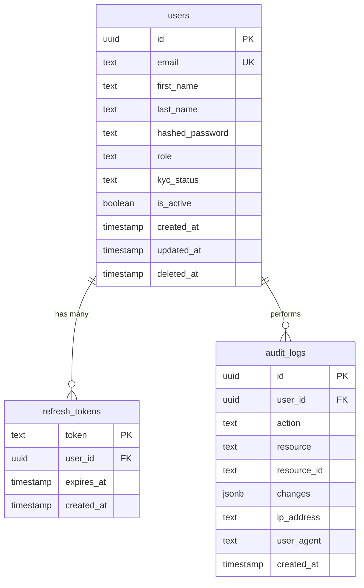

# User Service Documentation

> **Service:** User Service  
> **Version:** 1.0  
> **Status:** ✅ Production Ready  
> **Phase:** Phase 1 (Initial Implementation)  
> **Last Updated:** November 8, 2025

---

## Table of Contents

1. [Overview](#overview)
2. [Responsibilities](#responsibilities)
3. [Architecture](#architecture)
4. [Database Schema](#database-schema)
5. [API Endpoints](#api-endpoints)
6. [Domain Events](#domain-events)
7. [Authentication & Authorization](#authentication--authorization)
8. [Error Handling](#error-handling)
9. [Testing](#testing)
10. [Configuration](#configuration)
11. [Deployment](#deployment)
12. [Monitoring & Observability](#monitoring--observability)

---

## Overview

The User Service is the foundational microservice for Pandora Exchange, handling all user-related operations including authentication, authorization, profile management, and KYC workflows.

### Key Features
- ✅ User registration with email validation
- ✅ Secure authentication (JWT + refresh tokens)
- ✅ Password hashing with Argon2id
- ✅ KYC status management
- ✅ Profile management (CRUD operations)
- ✅ Admin operations (user management)
- ✅ Audit logging for compliance
- ✅ Event-driven architecture (Redis Streams)
- ✅ Secret management (HashiCorp Vault)

### Technology Stack
| Component | Technology | Version |
|-----------|------------|---------|
| Language | Go | 1.21+ |
| Web Framework | Gin | Latest |
| Database | PostgreSQL | 15+ |
| Data Access | sqlc | Latest |
| Cache/Events | Redis | 7+ |
| Auth | JWT + Argon2id | - |
| Secrets | HashiCorp Vault | Latest |
| Logging | Zerolog | Latest |
| Tracing | OpenTelemetry | Latest |

---

## Responsibilities

### Core Responsibilities
1. **User Management**
   - Create, read, update, delete user accounts
   - Soft delete for compliance (audit trail)
   - Profile management

2. **Authentication**
   - User registration with email/password
   - Login with JWT access tokens (15 min expiry)
   - Refresh tokens (7 day expiry)
   - Password hashing with Argon2id
   - Token validation and renewal

3. **Authorization**
   - Role-based access control (user, admin)
   - JWT middleware for protected routes
   - Admin-only endpoint protection

4. **KYC Management**
   - Track KYC status (pending, verified, rejected)
   - KYC status updates
   - KYC event publishing

5. **Audit & Compliance**
   - Immutable audit logs for all operations
   - Automatic log cleanup (retention policy)
   - PII redaction in logs

6. **Event Publishing**
   - Publish domain events to Redis Streams
   - Event types: user.registered, user.kyc.updated, etc.
   - Event consumers (other microservices)

### Boundaries (What This Service Does NOT Do)
- ❌ Wallet operations (Wallet Service)
- ❌ Trading/orders (Trading Engine)
- ❌ Payments (Payments Service)
- ❌ Notifications (Notification Service)
- ❌ Direct service-to-service calls (use events or gRPC)

---

## Architecture

### Clean Architecture Layers

```
┌─────────────────────────────────────────────────┐
│             Transport Layer                      │
│  ┌──────────────┐         ┌──────────────┐     │
│  │  HTTP (Gin)  │         │  gRPC (TBD)  │     │
│  └──────────────┘         └──────────────┘     │
└─────────────────────────────────────────────────┘
                    │
                    ▼
┌─────────────────────────────────────────────────┐
│          Application/Service Layer               │
│  ┌──────────────────────────────────────┐       │
│  │      UserService (business logic)    │       │
│  └──────────────────────────────────────┘       │
└─────────────────────────────────────────────────┘
                    │
                    ▼
┌─────────────────────────────────────────────────┐
│              Domain Layer                        │
│  ┌──────────┐  ┌──────────┐  ┌──────────┐      │
│  │   User   │  │  Errors  │  │  Events  │      │
│  └──────────┘  └──────────┘  └──────────┘      │
└─────────────────────────────────────────────────┘
                    │
                    ▼
┌─────────────────────────────────────────────────┐
│          Infrastructure Layer                    │
│  ┌──────────────┐  ┌──────────────┐            │
│  │  Repository  │  │    Events    │            │
│  │   (sqlc)     │  │(Redis Streams)│           │
│  └──────────────┘  └──────────────┘            │
└─────────────────────────────────────────────────┘
```

**Dependency Rule:** Inner layers know nothing about outer layers.
- Domain layer is pure business logic (no infrastructure imports)
- Service layer orchestrates domain + repositories
- Transport layer only handles HTTP/gRPC (no business logic)

### Directory Structure

```
internal/
├── config/              # Configuration management
│   ├── config.go
│   └── config_test.go
├── domain/              # Domain models & interfaces (pure Go)
│   ├── models.go        # User, RefreshToken structs
│   ├── errors.go        # Domain errors (sentinel errors)
│   ├── events.go        # Event definitions
│   ├── repository.go    # Repository interfaces
│   ├── service.go       # Service interface
│   └── *_test.go
├── postgres/            # sqlc generated code
│   ├── db.go
│   ├── models.go        # sqlc models (NOT exposed to API)
│   ├── queries/         # SQL query files
│   │   ├── users.sql
│   │   ├── refresh_tokens.sql
│   │   └── audit_logs.sql
│   └── *.sql.go         # Generated query code
├── repository/          # Repository implementations
│   ├── user_repository.go
│   ├── refresh_token_repository.go
│   ├── audit_repository.go
│   └── *_test.go
├── service/             # Business logic layer
│   ├── user_service.go
│   ├── audit_cleanup_job.go
│   └── *_test.go
├── transport/           # Delivery layer
│   ├── http/            # REST API (Gin)
│   │   ├── user_handlers.go
│   │   ├── admin_handlers.go
│   │   ├── router.go
│   │   └── *_test.go
│   └── grpc/            # gRPC (planned)
├── events/              # Event publishing
│   ├── publisher.go
│   └── publisher_test.go
├── middleware/          # HTTP middleware
│   ├── auth.go          # JWT authentication
│   ├── admin.go         # Admin role check
│   ├── error.go         # Error handling
│   ├── audit.go         # Audit logging
│   └── *_test.go
├── observability/       # Logging & tracing
│   ├── logger.go
│   ├── tracer.go
│   └── *_test.go
└── vault/               # Vault integration
    ├── client.go
    ├── integration_test.go
    └── TESTING.md
```

---

## Database Schema

### Tables

#### 1. `users` Table

```sql
CREATE TABLE users (
    id UUID PRIMARY KEY DEFAULT gen_random_uuid(),
    email TEXT UNIQUE NOT NULL,
    first_name TEXT,
    last_name TEXT,
    hashed_password TEXT NOT NULL,
    role TEXT NOT NULL DEFAULT 'user',
    kyc_status TEXT NOT NULL DEFAULT 'pending',
    is_active BOOLEAN NOT NULL DEFAULT true,
    created_at TIMESTAMP NOT NULL DEFAULT NOW(),
    updated_at TIMESTAMP NOT NULL DEFAULT NOW(),
    deleted_at TIMESTAMP
);

CREATE INDEX idx_users_email ON users(email) WHERE deleted_at IS NULL;
CREATE INDEX idx_users_role ON users(role);
CREATE INDEX idx_users_kyc_status ON users(kyc_status);
```

**Columns:**
| Column | Type | Constraints | Description |
|--------|------|-------------|-------------|
| `id` | UUID | PRIMARY KEY | Unique user identifier |
| `email` | TEXT | UNIQUE, NOT NULL | User email (login credential) |
| `first_name` | TEXT | - | User's first name |
| `last_name` | TEXT | - | User's last name |
| `hashed_password` | TEXT | NOT NULL | Argon2id hashed password |
| `role` | TEXT | NOT NULL | User role (`user`, `admin`) |
| `kyc_status` | TEXT | NOT NULL | KYC status (`pending`, `verified`, `rejected`) |
| `is_active` | BOOLEAN | NOT NULL | Account active status |
| `created_at` | TIMESTAMP | NOT NULL | Account creation timestamp |
| `updated_at` | TIMESTAMP | NOT NULL | Last update timestamp |
| `deleted_at` | TIMESTAMP | NULL | Soft delete timestamp |

**Business Rules:**
- Email must be unique (case-insensitive enforced at application level)
- Passwords hashed with Argon2id (never stored in plaintext)
- Soft delete preserves audit trail (set `deleted_at`)
- Default role is `user` (admin must be set explicitly)
- Default KYC status is `pending`

#### 2. `refresh_tokens` Table

```sql
CREATE TABLE refresh_tokens (
    token TEXT PRIMARY KEY,
    user_id UUID NOT NULL REFERENCES users(id) ON DELETE CASCADE,
    expires_at TIMESTAMP NOT NULL,
    created_at TIMESTAMP NOT NULL DEFAULT NOW()
);

CREATE INDEX idx_refresh_tokens_user_id ON refresh_tokens(user_id);
CREATE INDEX idx_refresh_tokens_expires_at ON refresh_tokens(expires_at);
```

**Columns:**
| Column | Type | Constraints | Description |
|--------|------|-------------|-------------|
| `token` | TEXT | PRIMARY KEY | Refresh token (hashed) |
| `user_id` | UUID | FOREIGN KEY | Reference to users.id |
| `expires_at` | TIMESTAMP | NOT NULL | Token expiration |
| `created_at` | TIMESTAMP | NOT NULL | Token creation timestamp |

**Business Rules:**
- Tokens expire after 7 days (configurable)
- Cascading delete when user deleted
- One token per device/session (future enhancement)
- Expired tokens cleaned up periodically

#### 3. `audit_logs` Table

```sql
CREATE TABLE audit_logs (
    id UUID PRIMARY KEY DEFAULT gen_random_uuid(),
    user_id UUID REFERENCES users(id),
    action TEXT NOT NULL,
    resource TEXT NOT NULL,
    resource_id TEXT,
    changes JSONB,
    ip_address TEXT,
    user_agent TEXT,
    created_at TIMESTAMP NOT NULL DEFAULT NOW()
);

CREATE INDEX idx_audit_logs_user_id ON audit_logs(user_id);
CREATE INDEX idx_audit_logs_action ON audit_logs(action);
CREATE INDEX idx_audit_logs_created_at ON audit_logs(created_at DESC);
```

**Columns:**
| Column | Type | Constraints | Description |
|--------|------|-------------|-------------|
| `id` | UUID | PRIMARY KEY | Audit log entry ID |
| `user_id` | UUID | FOREIGN KEY | User who performed action |
| `action` | TEXT | NOT NULL | Action type (e.g., `user.created`) |
| `resource` | TEXT | NOT NULL | Resource type (e.g., `user`) |
| `resource_id` | TEXT | - | Resource identifier |
| `changes` | JSONB | - | Change details |
| `ip_address` | TEXT | - | Client IP address |
| `user_agent` | TEXT | - | Client user agent |
| `created_at` | TIMESTAMP | NOT NULL | Log entry timestamp |

**Business Rules:**
- Immutable (no updates or deletes except cleanup job)
- Retention period: 90 days (configurable)
- PII redacted from changes JSON
- Automatic cleanup via scheduled job

### Entity Relationships



---

## API Endpoints

### REST API (Gin)

**Base URL:** `http://localhost:8080/api/v1`

#### Authentication Endpoints

##### POST `/auth/register`
Register a new user account.

**Request Body:**
```json
{
  "email": "user@example.com",
  "password": "SecurePassword123!",
  "first_name": "John",
  "last_name": "Doe"
}
```

**Response (201 Created):**
```json
{
  "id": "550e8400-e29b-41d4-a716-446655440000",
  "email": "user@example.com",
  "first_name": "John",
  "last_name": "Doe",
  "role": "user",
  "kyc_status": "pending",
  "is_active": true,
  "created_at": "2025-11-08T10:00:00Z"
}
```

**Errors:**
- `400` - Invalid input (email format, password too weak)
- `409` - User already exists

---

##### POST `/auth/login`
Authenticate user and return JWT tokens.

**Request Body:**
```json
{
  "email": "user@example.com",
  "password": "SecurePassword123!"
}
```

**Response (200 OK):**
```json
{
  "access_token": "eyJhbGciOiJIUzI1NiIs...",
  "refresh_token": "refresh_token_here",
  "expires_in": 900,
  "user": {
    "id": "550e8400-e29b-41d4-a716-446655440000",
    "email": "user@example.com",
    "first_name": "John",
    "last_name": "Doe",
    "role": "user",
    "kyc_status": "pending"
  }
}
```

**Errors:**
- `400` - Invalid input
- `401` - Invalid credentials
- `404` - User not found

---

##### POST `/auth/refresh`
Refresh access token using refresh token.

**Request Body:**
```json
{
  "refresh_token": "refresh_token_here"
}
```

**Response (200 OK):**
```json
{
  "access_token": "eyJhbGciOiJIUzI1NiIs...",
  "refresh_token": "new_refresh_token_here",
  "expires_in": 900
}
```

**Errors:**
- `400` - Invalid input
- `401` - Invalid or expired refresh token

---

#### User Profile Endpoints (Requires JWT)

##### GET `/users/me`
Get current user's profile.

**Headers:**
```
Authorization: Bearer <access_token>
```

**Response (200 OK):**
```json
{
  "id": "550e8400-e29b-41d4-a716-446655440000",
  "email": "user@example.com",
  "first_name": "John",
  "last_name": "Doe",
  "role": "user",
  "kyc_status": "verified",
  "is_active": true,
  "created_at": "2025-11-08T10:00:00Z",
  "updated_at": "2025-11-08T11:00:00Z"
}
```

**Errors:**
- `401` - Unauthorized (missing or invalid token)

---

##### PUT `/users/me`
Update current user's profile.

**Headers:**
```
Authorization: Bearer <access_token>
```

**Request Body:**
```json
{
  "first_name": "Jane",
  "last_name": "Smith"
}
```

**Response (200 OK):**
```json
{
  "id": "550e8400-e29b-41d4-a716-446655440000",
  "email": "user@example.com",
  "first_name": "Jane",
  "last_name": "Smith",
  "role": "user",
  "kyc_status": "verified",
  "is_active": true,
  "created_at": "2025-11-08T10:00:00Z",
  "updated_at": "2025-11-08T12:00:00Z"
}
```

**Errors:**
- `400` - Invalid input
- `401` - Unauthorized

---

##### PATCH `/users/me/kyc`
Update current user's KYC status (self-update limited to submitting documents).

**Headers:**
```
Authorization: Bearer <access_token>
```

**Request Body:**
```json
{
  "kyc_status": "pending"
}
```

**Response (200 OK):**
```json
{
  "id": "550e8400-e29b-41d4-a716-446655440000",
  "email": "user@example.com",
  "kyc_status": "pending",
  "updated_at": "2025-11-08T12:30:00Z"
}
```

**Errors:**
- `400` - Invalid KYC status
- `401` - Unauthorized
- `403` - Forbidden (cannot set to 'verified' without admin)

---

##### DELETE `/users/me`
Soft delete current user's account.

**Headers:**
```
Authorization: Bearer <access_token>
```

**Response (204 No Content)**

**Errors:**
- `401` - Unauthorized

---

#### Admin Endpoints (Requires Admin JWT)

##### GET `/admin/users`
List all users (paginated).

**Headers:**
```
Authorization: Bearer <admin_access_token>
```

**Query Parameters:**
- `page` (default: 1)
- `limit` (default: 20, max: 100)
- `role` (filter by role)
- `kyc_status` (filter by KYC status)

**Response (200 OK):**
```json
{
  "users": [
    {
      "id": "550e8400-e29b-41d4-a716-446655440000",
      "email": "user@example.com",
      "first_name": "John",
      "last_name": "Doe",
      "role": "user",
      "kyc_status": "verified",
      "is_active": true,
      "created_at": "2025-11-08T10:00:00Z"
    }
  ],
  "total": 100,
  "page": 1,
  "limit": 20
}
```

**Errors:**
- `401` - Unauthorized
- `403` - Forbidden (not admin)

---

##### GET `/admin/users/:id`
Get user by ID (admin only).

**Headers:**
```
Authorization: Bearer <admin_access_token>
```

**Response (200 OK):**
```json
{
  "id": "550e8400-e29b-41d4-a716-446655440000",
  "email": "user@example.com",
  "first_name": "John",
  "last_name": "Doe",
  "role": "user",
  "kyc_status": "verified",
  "is_active": true,
  "created_at": "2025-11-08T10:00:00Z",
  "updated_at": "2025-11-08T11:00:00Z"
}
```

**Errors:**
- `401` - Unauthorized
- `403` - Forbidden (not admin)
- `404` - User not found

---

##### PUT `/admin/users/:id/kyc`
Admin update user's KYC status.

**Headers:**
```
Authorization: Bearer <admin_access_token>
```

**Request Body:**
```json
{
  "kyc_status": "verified"
}
```

**Response (200 OK):**
```json
{
  "id": "550e8400-e29b-41d4-a716-446655440000",
  "email": "user@example.com",
  "kyc_status": "verified",
  "updated_at": "2025-11-08T13:00:00Z"
}
```

**Errors:**
- `400` - Invalid KYC status
- `401` - Unauthorized
- `403` - Forbidden (not admin)
- `404` - User not found

---

##### DELETE `/admin/users/:id`
Admin soft delete user.

**Headers:**
```
Authorization: Bearer <admin_access_token>
```

**Response (204 No Content)**

**Errors:**
- `401` - Unauthorized
- `403` - Forbidden (not admin)
- `404` - User not found

---

#### Health Endpoints

##### GET `/health`
Service health check.

**Response (200 OK):**
```json
{
  "status": "healthy",
  "timestamp": "2025-11-08T14:00:00Z",
  "version": "1.0.0",
  "checks": {
    "database": "healthy",
    "redis": "healthy",
    "vault": "healthy"
  }
}
```

---

## Domain Events

### Event Publishing

All domain events are published to Redis Streams for asynchronous processing by other services.

**Stream Name:** `user-service:events`  
**Max Length:** 10,000 events (auto-trimmed)

### Event Types

#### 1. `user.registered`
Published when a new user registers.

**Payload:**
```json
{
  "id": "event-uuid",
  "type": "user.registered",
  "timestamp": "2025-11-08T10:00:00Z",
  "user_id": "user-uuid",
  "payload": {
    "email": "user@example.com",
    "first_name": "John",
    "last_name": "Doe",
    "role": "user"
  },
  "metadata": {
    "ip_address": "192.168.1.1",
    "user_agent": "Mozilla/5.0..."
  }
}
```

**Consumers:**
- Notification Service (send welcome email)
- Analytics Service (track new users)

---

#### 2. `user.kyc.updated`
Published when KYC status changes.

**Payload:**
```json
{
  "id": "event-uuid",
  "type": "user.kyc.updated",
  "timestamp": "2025-11-08T12:00:00Z",
  "user_id": "user-uuid",
  "payload": {
    "email": "user@example.com",
    "kyc_status": "verified",
    "old_status": "pending"
  },
  "metadata": {
    "admin_id": "admin-uuid"
  }
}
```

**Consumers:**
- Notification Service (notify user of KYC decision)
- Wallet Service (enable trading if verified)

---

#### 3. `user.profile.updated`
Published when user profile is updated.

**Payload:**
```json
{
  "id": "event-uuid",
  "type": "user.profile.updated",
  "timestamp": "2025-11-08T13:00:00Z",
  "user_id": "user-uuid",
  "payload": {
    "email": "user@example.com",
    "first_name": "Jane",
    "last_name": "Smith"
  }
}
```

**Consumers:**
- Notification Service (profile update confirmation)

---

#### 4. `user.deleted`
Published when user account is deleted.

**Payload:**
```json
{
  "id": "event-uuid",
  "type": "user.deleted",
  "timestamp": "2025-11-08T14:00:00Z",
  "user_id": "user-uuid",
  "payload": {
    "deleted_at": "2025-11-08T14:00:00Z"
  }
}
```

**Consumers:**
- Wallet Service (freeze/close wallets)
- Analytics Service (churn tracking)

---

#### 5. `user.logged_in`
Published on successful login.

**Payload:**
```json
{
  "id": "event-uuid",
  "type": "user.logged_in",
  "timestamp": "2025-11-08T15:00:00Z",
  "user_id": "user-uuid",
  "payload": {
    "email": "user@example.com"
  },
  "metadata": {
    "ip_address": "192.168.1.1",
    "user_agent": "Mozilla/5.0..."
  }
}
```

**Consumers:**
- Security Service (track login patterns)
- Analytics Service (engagement metrics)

---

## Authentication & Authorization

### Password Hashing
**Algorithm:** Argon2id

**Parameters:**
- Time: 1 iteration
- Memory: 64 MB
- Threads: 4
- Salt: 16 bytes (random)
- Output: 32 bytes

**Why Argon2id?**
- Winner of Password Hashing Competition (2015)
- Resistant to GPU/ASIC attacks
- Memory-hard (resistant to brute force)
- Side-channel attack resistant

### JWT Tokens

#### Access Token
- **Expiry:** 15 minutes (configurable via `JWT_ACCESS_TOKEN_EXPIRY`)
- **Claims:**
  ```json
  {
    "sub": "user-uuid",
    "email": "user@example.com",
    "role": "user",
    "exp": 1699451234,
    "iat": 1699450334
  }
  ```
- **Usage:** Bearer token in `Authorization` header
- **Refresh:** Use refresh token to obtain new access token

#### Refresh Token
- **Expiry:** 7 days (configurable via `JWT_REFRESH_TOKEN_EXPIRY`)
- **Storage:** Database (`refresh_tokens` table)
- **Usage:** POST to `/auth/refresh` to get new access token
- **Rotation:** New refresh token issued on each refresh

### Role-Based Access Control (RBAC)

**Roles:**
- `user` - Standard user (default)
- `admin` - Administrative user (full access)

**Middleware:**
- `AuthMiddleware()` - Validates JWT, sets user context
- `AdminMiddleware()` - Checks if user has admin role
- Applied to routes requiring authentication/authorization

---

## Error Handling

See [Error Handling Documentation](../../ERROR_HANDLING.md) for complete error catalog.

### Domain Errors (Sentinel Errors)

```go
var (
    ErrUserNotFound       = errors.New("user not found")
    ErrUserAlreadyExists  = errors.New("user already exists")
    ErrInvalidCredentials = errors.New("invalid credentials")
    ErrInvalidInput       = errors.New("invalid input")
    ErrUnauthorized       = errors.New("unauthorized")
    ErrForbidden          = errors.New("forbidden")
)
```

### HTTP Error Mapping

| Domain Error | HTTP Status | Response Code |
|--------------|-------------|---------------|
| `ErrUserNotFound` | 404 | `USER_NOT_FOUND` |
| `ErrUserAlreadyExists` | 409 | `USER_ALREADY_EXISTS` |
| `ErrInvalidCredentials` | 401 | `INVALID_CREDENTIALS` |
| `ErrInvalidInput` | 400 | `INVALID_INPUT` |
| `ErrUnauthorized` | 401 | `UNAUTHORIZED` |
| `ErrForbidden` | 403 | `FORBIDDEN` |

### Error Response Format

```json
{
  "error": {
    "code": "USER_NOT_FOUND",
    "message": "User not found",
    "trace_id": "otel-trace-id-here"
  }
}
```

---

## Testing

### Test Coverage

| Package | Tests | Coverage |
|---------|-------|----------|
| domain | 25+ | >90% |
| repository | 48+ | >85% |
| service | 40+ | >90% |
| transport/http | 45+ | >85% |
| middleware | 40+ | >90% |
| events | 17+ | >92% |
| vault | 3 unit + 6 integration | >80% |
| **TOTAL** | **218+ tests** | **>85%** |

### Test Strategy

**TDD Approach:** All tests written BEFORE production code.

**Test Types:**
1. **Unit Tests** - Test individual functions in isolation
2. **Integration Tests** - Test full request lifecycle with real DB
3. **Table-Driven Tests** - Parameterized test cases

### Running Tests

```bash
# All tests
make test

# Specific package
go test ./internal/domain/... -v

# With coverage
go test ./... -cover -coverprofile=coverage.out
go tool cover -html=coverage.out

# Integration tests
go test ./tests/integration/... -v

# Vault integration tests (requires vault binary)
VAULT_INTEGRATION_TESTS=true go test ./internal/vault/... -v
```

### Test Examples

See [Testing Guidelines](../testing.md) for detailed patterns and examples.

---

## Configuration

### Environment Variables

| Variable | Required | Default | Description |
|----------|----------|---------|-------------|
| `APP_ENV` | Yes | `dev` | Environment (dev/sandbox/audit/prod) |
| `SERVER_PORT` | Yes | `8080` | HTTP server port |
| `SERVER_HOST` | Yes | `localhost` | HTTP server host |
| `GRPC_PORT` | No | `9090` | gRPC server port |
| `DB_HOST` | Yes | - | PostgreSQL host |
| `DB_PORT` | Yes | `5432` | PostgreSQL port |
| `DB_USER` | Yes | - | PostgreSQL user |
| `DB_PASSWORD` | Yes | - | PostgreSQL password |
| `DB_NAME` | Yes | - | PostgreSQL database name |
| `DB_SSLMODE` | Yes | `disable` | PostgreSQL SSL mode |
| `JWT_SECRET` | Yes | - | JWT signing secret (32+ chars) |
| `JWT_ACCESS_TOKEN_EXPIRY` | Yes | `15m` | Access token expiry |
| `JWT_REFRESH_TOKEN_EXPIRY` | Yes | `168h` | Refresh token expiry (7 days) |
| `REDIS_HOST` | Yes | - | Redis host |
| `REDIS_PORT` | Yes | `6379` | Redis port |
| `REDIS_PASSWORD` | No | - | Redis password |
| `REDIS_DB` | Yes | `0` | Redis database number |
| `VAULT_ENABLED` | No | `false` | Enable HashiCorp Vault |
| `VAULT_ADDR` | If Vault enabled | - | Vault server address |
| `VAULT_TOKEN` | If Vault enabled | - | Vault authentication token |
| `VAULT_SECRET_PATH` | If Vault enabled | `secret/data/pandora/user-service` | Vault secret path |

### Configuration Files

**Development:** `.env.dev`  
**Sandbox:** `.env.sandbox` (not committed)  
**Production:** Secrets from Vault, config from Kubernetes ConfigMap

---

## Deployment

### Docker

**Build Image:**
```bash
make docker-build
```

**Run Container:**
```bash
docker run -p 8080:8080 --env-file .env.dev pandora-user-service:latest
```

### Kubernetes

**Manifests:** `deployments/k8s/`

**Deploy:**
```bash
# Development
kubectl apply -k deployments/k8s/overlays/dev/

# Production
kubectl apply -k deployments/k8s/overlays/prod/
```

**Vault Integration:**
- Vault Agent Injector injects secrets as environment variables
- See [Vault Integration](../../VAULT_INTEGRATION.md) for setup

### Database Migrations

**Run Migrations:**
```bash
make migrate
```

**Rollback:**
```bash
make migrate-down
```

**Migration Safety:**
- Always test migrations in sandbox first
- Backup database before production migrations
- Use transactions for data migrations
- See [Migration Guide](../db/migrations.md) for details

---

## Monitoring & Observability

### Logging

**Framework:** Zerolog (structured JSON logging)

**Log Levels:**
- `debug` - Verbose debugging (dev only)
- `info` - General information
- `warn` - Warning conditions
- `error` - Error conditions
- `fatal` - Fatal errors (service crash)

**PII Redaction:**
- Passwords never logged
- Email addresses redacted in production
- IP addresses anonymized

### Tracing

**Framework:** OpenTelemetry

**Trace Context:**
- Trace ID included in all error responses
- Distributed tracing across services
- Exported to OTEL collector

### Metrics

**Planned:**
- Request count by endpoint
- Request duration percentiles
- Error rate by endpoint
- Active user sessions
- Database connection pool stats

### Health Checks

**Endpoint:** `/health`

**Checks:**
- Database connectivity
- Redis connectivity
- Vault availability (if enabled)

---

## Security Considerations

### Threat Model

**Threats Mitigated:**
- ✅ Password brute force (Argon2id + account lockout)
- ✅ SQL injection (sqlc parameterized queries)
- ✅ JWT token theft (short expiry + rotation)
- ✅ Secrets exposure (Vault integration)
- ✅ CORS attacks (CORS middleware)
- ✅ Audit trail tampering (immutable logs)

**Future Enhancements:**
- Rate limiting per IP/user
- MFA support
- HSM for key management
- Advanced anomaly detection

### Compliance

**GDPR:**
- Right to access (GET `/users/me`)
- Right to erasure (DELETE `/users/me` - soft delete)
- PII redaction in logs
- Audit trail for all user data access

**SOC 2:**
- Immutable audit logs
- Access control (RBAC)
- Encryption in transit (TLS)
- Encryption at rest (PostgreSQL encryption)

---

## Future Enhancements

### Planned Features
- [ ] Multi-factor authentication (MFA)
- [ ] Email verification
- [ ] Password reset flow
- [ ] Session management (multi-device)
- [ ] User preferences/settings
- [ ] Rate limiting
- [ ] Account lockout after failed attempts
- [ ] gRPC service implementation
- [ ] GraphQL API (optional)

### Scaling Considerations
- Horizontal scaling (stateless service)
- Database read replicas
- Redis cluster for high availability
- Vault HA mode in production
- CDN for static assets (future web UI)

---

## References

- [ARCHITECTURE.md](../../ARCHITECTURE.md) - Architecture specification
- [ERROR_HANDLING.md](../../ERROR_HANDLING.md) - Error handling guide
- [VAULT_INTEGRATION.md](../../VAULT_INTEGRATION.md) - Vault setup
- [AUDIT_RETENTION_POLICY.md](../../AUDIT_RETENTION_POLICY.md) - Audit policy
- [Testing Guidelines](../testing.md) - TDD patterns
- [Security Documentation](../security/README.md) - Security overview
- [Deployment Runbook](../runbooks/deployment.md) - Deployment guide

---

**Last Updated:** November 8, 2025  
**Maintained By:** Pandora Engineering Team  
**Service Owner:** Backend Team  
**On-Call:** #pandora-backend-oncall
